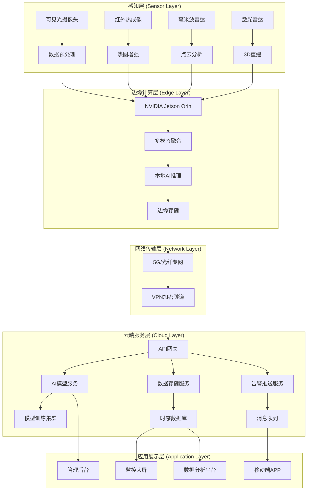

### 项目架构

```
开发目录/
├── .idea/                  # IDE 配置文件
├── 开发日志/                # 项目开发记录
├── 开发目录/                # 真实源码主目录（你的 Flask + 模型系统）
│   ├── Route_Forwarding/    # 路由蓝图（页面 + API）
│   │   ├── __init__.py
│   │   ├── page_routes.py   # 页面路由
│   │   └── api_routes.py    # 接口路由
│   ├── detection/          # 目标检测模型（YOLO、RTDETR、姿态、年龄性别）
│   ├── data_transport/      # 数据传输、设备、模型、仪表盘模块
│   ├── llm_integration/     # 大模型环境分析集成
│   ├── database_controller/ # 数据库控制器
│   ├── static/              # 前端静态资源（CSS/JS/图片）
│   ├── templates/           # HTML 页面模板
│   ├── uploads/             # 上传图片存储
│   ├── runs/                # 检测结果输出
│   ├── dehaze_results/       # 去雾结果输出
│   ├── log/                 # 用户、登录日志 JSON
│   ├── app.py                # 系统主入口（Flask）
│   └── 各类模型权重文件 / ONNX 文件
├── 测试报告/                # 功能/性能测试记录
├── 资料/                    # 项目参考资料、文档
├── 项目说明/                # 项目介绍、使用说明
└── README.md                # 项目说明文件
```

### 技术栈

| 技术分类       | 技术 / 框架 / 库          | 版本        | 用途说明                                 |
| -------------- | ------------------------- | ----------- | ---------------------------------------- |
| 后端框架       | Flask                     | 3.1.2       | Web 服务、接口开发、路由管理、会话控制   |
|                | Flask-CORS                | 6.0.2       | 处理前后端跨域请求                       |
|                | Werkzeug                  | 3.1.3       | Flask 底层 WSGI 服务组件                 |
|                | Jinja2                    | 3.1.6       | HTML 模板渲染引擎                        |
| 前端技术       | HTML5 / CSS3 / JavaScript | -           | 页面结构、样式、基础交互                 |
|                | jQuery                    | -           | DOM 操作、AJAX 请求、事件绑定、页面交互  |
| 数据交互       | AJAX / Fetch API          | -           | 前后端异步数据请求、接口调用、结果刷新   |
| 深度学习框架   | PyTorch                   | 2.4.1       | 模型加载、推理、训练核心框架             |
|                | torchvision               | 0.19.1      | 图像预处理、预训练模型支持               |
|                | torchaudio                | 2.4.1       | 音频相关处理支持                         |
|                | mamba\_ssm                | -           | 视觉 / 时序类 SSM 模型结构加速与推理支持 |
| 目标检测与视觉 | Ultralytics               | 8.3.231     | YOLOv11 检测、姿态估计、模型调用         |
|                | OpenCV                    | 4.13.0.92   | 图像读取、绘制检测框、视频流处理         |
|                | opencv-contrib-python     | 4.11.0.86   | 扩展视觉算法支持                         |
|                | Pillow                    | 10.2.0      | 图像加载、格式转换、预处理               |
|                | scikit-image              | 0.25.2      | 图像处理、特征提取辅助                   |
| 模型推理       | ONNX                      | 1.20.1      | 模型格式转换与标准化                     |
|                | onnxruntime               | 1.24.3      | C2PNet 等模型加速推理                    |
| 数据与数值计算 | numpy                     | 2.4.3       | 数组运算、矩阵处理、数据格式转换         |
|                | pandas                    | 2.2.2       | 检测记录、采集数据结构化管理             |
|                | scipy                     | 1.17.1      | 科学计算、信号与数值处理                 |
|                | scikit-learn              | 1.6.1       | 特征处理、统计分析辅助                   |
| 数据可视化     | matplotlib                | 3.10.8      | 图表绘制、结果可视化                     |
|                | plotly                    | 6.2.0       | 交互式数据可视化图表                     |
| 数据库与存储   | SQLite                    | -           | 轻量级数据库，持久化存储业务数据         |
|                | JSON                      | -           | 日志、配置、采集数据存储                 |
| 部署与容器     | Docker                    | -           | 项目容器化、环境隔离、一键部署           |
| 系统监控       | psutil                    | 6.1.1       | CPU、内存、磁盘等硬件状态监控            |
|                | pynvml / nvidia-ml-py     | 13.595.45   | GPU 显存、使用率实时监控                 |
| 大模型集成     | 自研 LLM 客户端           | -           | 极端环境分析、安全建议生成               |
| 开发与工具     | Git / GitPython           | -           | 代码版本管理与协作                       |
|                | tqdm                      | 4.66.2      | 进度条展示                               |
|                | requests                  | 2.31.0      | HTTP 网络请求                            |
|                | PyYAML                    | 6.0.3       | 配置文件解析                             |
|                | python-dateutil           | 2.9.0.post0 | 日期时间处理                             |
| 运行环境       | Python                    | 3.12        | 项目整体开发与运行环境                   |

### 系统架构图



### web端管理系统架构图

```mermaid
flowchart TD
    A[极境守护系统] -->|账号| B[用户登录]

    B -->|管理员/运维人员| C[设备管理]
    B -->|管理员/算法工程师| D[模型管理]
    B -->|运维/分析人员| E[目标检测中心]
    B -->|运维/分析人员| F[历史溯源]
    B -->|运维/分析人员| G[数据分析]
    B -->|管理员/运维人员| H[监控中心大屏]
    
    %% ====================== 新增两个核心子模块 ======================
    B -->|采集人员/管理员| I[数据采集]
    B -->|运维/监控人员| J[天气预警]

    C -->|设备信息| C1[设备注册]
    C -->|状态数据| C2[设备监控]
    C -->|故障信息| C3[故障处理]

    D -->|模型文件| D1[模型部署]
    D -->|训练数据| D2[训练可视化]
    D -->|效果数据| D3[效果演示]

    E -->|媒体数据| E1[推理控制]
    E -->|检测结果| E2[结果可视化]
    E -->|性能数据| E3[性能监控]

    F -->|检索条件| F1[多条件筛选]
    F -->|记录数据| F2[记录展示]
    F -->|取证数据| F3[报告导出]

    G -->|统计数据| G1[指标统计]
    G -->|可视化数据| G2[图表渲染]
    G -->|风险数据| G3[风险分析]

    H -->|GIS数据| H1[3D可视化]
    H -->|告警数据| H2[告警监控]
    H -->|系统数据| H3[系统日志]

    %% ====================== 新增：数据采集 ======================
    I -->|场景配置| I1[采集任务配置]
    I -->|现场数据| I2[实时数据采集]
    I -->|采集结果| I3[数据质检与存储]

    I1 -->|参数录入| I11[读取输入]
    I1 -->|规则编辑| I12[编辑输入]
    I2 -->|视频/图片| I21[流数据读取]
    I3 -->|质量校验| I31[数据审核]
    I3 -->|入库存储| I32[数据保存]

    %% ====================== 新增：天气预警 ======================
    J -->|实时画面| J1[天气类型识别]
    J -->|恶劣天气| J2[等级判定]
    J -->|预警信号| J3[多通道告警]
    J -->|预警记录| J4[预警溯源]

    J1 -->|图像分析| J11[天气分类]
    J2 -->|阈值判断| J21[等级映射]
    J3 -->|推送通知| J31[告警下发]
    J4 -->|历史查询| J41[记录归档]

    %% 原有下级节点不动
    C1 -->|输入信息| C11[读取输入]
    C1 -->|编辑信息| C12[编辑输入]
    D1 -->|输入模型| D11[读取输入]
    D1 -->|配置参数| D12[编辑输入]
    E1 -->|输入媒体| E11[读取输入]
    E1 -->|推理参数| E12[编辑输入]

    F1 -->|输入查询| F11[输入]
    F1 -->|查询结果| F12[查询]
    G1 -->|输入数据| G11[输入]
    G1 -->|统计结果| G12[查询]
    H1 -->|输入视角| H11[输入]
    H1 -->|视角结果| H12[查询]

    %% 样式美化（保持你原来的风格）
    classDef box fill:#f0f7ff,stroke:#4299e1,stroke-width:1px
    class A,B,C,D,E,F,G,H,I,J,C1,C2,C3,D1,D2,D3,E1,E2,E3,F1,F2,F3,G1,G2,G3,H1,H2,H3,I1,I2,I3,J1,J2,J3,J4 box
    class C11,C12,D11,D12,E11,E12,F11,F12,G11,G12,H11,H12,I11,I12,I21,I31,I32,J11,J21,J31,J41 box
```



### 路由转发图

```mermaid
flowchart TD
    %% ===== 样式定义 =====
    classDef userLayer fill:#e3f2fd,stroke:#1976d2,stroke-width:1px,color:#0d47a1
    classDef loginLayer fill:#c8e6c9,stroke:#388e3c,stroke-width:1px,color:#1b5e20
    classDef pageLayer fill:#f3e5f5,stroke:#6a1b9a,stroke-width:1px,color:#4a148c
    classDef apiLayer fill:#fff3e0,stroke:#f57c00,stroke-width:1px,color:#e65100
    classDef staticLayer fill:#eeeeee,stroke:#616161,stroke-width:1px,color:#212121
    classDef tip fill:#fff9c4,stroke:#fbc02d,stroke-width:1px,color:#f57f17
    classDef title fill:#e0f7fa,stroke:#006064,stroke-width:2px,font-weight:bold

    %% ===== 顶层结构 =====
    A["浏览器/移动端<br/>(Bootstrap前端)"]:::userLayer

    B["/login<br/>(GET/POST | 免登)"]:::loginLayer
    tipB["登录失败 → 重定向自身<br/>登录成功 → 核心功能"]:::tip

    A -->|初始访问| B
    B -.-> tipB

    %% ===== 核心业务页面 =====
    subgraph CORE title
        direction LR
        P1["/ 导航中心"]:::pageLayer
        P2["/dashboard 可视化大屏"]:::pageLayer
        P3["/statistics 数据统计分析"]:::pageLayer
        P4["/object_detection_controlcenter<br/>文件上传检测"]:::pageLayer
        P5["/camera 摄像头检测"]:::pageLayer
        P6["/history 历史记录"]:::pageLayer
        P7["/ai_assistant AI助手"]:::pageLayer
        P8["/data_collection 数据采集"]:::pageLayer
        P9["/weather_alert 极端天气预警"]:::pageLayer
        P10["/model_management 模型管理"]:::pageLayer
        P11["/edge_device_management 设备管理"]:::pageLayer
        P12["/user_center 用户中心"]:::pageLayer
        P13["/register 注册页"]:::pageLayer
    end
    class CORE title

    B -->|登录成功| P1 & P2 & P3 & P4 & P5 & P6 & P7 & P8 & P9 & P10 & P11 & P12 & P13

    %% ===== 功能接口 =====
    subgraph API title
        direction LR
        A1["/api/detect<br/>文件上传检测"]:::apiLayer
        A2["/api/*_results/weather/data<br/>检测/数据获取"]:::apiLayer
        A3["/api/weather/detect<br/>天气图片检测"]:::apiLayer
        A4["/api/weather/stream<br/>摄像头/视频流检测"]:::apiLayer
        A5["/api/start/stop_camera/video<br/>摄像头/视频控制"]:::apiLayer
        A6["/api/alert/status<br/>预警状态获取"]:::apiLayer
        A7["/api/alert/history<br/>预警历史查询"]:::apiLayer
        A8["/api/weather/status<br/>天气状态轮询"]:::apiLayer
        A9["/api/verify-login<br/>登录验证"]:::apiLayer
        A10["/api/register<br/>用户注册"]:::apiLayer
        A11["/api/generate-code<br/>验证码生成"]:::apiLayer
        A12["/api/logout<br/>登出"]:::apiLayer
        A13["/api/current-user<br/>当前用户信息"]:::apiLayer
        A14["/api/device_status<br/>设备状态监控"]:::apiLayer
        A15["/api/sync_json_to_db<br/>数据同步"]:::apiLayer
        A16["/api/analyze_environment<br/>环境分析"]:::apiLayer
        A17["/api/data_collection<br/>数据采集提交"]:::apiLayer
        A18["/api/detection_records<br/>检测记录查询"]:::apiLayer
    end
    class API title

    %% ===== 模板化页面 =====
    subgraph TEMPLATE title
        direction LR
        T1["/templates/<name> 模板加载"]:::apiLayer
        T2["/view_detail/<record_id> 检测详情页"]:::apiLayer
    end
    class TEMPLATE title

    %% ===== 静态文件/资源 =====
    subgraph STATIC title
        direction LR
        S1["/uploads/<file> 用户上传文件"]:::staticLayer
        S2["/static/<file> 前端资源"]:::staticLayer
        S3["/detections/<file> 检测结果文件"]:::staticLayer
        S4["/dehaze_results/<file> 去雾结果文件"]:::staticLayer
        S5["/results/<file> 可视化结果"]:::staticLayer
    end
    class STATIC title

    %% ===== 数据流整理 =====
    P4 -->|文件上传| A1
    P5 -->|设备控制| A5
    P9 -->|天气检测| A2 & A4
    P9 -->|预警状态| A6 & A7 & A8
    P1 -->|数据获取| A2 & A14 & A18
    P3 -->|数据统计| A2 & A18
    P6 -->|查看详情| A18 --> T2 -->|加载结果| S3
    P8 -->|数据提交| A17
    P12 -->|用户信息| A13
    A1 -->|存储结果| S3 & S5
    A3 & A4 -->|天气数据| A6

    %% 静态加载关系
    P1 & P2 & P3 & P4 & P5 & P6 & P7 & P8 & P9 & P10 & P11 & P12 -->|加载资源| S2
    P4 -->|上传文件访问| S1
    P5 -->|加载视频流| S2
    A3 -->|结果文件| S4

    %% 登录与注册交互
    B -->|验证登录| A9 -->|验证码| A11
    A10 -->|注册| B
    A12 -->|登出| B
    A13 -->|返回用户信息| P12
    A15 -->|同步数据| P10
    A16 -->|环境分析| P4
    A17 -->|数据回传| P8
    A18 -->|历史记录| P6
```



