### 设备管理模块

#### 一、模块概述

设备管理模块是「极境守护」系统的核心业务模块，负责边缘设备的**注册、状态监控、数据存储与可视化管理**，实现了前后端完整的数据流转与交互闭环。

#### 二、核心功能清单

| 功能类别   | 具体功能                                                     |
| ---------- | ------------------------------------------------------------ |
| 设备注册   | 支持通过表单提交设备信息（ID、IP、位置、环境类型等），自动生成唯一 ID 与提交时间戳 |
| 数据传输   | 设备数据持久化到 `log/devices.json`，支持追加写入与数据完整性校验 |
| 设备可视化 | 以卡片形式展示所有设备，包含状态标识（在线 / 异常 / 维护中 / 离线）、温度、CPU 负载、信号强度等核心指标 |
| 设备详情   | 点击设备卡片可打开侧边栏，查看完整设备信息（含运维记录、实时数据图表） |
| 故障处理   | 提供「排查故障」「尝试重连」「设备诊断」操作，模拟设备状态流转与故障恢复流程 |
| 告警系统   | 定时推送设备异常告警，支持自动消失与手动关闭                 |
| 搜索过滤   | 支持按设备 ID、安装位置、运行环境模糊搜索，快速定位目标设备  |
| 统计展示   | 顶部实时统计在线 / 异常 / 维护中 / 离线设备数量，直观呈现系统状态 |


| 接口                               | 方法 | 功能                                                         |
| ---------------------------------- | ---- | ------------------------------------------------------------ |
| `/api/device/register`             | POST | 接收设备注册表单数据，持久化到 `devices.json`，默认状态为正常运行 |
| `/api/device/list`                 | GET  | 返回所有设备列表，用于前端渲染设备卡片与统计数据             |
| `/api/device/<device_name>/status` | PUT  | 更新设备状态（正常运行 / 故障 / 离线），同步写入 JSON 并记录更新时间 |
| `/api/device/<device_name>/fault`  | POST | 触发设备故障处理流程，更新故障信息与告警记录                 |

#### 三、技术栈与算法说明

##### 1. 技术栈

- **后端**：Python + Flask（蓝图机制）+ JSON 文件存储
- **前端**：HTML5 + Tailwind CSS + Vanilla JS + Chart.js（数据可视化）
- **测试**：pytest（单元测试）+ Selenium（集成测试）
- **工程化**：前后端分离，静态资源与模板分离，模块化导入

##### 2. 核心算法 / 逻辑

- **数据持久化**：采用 JSON 文件追加写入模式，自动生成 `id`（自增）与 `submit_time`（提交时间），保证数据唯一性与可追溯性
- **状态流转**：设备状态遵循 `online ↔ error ↔ maintenance ↔ offline` 四态转换，故障修复后自动恢复为在线状态
- **搜索过滤**：基于字符串包含匹配，对设备 ID、位置、环境字段进行小写归一化后检索
- **告警推送**：定时器定时生成模拟告警，采用 DOM 动态插入与自动移除实现通知效果

#### 四、完成文件清单

1. 后端文件

| 文件路径                             | 职责                                                         |
| ------------------------------------ | ------------------------------------------------------------ |
| `data_transport/device_transport.py` | 核心数据传输模块：实现设备注册接口、JSON 读写、数据校验      |
| `data_transport/device_report.py`    | 用于导出设备报告                                             |
| `data_transport/__init__.py`         | 模块初始化文件（空文件，标识 Python 包）                     |
| `log/devices.json`                   | 设备数据持久化存储文件                                       |
| `app.py`                             | Flask 应用入口：注册设备传输蓝图，配置跨域、静态资源与服务启动 |

2. 前端文件	

   

| 文件路径                                   | 职责                                                        |
| ------------------------------------------ | ----------------------------------------------------------- |
| `templates/edge_device_management.html`    | 设备管理主页面：页面结构、设备卡片、侧边栏、弹窗等 DOM 结构 |
| `templates/edge_device_info_register.html` | 设备注册页面：设备信息提交表单                              |
| `static/edge_device_management.css`        | 设备管理页面样式：玻璃态面板、动画、响应式布局              |
| `static/edge_device_management.js`         | 设备管理交互逻辑：侧边栏、告警、故障处理、搜索、图表渲染等  |

3. 测试文件

| 文件路径                     | 职责                                       |
| ---------------------------- | ------------------------------------------ |
| `test/test_device_system.py` | 单元测试（数据传输）+ 集成测试（页面交互） |

#### 五、模块关联关系

##### 1. 数据流

```
前端表单提交 → device_transport.py 接口 → 写入 log/devices.json
设备管理页面 → 读取 devices.json → 渲染设备卡片与统计数据
故障操作 → 更新设备状态 → 同步写入 JSON → 前端刷新状态
```

##### 2. 代码依赖

- `app.py` 导入 `device_transport_bp` 蓝图，将 `/api/device/register` 接口挂载到 Flask 应用
- `edge_device_management.html` 引入 `edge_device_management.css` 与 `edge_device_management.js`，实现样式与交互
- `edge_device_management.js` 调用后端接口，操作 DOM 实现页面交互
- `test_device_system.py` 导入 `device_transport.py` 函数，测试数据读写与页面功能

#### 六、关键实现细节

##### 1. 数据传输层

- 采用**蓝图机制**避免循环依赖，`device_transport.py` 不再直接导入 `app`，而是通过 `device_transport_bp` 注册路由
- 自动创建 `log` 目录，保证 `devices.json` 写入路径可靠
- 异常捕获：对文件读写、JSON 解析进行异常处理，保证服务稳定性

##### 2. 前端交互层

- **侧边栏交互**：点击设备卡片动态加载设备详情，通过 CSS `width` 过渡实现平滑展开 / 收起
- **状态样式**：不同设备状态对应不同颜色标识（在线 - 绿色、异常 - 红色、维护中 - 黄色、离线 - 灰色）
- **实时图表**：使用 Chart.js 渲染温度、CPU 负载、信号强度的时序曲线，直观展示设备运行趋势
- **告警通知**：采用固定定位与滑动动画，保证告警不影响主操作流

##### 3. 测试层

- **单元测试**：验证 `save_device_to_json` 函数的追加写入、自动字段生成、数据完整性
- **集成测试**：模拟用户操作，验证页面加载、侧边栏打开、告警推送、故障处理等流程

#### 七、功能详细展示：

**前端页面**

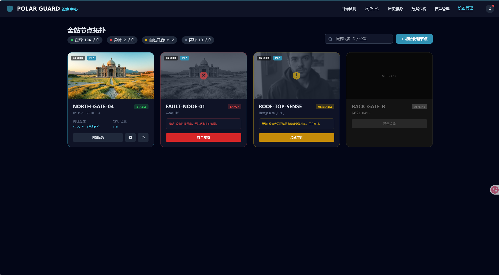

**表单提交功能**

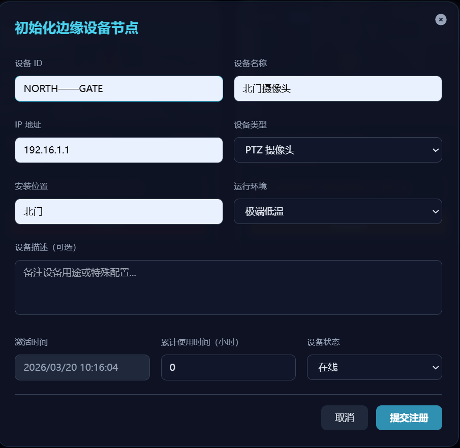

**计数统计**


**搜索功能**

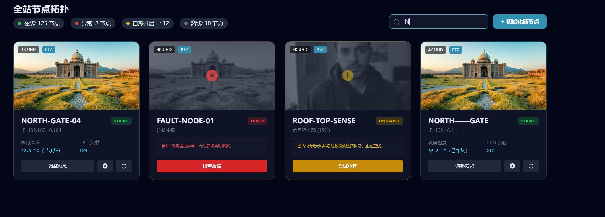

**告警功能**：


**卡片实现**

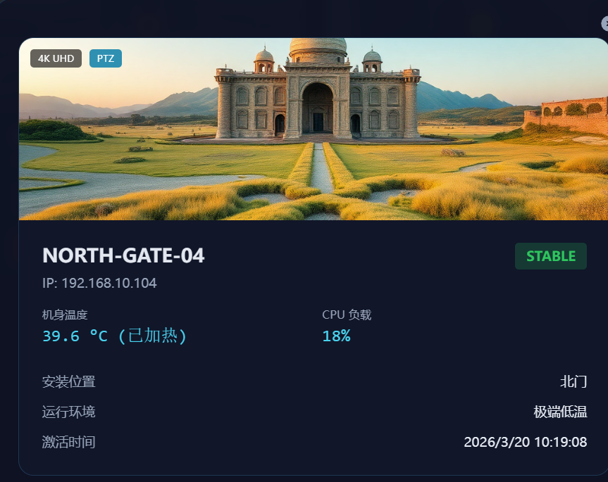

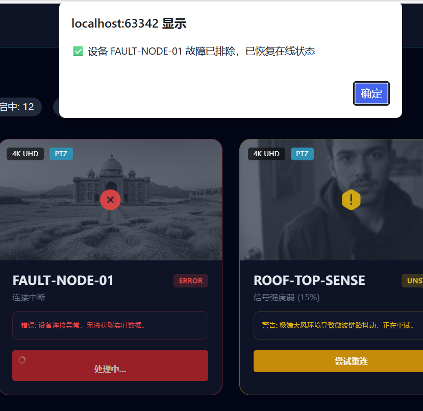

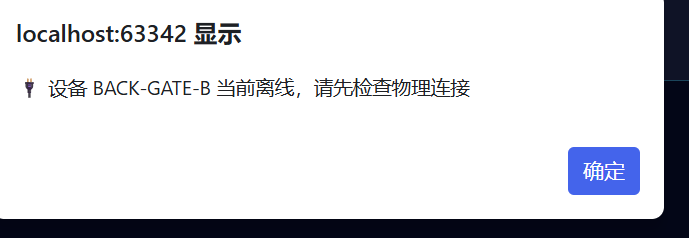

**设备统计分析**

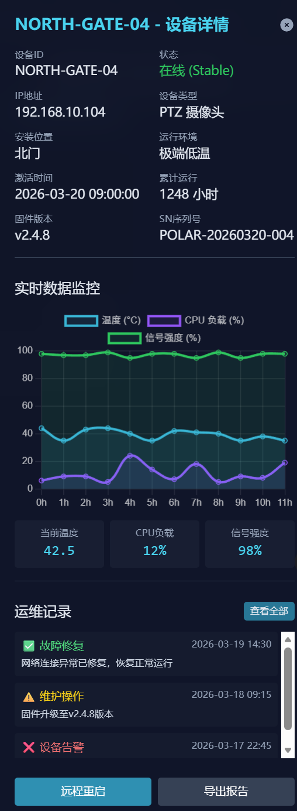

### 大模型模块

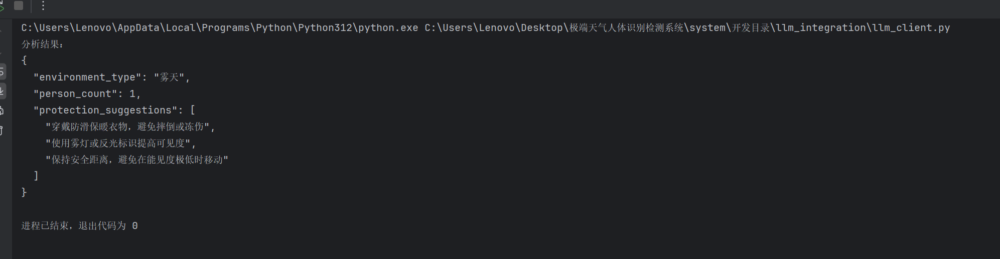

开发目录/llm_integration/llm_client.py

调用米塔大模型，支持失败时本地静态分析结果

将来与目标检测网页要联动

### 模型管理模块：

#### 一、模块基本信息

- **模块名称**：模型管理模块

- **开发时间**：2026-03-20

- **开发人员**：

- 文件路径：

  - 前端：`/开发目录/templates/model_management.html`、`/开发目录/static/model_management.css`、`/开发目录/static/model_management.js`
  - 后端：`/开发目录/data_transport/model_transport.py`

  

- **依赖文件**：`/开发目录/log/models.json`（模型数据持久化存储）

#### 二、功能概述

模型管理模块是「极境守护」极端环境人体识别检测系统的核心功能模块，实现了**模型全生命周期管理**，涵盖模型加载 / 部署、训练可视化、指标分析、实时演示四大核心场景，为边缘设备上的模型调度与效果评估提供完整支撑。

#### 三、核心功能实现

##### 1. 后端接口层（model_transport.py）

基于 Flask Blueprint 实现模型数据的 CRUD 接口，与前端完全解耦：

| 接口                             | 方法 | 功能                                                         |
| -------------------------------- | ---- | ------------------------------------------------------------ |
| `/api/model/upload`              | POST | 接收模型表单数据，持久化到 `models.json`，默认状态为 `unloaded` |
| `/api/model/list`                | GET  | 返回所有模型列表，用于前端初始化卡片                         |
| `/api/model/<model_name>/status` | PUT  | 更新模型状态（`loaded`/`unloaded`/`restarting`），加载时记录 `loadTime` |

**关键实现**：

- 数据持久化：通过 `load_models()`/`save_models()` 读写 JSON 文件，保证数据跨会话留存
- 字段校验：对 `modelName`/`version`/`device` 等必填字段做非空校验
- 异常处理：捕获 JSON 解析、文件操作等异常，返回标准化错误响应

##### 2. 前端页面层（model_management.html）

采用**分版块 Tab 布局**，将功能拆分为 4 个独立子页面：

1. **模型加载与部署**

   

   - 模型卡片列表：展示模型名称、版本、设备、大小、推理耗时、精度等核心信息
   - 状态管理：支持「加载 / 重启 / 卸载」三种状态切换，已加载模型显示绿色标签，未加载显示灰色标签
   - 上传弹窗：表单收集模型全量信息，点击上传后调用后端接口并新增卡片

   

2. **训练曲线可视化**

   

   - 4 张核心折线图：训练损失、验证损失、mAP 指标、精确率 & 召回率
   - 数据采样：每 5 轮 Epoch 采样一个点，避免图表过于密集
   - 深色主题适配：Chart.js 配置适配系统暗色风格，提升视觉一致性

   

3. **训练指标分析**

   

   - 总体指标卡片：展示精确率、召回率、F1 分数、mAP@0.5、推理速度、参数量
   - 类别级指标表格：按「人员 / 车辆 / 异常物体 / 环境异常」分类展示详细指标
   - 混淆矩阵热力图：直观呈现模型在不同类别上的分类效果
   - PDF 导出：一键导出完整指标报告（含总体指标 + 类别级指标）

   

4. **模型效果实时演示**

   

   - 双画面对比：原始监控画面 vs 模型推理结果（带检测框与置信度）
   - 实时控制：支持开始 / 暂停 / 停止演示、调整置信度阈值、筛选检测类别
   - 统计面板：实时展示检测目标总数、FPS、类别分布、最新告警
   - 演示日志：记录操作与检测事件，支持导出日志文件

#### 四、模型管理模块完成文件清单

1. 后端文件

| 文件路径                            | 职责                                                         |
| ----------------------------------- | ------------------------------------------------------------ |
| `data_transport/model_transport.py` | 核心模型管理模块：实现模型上传接口、模型列表查询、模型状态更新、JSON 数据持久化与读写 |
| `data_transport/__init__.py`        | 模块初始化文件（空文件，标识 Python 包）                     |
| `log/models.json`                   | 模型数据持久化存储文件                                       |
| `app.py`                            | Flask 应用入口：注册模型管理蓝图，配置跨域、静态资源与服务启动 |

2. 前端文件

| 文件路径                          | 职责                                                         |
| --------------------------------- | ------------------------------------------------------------ |
| `templates/model_management.html` | 模型管理主页面：页面结构、模型卡片、子版块 Tab、弹窗、图表容器等 DOM 结构 |
| `static/model_management.css`     | 模型管理页面样式：玻璃态面板、弹窗动画、响应式布局、深色主题适配、告警提示样式 |
| `static/model_management.js`      | 模型管理交互逻辑：Tab 切换、模型卡片渲染、状态同步、图表初始化、上传弹窗控制、告警提示、PDF 报告导出 |

#### 五、模块关联关系

1. 数据流

```
前端表单提交 → model_transport.py 接口 → 写入 log/models.json
模型管理页面 → 读取 models.json → 渲染模型卡片与状态信息
模型状态操作（加载/重启/卸载） → 更新模型状态 → 同步写入 JSON → 前端刷新状态
```

. 代码依赖

- `app.py` 导入 `model_transport_bp` 蓝图，将 `/api/model/*` 系列接口挂载到 Flask 应用
- `model_management.html` 引入 `model_management.css` 与 `model_management.js`，实现页面样式与交互逻辑
- `model_management.js` 调用后端模型管理接口，操作 DOM 实现模型卡片渲染、状态切换与图表展示
- `test_model_system.py`（待补充）导入 `model_transport.py` 函数，测试模型数据读写与页面交互功能

#### 六、功能详细展示：

前端页面

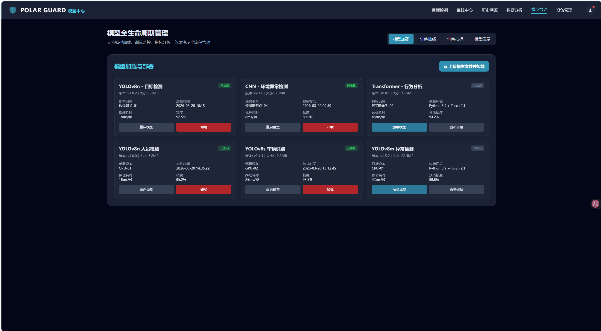


可交互指标

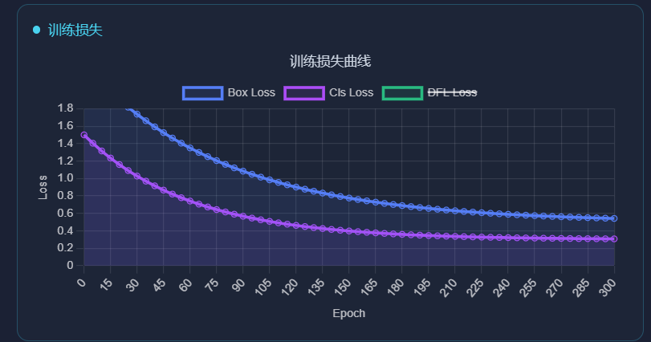

模型上传

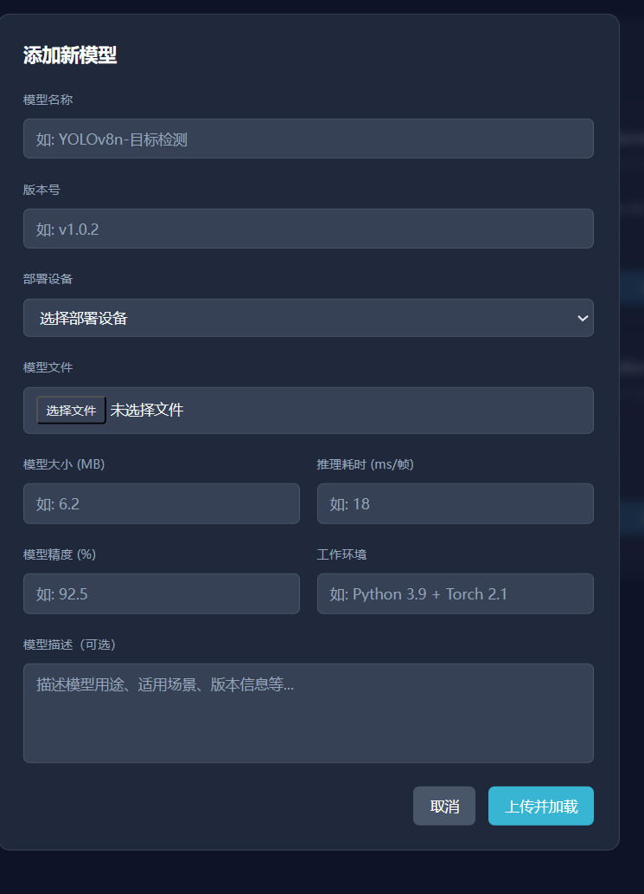

模型加载删除与详情重启

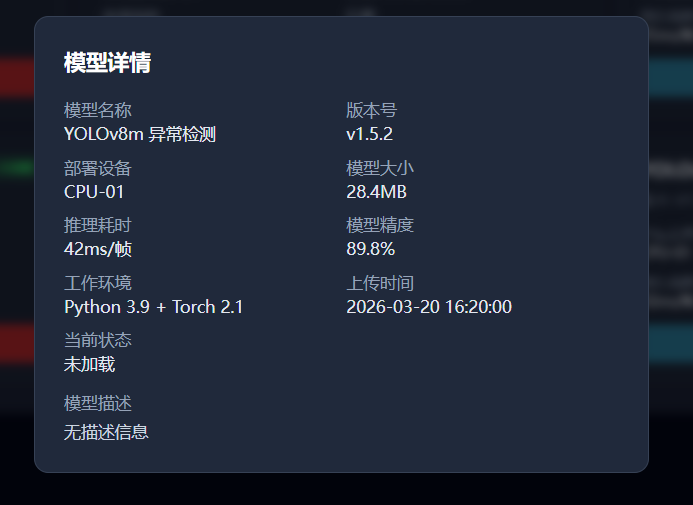

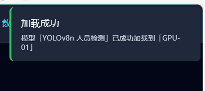