### 设备管理模块

#### 一、模块概述

设备管理模块是「极境守护」系统的核心业务模块，负责边缘设备的**注册、状态监控、数据存储与可视化管理**，实现了前后端完整的数据流转与交互闭环。

#### 二、核心功能清单

| 功能类别   | 具体功能                                                     |
| ---------- | ------------------------------------------------------------ |
| 设备注册   | 支持通过表单提交设备信息（ID、IP、位置、环境类型等），自动生成唯一 ID 与提交时间戳 |
| 数据传输   | 设备数据持久化到 `log/devices.json`，支持追加写入与数据完整性校验 |
| 设备可视化 | 以卡片形式展示所有设备，包含状态标识（在线 / 异常 / 维护中 / 离线）、温度、CPU 负载、信号强度等核心指标 |
| 设备详情   | 点击设备卡片可打开侧边栏，查看完整设备信息（含运维记录、实时数据图表） |
| 故障处理   | 提供「排查故障」「尝试重连」「设备诊断」操作，模拟设备状态流转与故障恢复流程 |
| 告警系统   | 定时推送设备异常告警，支持自动消失与手动关闭                 |
| 搜索过滤   | 支持按设备 ID、安装位置、运行环境模糊搜索，快速定位目标设备  |
| 统计展示   | 顶部实时统计在线 / 异常 / 维护中 / 离线设备数量，直观呈现系统状态 |


| 接口                               | 方法 | 功能                                                         |
| ---------------------------------- | ---- | ------------------------------------------------------------ |
| `/api/device/register`             | POST | 接收设备注册表单数据，持久化到 `devices.json`，默认状态为正常运行 |
| `/api/device/list`                 | GET  | 返回所有设备列表，用于前端渲染设备卡片与统计数据             |
| `/api/device/<device_name>/status` | PUT  | 更新设备状态（正常运行 / 故障 / 离线），同步写入 JSON 并记录更新时间 |
| `/api/device/<device_name>/fault`  | POST | 触发设备故障处理流程，更新故障信息与告警记录                 |

#### 三、技术栈与算法说明

##### 1. 技术栈

- **后端**：Python + Flask（蓝图机制）+ JSON 文件存储
- **前端**：HTML5 + Tailwind CSS + Vanilla JS + Chart.js（数据可视化）
- **测试**：pytest（单元测试）+ Selenium（集成测试）
- **工程化**：前后端分离，静态资源与模板分离，模块化导入

##### 2. 核心算法 / 逻辑

- **数据持久化**：采用 JSON 文件追加写入模式，自动生成 `id`（自增）与 `submit_time`（提交时间），保证数据唯一性与可追溯性
- **状态流转**：设备状态遵循 `online ↔ error ↔ maintenance ↔ offline` 四态转换，故障修复后自动恢复为在线状态
- **搜索过滤**：基于字符串包含匹配，对设备 ID、位置、环境字段进行小写归一化后检索
- **告警推送**：定时器定时生成模拟告警，采用 DOM 动态插入与自动移除实现通知效果

#### 四、完成文件清单

1. 后端文件

| 文件路径                             | 职责                                                         |
| ------------------------------------ | ------------------------------------------------------------ |
| `data_transport/device_transport.py` | 核心数据传输模块：实现设备注册接口、JSON 读写、数据校验      |
| `data_transport/device_report.py`    | 用于导出设备报告                                             |
| `data_transport/__init__.py`         | 模块初始化文件（空文件，标识 Python 包）                     |
| `log/devices.json`                   | 设备数据持久化存储文件                                       |
| `app.py`                             | Flask 应用入口：注册设备传输蓝图，配置跨域、静态资源与服务启动 |

2. 前端文件	

   

| 文件路径                                   | 职责                                                        |
| ------------------------------------------ | ----------------------------------------------------------- |
| `templates/edge_device_management.html`    | 设备管理主页面：页面结构、设备卡片、侧边栏、弹窗等 DOM 结构 |
| `templates/edge_device_info_register.html` | 设备注册页面：设备信息提交表单                              |
| `static/edge_device_management.css`        | 设备管理页面样式：玻璃态面板、动画、响应式布局              |
| `static/edge_device_management.js`         | 设备管理交互逻辑：侧边栏、告警、故障处理、搜索、图表渲染等  |

3. 测试文件

| 文件路径                     | 职责                                       |
| ---------------------------- | ------------------------------------------ |
| `test/test_device_system.py` | 单元测试（数据传输）+ 集成测试（页面交互） |

#### 五、模块关联关系

##### 1. 数据流

```
前端表单提交 → device_transport.py 接口 → 写入 log/devices.json
设备管理页面 → 读取 devices.json → 渲染设备卡片与统计数据
故障操作 → 更新设备状态 → 同步写入 JSON → 前端刷新状态
```

##### 2. 代码依赖

- `app.py` 导入 `device_transport_bp` 蓝图，将 `/api/device/register` 接口挂载到 Flask 应用
- `edge_device_management.html` 引入 `edge_device_management.css` 与 `edge_device_management.js`，实现样式与交互
- `edge_device_management.js` 调用后端接口，操作 DOM 实现页面交互
- `test_device_system.py` 导入 `device_transport.py` 函数，测试数据读写与页面功能

#### 六、关键实现细节

##### 1. 数据传输层

- 采用**蓝图机制**避免循环依赖，`device_transport.py` 不再直接导入 `app`，而是通过 `device_transport_bp` 注册路由
- 自动创建 `log` 目录，保证 `devices.json` 写入路径可靠
- 异常捕获：对文件读写、JSON 解析进行异常处理，保证服务稳定性

##### 2. 前端交互层

- **侧边栏交互**：点击设备卡片动态加载设备详情，通过 CSS `width` 过渡实现平滑展开 / 收起
- **状态样式**：不同设备状态对应不同颜色标识（在线 - 绿色、异常 - 红色、维护中 - 黄色、离线 - 灰色）
- **实时图表**：使用 Chart.js 渲染温度、CPU 负载、信号强度的时序曲线，直观展示设备运行趋势
- **告警通知**：采用固定定位与滑动动画，保证告警不影响主操作流

##### 3. 测试层

- **单元测试**：验证 `save_device_to_json` 函数的追加写入、自动字段生成、数据完整性
- **集成测试**：模拟用户操作，验证页面加载、侧边栏打开、告警推送、故障处理等流程

#### 七、功能详细展示：

**前端页面**

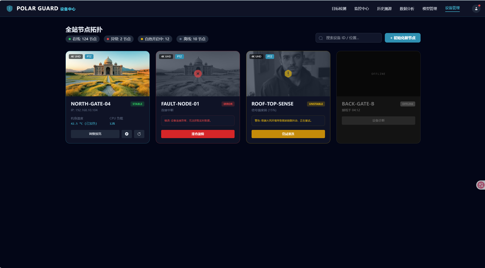

**表单提交功能**

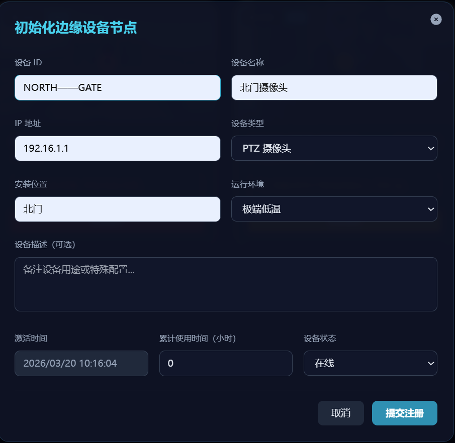

**计数统计**


**搜索功能**

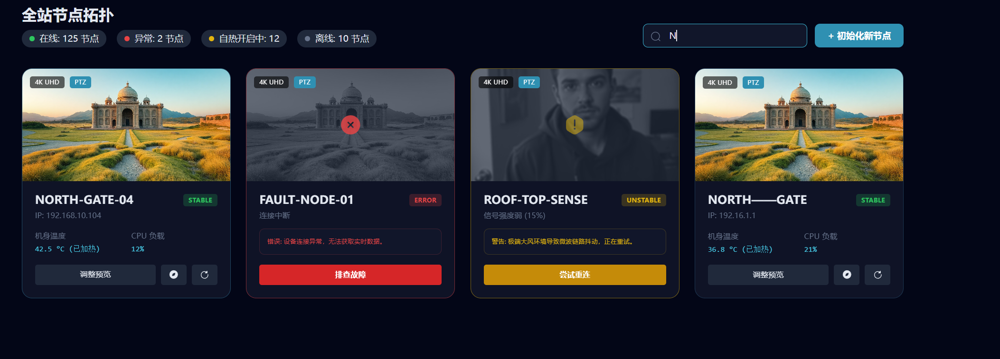

**告警功能**：


**卡片实现**

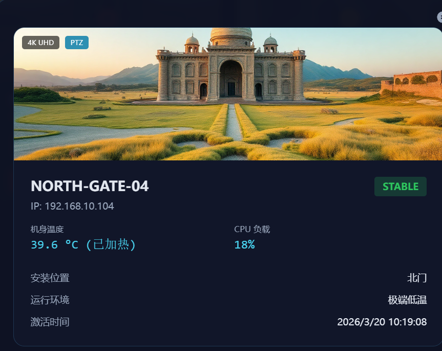

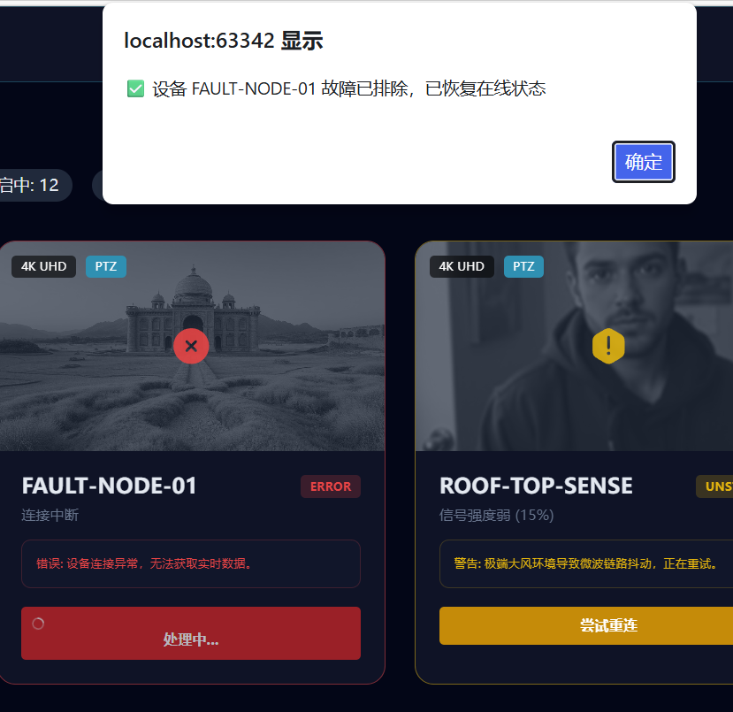

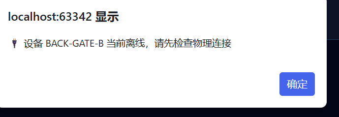

**设备统计分析**

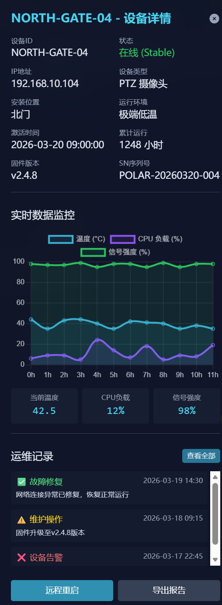

### 大模型模块

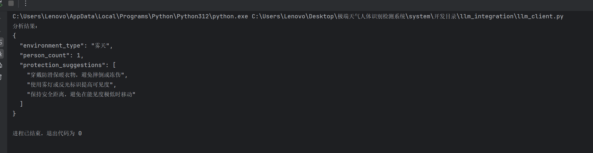

开发目录/llm_integration/llm_client.py

调用米塔大模型，支持失败时本地静态分析结果

将来与目标检测网页要联动

### 模型管理模块：

#### 一、模块基本信息

- **模块名称**：模型管理模块

- **开发时间**：2026-03-20

- **开发人员**：

- 文件路径：

  - 前端：`/开发目录/templates/model_management.html`、`/开发目录/static/model_management.css`、`/开发目录/static/model_management.js`
  - 后端：`/开发目录/data_transport/model_transport.py`

  

- **依赖文件**：`/开发目录/log/models.json`（模型数据持久化存储）

#### 二、功能概述

模型管理模块是「极境守护」极端环境人体识别检测系统的核心功能模块，实现了**模型全生命周期管理**，涵盖模型加载 / 部署、训练可视化、指标分析、实时演示四大核心场景，为边缘设备上的模型调度与效果评估提供完整支撑。

#### 三、核心功能实现

##### 1. 后端接口层（model_transport.py）

基于 Flask Blueprint 实现模型数据的 CRUD 接口，与前端完全解耦：

| 接口                             | 方法 | 功能                                                         |
| -------------------------------- | ---- | ------------------------------------------------------------ |
| `/api/model/upload`              | POST | 接收模型表单数据，持久化到 `models.json`，默认状态为 `unloaded` |
| `/api/model/list`                | GET  | 返回所有模型列表，用于前端初始化卡片                         |
| `/api/model/<model_name>/status` | PUT  | 更新模型状态（`loaded`/`unloaded`/`restarting`），加载时记录 `loadTime` |

**关键实现**：

- 数据持久化：通过 `load_models()`/`save_models()` 读写 JSON 文件，保证数据跨会话留存
- 字段校验：对 `modelName`/`version`/`device` 等必填字段做非空校验
- 异常处理：捕获 JSON 解析、文件操作等异常，返回标准化错误响应

##### 2. 前端页面层（model_management.html）

采用**分版块 Tab 布局**，将功能拆分为 4 个独立子页面：

1. **模型加载与部署**

   

   - 模型卡片列表：展示模型名称、版本、设备、大小、推理耗时、精度等核心信息
   - 状态管理：支持「加载 / 重启 / 卸载」三种状态切换，已加载模型显示绿色标签，未加载显示灰色标签
   - 上传弹窗：表单收集模型全量信息，点击上传后调用后端接口并新增卡片

   

2. **训练曲线可视化**

   

   - 4 张核心折线图：训练损失、验证损失、mAP 指标、精确率 & 召回率
   - 数据采样：每 5 轮 Epoch 采样一个点，避免图表过于密集
   - 深色主题适配：Chart.js 配置适配系统暗色风格，提升视觉一致性

   

3. **训练指标分析**

   

   - 总体指标卡片：展示精确率、召回率、F1 分数、mAP@0.5、推理速度、参数量
   - 类别级指标表格：按「人员 / 车辆 / 异常物体 / 环境异常」分类展示详细指标
   - 混淆矩阵热力图：直观呈现模型在不同类别上的分类效果
   - PDF 导出：一键导出完整指标报告（含总体指标 + 类别级指标）

   

4. **模型效果实时演示**

   

   - 双画面对比：原始监控画面 vs 模型推理结果（带检测框与置信度）
   - 实时控制：支持开始 / 暂停 / 停止演示、调整置信度阈值、筛选检测类别
   - 统计面板：实时展示检测目标总数、FPS、类别分布、最新告警
   - 演示日志：记录操作与检测事件，支持导出日志文件

#### 四、模型管理模块完成文件清单

1. 后端文件

| 文件路径                            | 职责                                                         |
| ----------------------------------- | ------------------------------------------------------------ |
| `data_transport/model_transport.py` | 核心模型管理模块：实现模型上传接口、模型列表查询、模型状态更新、JSON 数据持久化与读写 |
| `data_transport/__init__.py`        | 模块初始化文件（空文件，标识 Python 包）                     |
| `log/models.json`                   | 模型数据持久化存储文件                                       |
| `app.py`                            | Flask 应用入口：注册模型管理蓝图，配置跨域、静态资源与服务启动 |

2. 前端文件

| 文件路径                          | 职责                                                         |
| --------------------------------- | ------------------------------------------------------------ |
| `templates/model_management.html` | 模型管理主页面：页面结构、模型卡片、子版块 Tab、弹窗、图表容器等 DOM 结构 |
| `static/model_management.css`     | 模型管理页面样式：玻璃态面板、弹窗动画、响应式布局、深色主题适配、告警提示样式 |
| `static/model_management.js`      | 模型管理交互逻辑：Tab 切换、模型卡片渲染、状态同步、图表初始化、上传弹窗控制、告警提示、PDF 报告导出 |

#### 五、模块关联关系

1. 数据流

```
前端表单提交 → model_transport.py 接口 → 写入 log/models.json
模型管理页面 → 读取 models.json → 渲染模型卡片与状态信息
模型状态操作（加载/重启/卸载） → 更新模型状态 → 同步写入 JSON → 前端刷新状态
```

. 代码依赖

- `app.py` 导入 `model_transport_bp` 蓝图，将 `/api/model/*` 系列接口挂载到 Flask 应用
- `model_management.html` 引入 `model_management.css` 与 `model_management.js`，实现页面样式与交互逻辑
- `model_management.js` 调用后端模型管理接口，操作 DOM 实现模型卡片渲染、状态切换与图表展示
- `test_model_system.py`（待补充）导入 `model_transport.py` 函数，测试模型数据读写与页面交互功能

#### 六、功能详细展示：

前端页面

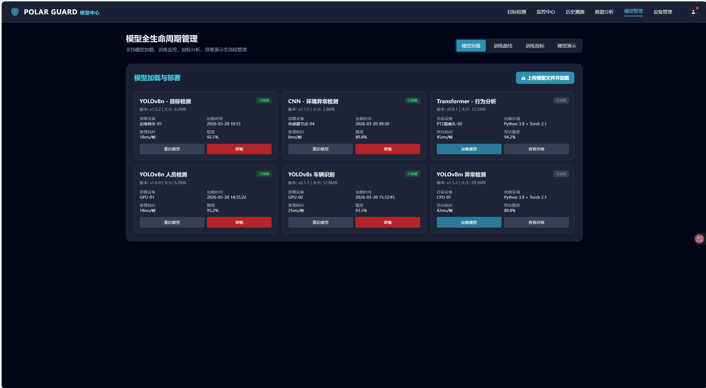


可交互指标

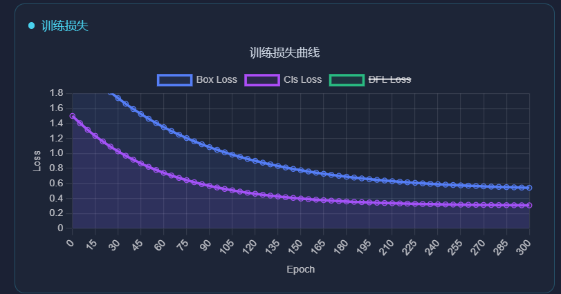

模型上传

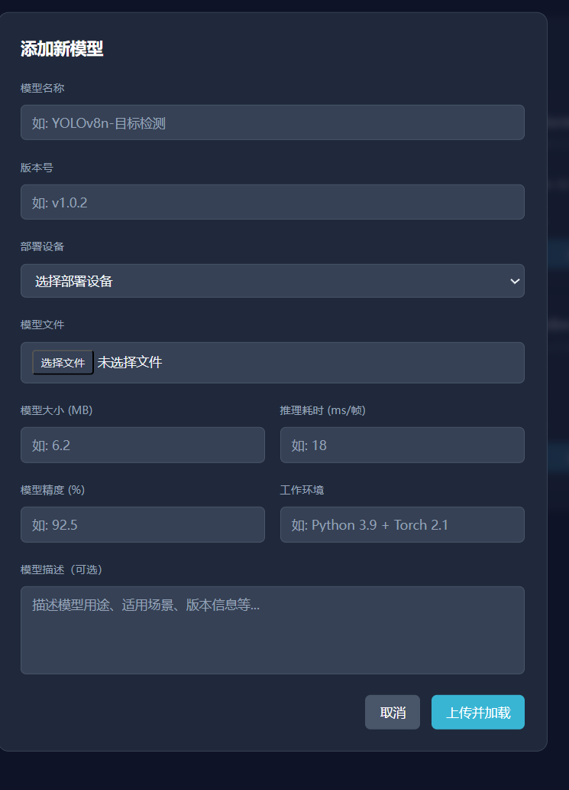

模型加载删除与详情重启

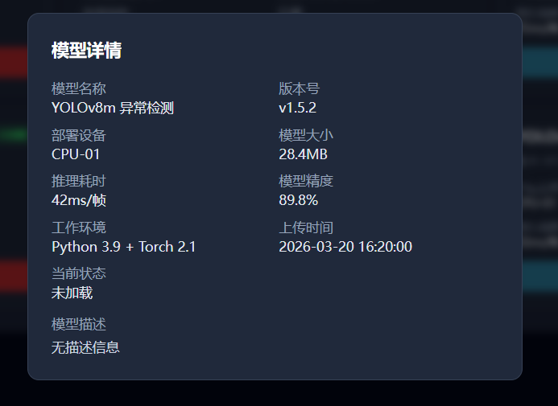

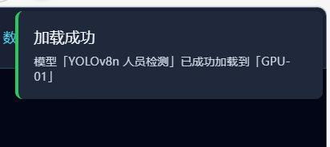

### 导航中心模块：

##### 一、模块概述

导航中心模块是「极境守护」系统的统一入口与门户页面，负责整合系统各核心业务模块入口，实现页面间高效跳转与系统状态概览展示，为用户提供直观、便捷的功能导航体验，同时承载系统欢迎页与状态看板功能

##### 二、核心功能清单

| 功能类别   | 具体功能                                                     |
| ---------- | ------------------------------------------------------------ |
| 页面导航   | 提供目标检测、监控中心、历史溯源、数据分析、模型管理、设备管理等模块的跳转入口，支持导航栏与卡片双入口 |
| 导航高亮   | 自动识别当前页面路径，高亮对应导航栏项，提升页面定位体验     |
| 状态概览   | 展示在线设备数、今日检测量、模型精度、平均延迟等核心系统指标，直观呈现系统运行态势 |
| 交互反馈   | 卡片点击波纹动画、导航栏滚动阴影效果，增强页面交互质感与视觉反馈 |
| 响应式布局 | 适配移动端与桌面端，在不同屏幕尺寸下保持布局可用性与美观性   |

##### 三、技术栈与算法说明

1. **技术栈**

- **前端**：HTML5 + Tailwind CSS + Vanilla JS + Iconify（图标库）
- **样式**：自定义 CSS 实现玻璃态面板、动态网格背景、发光文字等视觉效果
- **交互**：原生 JS 实现导航高亮、滚动监听、点击波纹等交互逻辑
- **工程化**：前后端分离，静态资源与模板分离，模块化引入样式与脚本

**2. 核心算法 / 逻辑**

- **导航高亮算法**：基于 `window.location.pathname` 匹配导航链接 `href` 属性，自动添加 / 移除 `active` 类实现当前页面高亮
- **滚动监听逻辑**：监听 `scroll` 事件，根据滚动距离动态添加 / 移除导航栏阴影，提升页面层次感
- **波纹动画算法**：点击卡片时计算点击位置与卡片边界的相对坐标，动态生成波纹元素并执行缩放淡出动画
- **响应式布局**：基于 Tailwind CSS 栅格系统，实现 1/2/3 列自适应布局，适配不同屏幕尺寸

##### 四、完成文件清单

1. 前端文件

| 文件路径                    | 职责                                                        |
| --------------------------- | ----------------------------------------------------------- |
| `templates/navigation.html` | 导航中心主页面：页面结构、功能卡片、系统状态看板等 DOM 结构 |
| `static/navigation.css`     | 导航中心页面样式：玻璃态面板、动画、响应式布局、卡片样式等  |
| `static/navigation.js`      | 导航中心交互逻辑：导航高亮、滚动监听、波纹动画等            |

##### 五、模块关联关系

###### 1. 数据流

- 无后端数据持久化需求，页面状态由前端 JS 动态维护
- 系统状态概览数据（在线设备、今日检测等）可后续对接后端 `/api/system/status` 接口获取实时数据
- 导航跳转直接关联各业务模块路由：
  - `/object_detection_controlcenter` → 目标检测模块
  - `/visual_dashboard` → 监控中心模块
  - `/history` → 历史溯源模块
  - `/historical_data_analysis` → 数据分析模块
  - `/model_management` → 模型管理模块
  - `/edge_device_management` → 设备管理模块

###### 2. 代码依赖

- `navigation.html` 引入 `navigation.css` 与 `navigation.js`，实现样式与交互
- `navigation.js` 依赖 `window.location` API 与 DOM 操作，实现页面交互逻辑
- 各业务模块页面需与导航中心保持路由一致，确保跳转正常

##### 六、核心实现细节

1. 前端页面层（`navigation.html`）

- 采用**顶部导航栏 + 功能卡片网格 + 状态看板**布局，结构清晰直观
- 导航栏包含系统 Logo、各模块入口与用户中心入口，固定顶部便于随时访问
- 功能卡片采用 3 列网格布局，每个卡片对应一个业务模块，包含图标、标题、描述与跳转箭头
- 系统状态概览区域以 4 列统计项展示核心指标，直观呈现系统运行状态

2. 样式层（`navigation.css`）

- 实现**玻璃态面板**效果：半透明背景 + 模糊滤镜 + 边框渐变，符合系统科幻风格
- 动态网格背景：通过 CSS 渐变与动画实现流动网格效果，增强页面科技感
- 卡片悬停动效：上浮 + 边框高亮 + 内阴影，提升交互反馈
- 响应式适配：移动端 1 列、平板 2 列、桌面 3 列，保证不同设备下的可用性

3. 交互层（`navigation.js`）

- **导航高亮**：页面加载时遍历导航链接，匹配当前路径并添加 `active` 类
- **滚动阴影**：监听滚动事件，滚动超过 10px 时为导航栏添加阴影，增强页面层次感
- **波纹动画**：点击卡片时动态生成波纹元素，从点击位置向外扩散并淡出，模拟 Material Design 交互效果
- 样式注入：动态创建 `<style>` 标签注入波纹动画样式，避免样式文件冗余

##### 七、功能演示：

前端页面

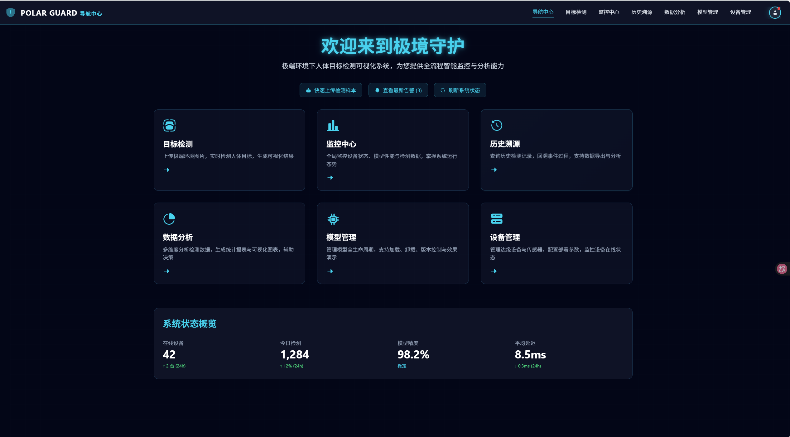

### 页面加载模块：


### 监控中心模块：

#### 一、模块概述

监控大屏模块是「极境守护」系统的**全域态势感知核心入口**，面向指挥中心与运维人员，提供 3D GIS 可视化、实时气象监测、设备热力分布、告警推送与系统日志一体化展示，实现极端环境下全域态势的直观感知与快速响应。

#### 二、核心功能清单

|   功能类别    |                           具体功能                           |
| :-----------: | :----------------------------------------------------------: |
| 3D GIS 可视化 | 基于 Three.js 实现地球与云层动态渲染，支持中国 / 全球视角切换，模拟气象云图流动效果 |
| 实时气象监测  | 展示温度、湿度、气压、AQI、风向、能见度等核心指标，通过 ECharts 绘制时序趋势曲线 |
| 设备热力分布  | 以热力图形式呈现边缘设备在线状态与负载分布，直观定位高负载 / 异常区域 |
|   告警系统    | 自动推送极端天气 / 设备异常告警，支持弹窗通知、自动消失与手动关闭，同步记录告警日志 |
|  系统日志流   | 实时滚动展示系统运行日志，包含传感器同步、设备状态、图表更新等关键事件 |
| 环境风险评估  | 通过仪表盘可视化环境风险等级，联动气象数据自动分级（低 / 中 / 高 / 极高） |
|   交互控制    | 提供数据刷新、预警测试、全屏显示、气象模式切换等操作入口，支持导出告警记录 |

|         接口路径          | 请求方法 |                           功能描述                           |
| :-----------------------: | :------: | :----------------------------------------------------------: |
| `/api/dashboard/weather`  |   GET    | 获取实时气象数据（温度、湿度、气压、AQI、能见度、风向、风速及趋势等） |
|  `/api/dashboard/alerts`  |   GET    |         获取当前系统告警列表（极端天气 / 设备异常）          |
| `/api/dashboard/abnormal` |   GET    |    获取极端异常事件信息（是否展示、事件类型、位置、时间）    |

#### 三、技术栈与算法说明

1. 技术栈

- **后端**：Python + Flask（蓝图机制）+ JSON 文件存储，提供 `/api/dashboard/weather`、`/api/dashboard/alerts` 等接口
- **前端**：HTML5 + Tailwind CSS + Vanilla JS + Three.js（3D 渲染）+ ECharts（数据可视化）+ Axios（网络请求）
- **工程化**：前后端分离，静态资源与模板分离，模块化导入，响应式布局适配多终端
- **样式**：玻璃态面板（glassmorphism）+ 霓虹蓝配色，符合科幻风监控大屏视觉风格

2. 核心算法 / 逻辑

- **3D 渲染**：SphereGeometry 构建地球与云层模型，通过 `requestAnimationFrame` 实现自动旋转与云层流动效果
- **数据联动**：前端定时轮询后端接口，自动更新气象数据、告警列表与风险等级
- **状态流转**：环境风险等级遵循 `低 ↔ 中 ↔ 高 ↔ 极高` 四态转换，由气象指标（温度、风速、AQI 等）驱动
- **告警推送**：定时器监听异常数据，通过 DOM 动态插入弹窗与样式类实现通知效果
- **日志管理**：前端模拟日志流，定时生成随机事件并维护固定长度列表，保证界面可读性

#### 四、完成文件清单

1. 后端文件

|                 文件路径                 |                           职责                           |
| :--------------------------------------: | :------------------------------------------------------: |
| `data_transport/visual_dashboard_api.py` | 核心数据传输模块，实现气象数据、告警信息、设备状态等接口 |
|            `log/alerts.json`             |                  告警数据持久化存储文件                  |
|                 `app.py`                 |  Flask 应用入口，注册可视化大屏蓝图，配置跨域与静态资源  |

2. 前端文件

|             文件路径              |                             职责                             |
| :-------------------------------: | :----------------------------------------------------------: |
| `templates/visual_dashboard.html` |   监控大屏主页面，包含 3D 场景、图表、告警弹窗等 DOM 结构    |
|   `static/visual_dashboard.css`   |          页面样式：玻璃态面板、动画效果、响应式布局          |
|   `static/visual_dashboard.js`    | 交互逻辑：3D 场景初始化、图表渲染、数据拉取、告警处理、日志流生成 |

#### 五、模块关联关系

1. 数据流

```
前端定时轮询 → visual_dashboard_api.py 接口 → 读取 JSON 数据 → 前端渲染 3D 场景/图表/告警
告警触发 → 更新 alerts.json → 前端弹窗通知 → 用户关闭 → 清除告警状态
```

2. 代码依赖

- `app.py` 导入 `visual_dashboard_bp` 蓝图，挂载大屏相关接口
- `visual_dashboard.html` 引入 `visual_dashboard.css` 与 `visual_dashboard.js`，实现样式与交互
- `visual_dashboard.js` 依赖 Three.js/ECharts/Axios，调用后端接口并操作 DOM
- `test_dashboard_system.py` 导入接口函数，验证数据完整性与页面可用性

#### 六、功能演示

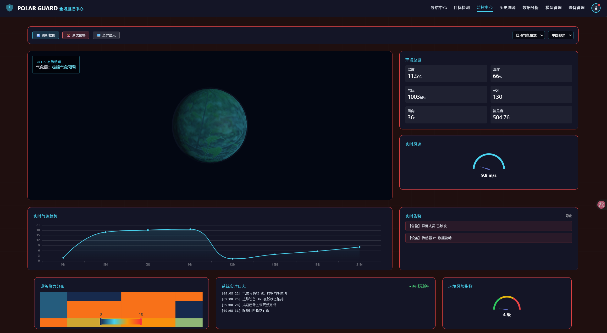

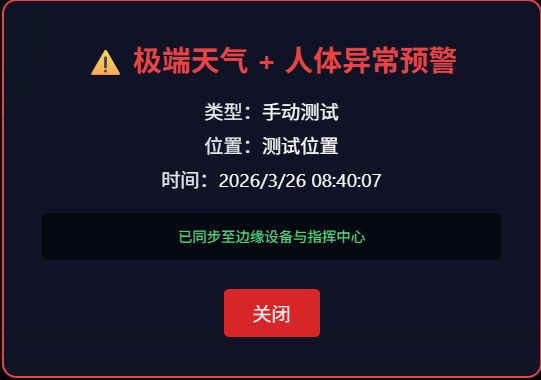

### 数据采集模块：

#### 一、模块概述

数据采集模块是「极境守护」系统的**基础数据支撑模块**，负责多场景（工厂、户外、极地、交通枢纽等）下的环境、设备、人员数据统一采集与标准化存储，为后续的检测分析、预警决策、模型训练提供完整、规范的原始数据，实现数据采集 - 存储 - 应用的全链路闭环。

#### 二、核心功能清单

|    功能类别    |                           具体功能                           |
| :------------: | :----------------------------------------------------------: |
| 多场景数据采集 | 支持工厂、户外、极地、交通枢纽等场景的数据采集，按场景定制必填字段（如工厂场景必填工号） |
|   数据标准化   | 对采集数据进行格式校验、字段归一化，保证不同场景数据结构一致性 |
|   数据持久化   | 将采集数据持久化到 `log/collection_data.json`，支持追加写入与数据完整性校验 |
|   场景化查询   |     支持按场景筛选采集记录，快速定位目标场景下的历史数据     |
|    数据校验    | 对关键字段（如工号、设备 ID、环境指标）进行非空 / 格式校验，返回标准化错误提示 |
|    权限控制    |     集成系统登录验证，仅授权用户可进行数据采集与查询操作     |

| 接口                           | 方法 | 功能                                                      |
| ------------------------------ | ---- | --------------------------------------------------------- |
| `/api/data_collection`         | POST | 接收多场景采集数据，校验后持久化到 `collection_data.json` |
| `/api/data_collection/records` | GET  | 返回所有采集记录（支持按场景筛选），用于前端渲染数据列表  |

#### 三、技术栈与算法说明

##### 1. 技术栈

- **后端**：Python + Flask（蓝图机制）+ JSON 文件存储 + 数据校验逻辑
- **前端**：HTML5 + Tailwind CSS + Vanilla JS + 表单校验
- **工程化**：前后端分离，权限控制装饰器，模块化数据处理

##### 2. 核心算法 / 逻辑

- **场景化校验逻辑**：针对不同采集场景（工厂 / 户外 / 极地等）动态校验必填字段，如工厂场景强制校验工号完整性
- **数据持久化**：采用 JSON 文件追加写入模式，自动生成 `collection_id`（UUID）与 `collection_time`（采集时间），保证数据唯一性与可追溯性
- **场景过滤算法**：基于请求参数中的 `scene` 字段，对采集记录进行精准筛选，返回对应场景的结构化数据
- **权限控制**：通过 `login_required` 装饰器拦截未授权请求，保证数据采集操作的安全性

#### 四、完成文件清单

1. 后端文件

|                   文件路径                    |                             职责                             |
| :-------------------------------------------: | :----------------------------------------------------------: |
| `data_transport/data_collection_transport.py` | 核心数据采集模块：实现数据接收、校验、JSON 读写、场景筛选逻辑 |
|         `data_transport/__init__.py`          |           模块初始化文件（空文件，标识 Python 包）           |
|          `log/collection_data.json`           |                    采集数据持久化存储文件                    |
|                   `app.py`                    |        Flask 应用入口：挂载数据采集接口，集成登录验证        |

1. 前端文件

|             文件路径             |                             职责                             |
| :------------------------------: | :----------------------------------------------------------: |
| `templates/data_collection.html` |  数据采集主页面：多场景表单、数据列表、筛选控件等 DOM 结构   |
|   `static/data_collection.css`   |  数据采集页面样式：玻璃态表单、响应式布局、表单校验提示样式  |
|   `static/data_collection.js`    | 数据采集交互逻辑：场景切换、表单校验、数据提交、记录查询渲染 |

#### 五、模块关联关系

##### 1. 数据流

```
前端多场景表单提交 → data_collection_transport.py 接口 → 数据校验 → 写入 log/collection_data.json
数据查询请求 → 读取 collection_data.json → 按场景筛选 → 前端渲染采集记录列表
```

##### 2. 代码依赖

- `app.py` 导入数据采集相关接口，挂载到 Flask 应用，集成 `login_required` 装饰器
- `data_collection.html` 引入 `data_collection.css` 与 `data_collection.js`，实现页面样式与交互
- `data_collection.js` 调用后端数据采集 / 查询接口，实现表单提交与记录展示
- `data_collection_transport.py` 依赖 JSON 读写工具，实现数据持久化与筛选

#### 六、关键实现细节

##### 1. 数据校验层

- 场景化动态校验：根据前端选择的采集场景，后端自动校验对应必填字段（如工厂场景校验 `worker_id`）
- 异常捕获：对 JSON 解析、文件读写、字段校验异常进行捕获，返回标准化错误响应（如 `{"success": false, "msg": "工厂场景工号为必填项"}`）
- 字段归一化：对环境指标（温度、湿度）、时间格式等进行统一格式化，保证数据一致性

##### 2. 前端交互层

- **场景切换**：下拉选择采集场景后，表单动态展示 / 隐藏对应场景的专属字段（如极地场景展示海拔、气温字段）
- **表单校验**：前端实时校验必填字段，提交前二次确认，减少无效请求
- **数据列表渲染**：分页展示采集记录，支持场景筛选按钮，筛选结果实时更新
- **交互反馈**：提交成功 / 失败给出可视化提示，表单重置、数据刷新等操作提供明确反馈

##### 3. 权限控制层

- 所有数据采集 / 查询接口均挂载 `login_required` 装饰器，未登录用户请求返回 401 状态码并提示登录
- 前端拦截未登录状态下的提交操作，自动跳转至登录页面

#### 七、功能详细展示：

### 天气预警模块：

#### 一、模块概述

天气预警模块是「极境守护」系统的**核心决策支撑模块**，基于多维度气象数据（能见度、降水强度、风速等）与图像分析结果，实现极端天气的自动化分级预警、多通道推送、预警升级与应急预案触发，联动检测系统动态调整检测策略，保障极端环境下人体识别检测的准确性与可靠性。

#### 二、核心功能清单

| 功能类别       | 具体功能                                                     |
| -------------- | ------------------------------------------------------------ |
| 多维度天气评估 | 基于能见度、降水强度、风速等指标，严格按阈值划分 5 级预警等级（蓝色→黑色） |
| 自动化预警触发 | 黄色及以上预警自动触发多通道推送（监控中心、邮件、短信、WebSocket、仪表盘） |
| 预警升级策略   | 连续预警 / 长时间预警自动升级响应级别，红色及以上预警触发应急预案 |
| 检测策略适配   | 按预警等级动态调整检测参数（置信度阈值、NMS 阈值）与模型选择（天气专属模型） |
| 预警历史管理   | 持久化存储预警记录，支持按位置、等级、时间查询历史预警       |
| 手动预警触发   | 支持管理员手动触发预警，适配应急演练 / 特殊场景需求          |
| 天气自适应处理 | 基于图像特征识别天气类型，自动执行图像增强（去雾 / 去雨 / 雪天增强） |

| 接口                  | 方法 | 功能                                               |
| --------------------- | ---- | -------------------------------------------------- |
| `/api/weather/detect` | POST | 上传图片检测天气类型，返回预警等级与适配的检测策略 |
| `/api/weather/stream` | POST | 接收视频帧 (Base64) 实时检测天气，返回实时预警状态 |
| `/api/weather/status` | GET  | 获取当前天气预警状态（兜底返回模拟 / 历史数据）    |
| `/api/alert/status`   | GET  | 获取指定位置的预警状态（等级、策略、响应措施）     |
| `/api/alert/history`  | GET  | 获取预警历史记录，支持分页 / 筛选                  |
| `/api/alert/trigger`  | POST | 手动触发预警，支持自定义天气数据与位置             |

#### 三、技术栈与算法说明

##### 1. 技术栈

- **后端**：Python + Flask（蓝图机制）+ 异步编程（asyncio）+ JSON 文件存储 + OpenCV + PyTorch
- **前端**：HTML5 + Tailwind CSS + Vanilla JS + ECharts（预警趋势可视化）+ WebSocket（实时推送）
- **核心算法库**：OpenCV（图像增强）、PyTorch（天气分类 / 检测模型）、numpy（数值计算）
- **工程化**：前后端分离，多模态数据融合，异步告警推送，权限控制

##### 2. 核心算法 / 逻辑

- 预警等级判定算法：

  基于能见度（m）+ 降水强度（mm/h）双阈值严格划分 5 级预警，补充风速等多维度评分校验，避免误判

  ```
  黑色预警：能见度<50m 或 降水强度>200mm/h
  红色预警：能见度<200m 或 降水强度>100mm/h
  橙色预警：能见度<500m 或 降水强度>50mm/h
  黄色预警：能见度<1000m 或 降水强度>25mm/h
  蓝色预警：能见度>1000m 且 降水强度≤10mm/h
  ```

- 天气自适应增强算法：

  - 雾天：暗通道先验去雾算法，提升图像对比度
  - 雨天：中值滤波去雨滴 + CLAHE 对比度增强
  - 雪天：YCrCb 亮度均衡 + HSV 饱和度增强
  - 极端天气：多算法融合增强（去噪 + 对比度 + 锐化）

  

- **多模态检测融合算法**：基于 IoU 聚类可见光 / 红外 / 雷达检测结果，加权融合置信度，提升极端天气下检测准确性

- **预警升级逻辑**：连续 3 次同等级预警自动升级响应级别，预警持续 60 分钟以上触发应急预案

#### 四、完成文件清单

1. 后端文件

|                 文件路径                  |                             职责                             |
| :---------------------------------------: | :----------------------------------------------------------: |
|      `alert_system/alert_system.py`       | 核心预警系统：实现预警等级判定、升级策略、多通道推送、历史管理 |
|       `alert_system/api_routes.py`        |       预警系统蓝图：挂载预警状态 / 历史 / 手动触发接口       |
| `weather_detection/weather_adaptation.py` |    天气自适应流水线：天气分类、图像增强、模型 / 参数适配     |
| `weather_detection/advanced_detection.py` |     多模态检测服务：支持可见光 / 红外 / 雷达数据融合检测     |
|       `log/weather_alert_log.json`        |                    预警历史持久化存储文件                    |
|                 `app.py`                  |       Flask 应用入口：注册预警蓝图，初始化预警系统实例       |

1. 前端文件

|            文件路径            |                             职责                             |
| :----------------------------: | :----------------------------------------------------------: |
| `templates/weather_alert.html` | 天气预警主页面：预警状态看板、历史记录、手动触发弹窗、趋势图表 |
|   `static/weather_alert.css`   | 预警页面样式：预警等级色彩标识、玻璃态面板、实时推送提示样式 |
|   `static/weather_alert.js`    | 预警交互逻辑：实时状态拉取、历史记录渲染、手动预警触发、WebSocket 监听 |

#### 五、模块关联关系

##### 1. 数据流

```
图像/视频帧上传 → weather_adaptation.py 识别天气类型 → alert_system.py 判定预警等级 → 多通道推送告警
预警等级同步 → advanced_detection.py 调整检测参数/模型 → 检测系统执行适配后的检测逻辑
手动预警触发 → 写入 weather_alert_log.json → 前端实时刷新预警状态
```

##### 2. 代码依赖

- `app.py` 导入 `alert_bp` 蓝图，挂载预警相关接口，初始化 `ExtremeWeatherAlertSystem` 单例
- `weather_alert.html` 引入 `weather_alert.css` 与 `weather_alert.js`，实现预警可视化与交互
- `weather_adaptation.py` 依赖 OpenCV 实现图像增强，为检测系统提供增强后帧数据
- `advanced_detection.py` 依赖 PyTorch 加载天气专属模型，接收预警系统的策略适配指令
- 所有预警接口均挂载 `login_required` 装饰器，保证操作安全性

#### 六、关键实现细节

##### 1. 预警核心层

- **多维度评估**：优先使用气象传感器数据判定天气，无传感器数据时基于图像特征分类，结合时间连续性避免频繁切换
- **异步告警推送**：采用 `asyncio` 并行执行多通道告警推送（监控中心、邮件、短信等），避免单通道阻塞
- **预警持久化**：预警记录自动写入 `weather_alert_log.json`，包含预警 ID、等级、位置、时间、持续时长、是否升级等字段
- **策略适配联动**：预警等级变更时自动同步到检测系统，调整置信度阈值（如雾天置信度降至 0.35）与模型（加载雾天专属模型）

##### 2. 天气自适应层

- **图像增强流水线**：针对不同天气类型执行专属增强算法，输出增强后帧数据，提升检测模型的识别效果
- **模型动态加载**：根据天气类型自动加载对应模型（如雨天加载 `rain/model.pt`），无对应模型时回退到晴天模型
- **参数自适应**：按天气类型调整检测参数（置信度 / NMS 阈值），极端天气下启用最低置信度（0.3）保证检出率

##### 3. 前端交互层

- **预警状态可视化**：不同预警等级对应不同色彩标识（蓝色 / 黄色 / 橙色 / 红色 / 黑色），直观展示当前预警级别
- **实时推送监听**：通过 WebSocket 监听预警状态变更，弹窗提示新告警，不阻塞主操作流
- **历史趋势分析**：使用 ECharts 绘制预警等级时序曲线，展示预警持续时长、升级记录等
- **手动触发面板**：管理员可自定义天气数据（能见度、降水强度）与位置，手动触发预警用于演练

#### 七、功能详细展示：

### 数据库管理模块：

#### 一、模块概述

数据库管理模块是「极境守护」系统的**统一数据持久化与管理核心**，负责将系统中所有业务数据（检测记录、设备、模型、用户、登录日志、个人信息）从 JSON 文件自动同步到 SQLite 数据库，提供标准化建表、数据导入、CRUD 操作、权限安全与数据一致性保障，实现系统从文件存储到数据库存储的平滑升级，为大数据量、高并发访问提供稳定支撑。

#### 二、核心功能清单

|    功能类别    |                           具体功能                           |
| :------------: | :----------------------------------------------------------: |
|    自动建表    | 自动创建 6 张核心数据表：检测记录、设备、模型、用户、个人信息、登录日志 |
| JSON 自动同步  | 一键将 log 目录下所有 JSON 数据导入 SQLite，支持重复导入自动覆盖 |
|  数据增删改查  | 提供检测记录、设备状态、模型状态、用户信息、登录日志的标准 CRUD 接口 |
|    外键关联    | 实现用户表 ↔ 个人信息表 ↔ 登录日志表的外键关联，保证数据完整性 |
|  登录日志管理  |             支持查询、单条删除、清空全部登录日志             |
| 系统启动初始化 |         项目启动时自动建表 + 自动同步 JSON → 数据库          |
|    安全存储    |       密码、用户信息统一入库，支持后续扩展密码加密存储       |

|             接口             |        功能         |
| :--------------------------: | :-----------------: |
|    `create_all_tables()`     | 创建全部 6 张数据表 |
| `import_detection_records()` |    导入检测记录     |
|      `import_devices()`      |    导入设备数据     |
|      `import_models()`       |    导入模型数据     |
|       `import_users()`       | 导入用户与个人信息  |
|    `import_login_logs()`     |    导入登录日志     |
| `insert_detection_record()`  |    新增检测记录     |
|   `update_device_status()`   |    更新设备状态     |
|   `update_model_status()`    |    更新模型状态     |
|    `record_user_login()`     |  记录用户登录日志   |
|      `get_login_logs()`      |    获取登录日志     |
|     `delete_login_log()`     |    删除单条日志     |
|   `clear_all_login_logs()`   |    清空全部日志     |

#### 三、技术栈与算法说明

1. 技术栈

- **后端**：Python + SQLite3 + 文件 IO + JSON 解析
- **存储架构**：JSON 文件 + 关系型数据库（双存储兼容）
- **工程化**：自动目录创建、事务提交、异常安全、字典式行访问
- **依赖**：内置 `sqlite3`，无第三方依赖

2. 核心算法 / 逻辑

- **自动建表机制**：`CREATE TABLE IF NOT EXISTS` 保证重复运行不报错
- **INSERT OR REPLACE 同步策略**：导入 JSON 时自动覆盖重复数据，保证数据库最新
- **外键约束**：`user_profiles`、`user_login_logs` 通过 `username` 关联 `users` 表
- **Row Factory 字典化**：查询结果自动转为字典，方便 Flask 接口直接返回
- **路径自动适配**：自动识别项目根目录与 log 目录，跨平台兼容

#### 四、完成文件清单

1. 后端文件

|                   文件路径                   |                    职责                    |
| :------------------------------------------: | :----------------------------------------: |
| `database_controller/database_controller.py` | 数据库核心模块：建表、导入、CRUD、事务管理 |
|               `polar_guard.db`               |             SQLite 数据库文件              |
|                   `app.py`                   |    启动时自动调用数据库初始化、同步数据    |

#### 五、模块关联关系

1. 数据流

```
JSON 文件（log 目录）
→ database_controller 导入函数
→ 自动建表
→ INSERT OR REPLACE 写入 SQLite
→ Flask 接口调用 CRUD
→ 前端页面展示/操作
```

2. 代码依赖

- `app.py` 启动时执行数据库初始化与全量同步
- 检测模块调用 `insert_detection_record` 保存记录
- 设备模块调用 `update_device_status` 更新状态
- 模型模块调用 `update_model_status` 更新模型状态
- 登录模块调用 `record_user_login` 记录登录日志
- 用户中心调用 `get_login_logs` 获取登录记录

#### 六、关键实现细节

1. 数据库连接层

- 单例连接模式，自动创建目录与数据库文件
- `check_same_thread=False` 适配 Flask 多线程
- `row_factory=sqlite3.Row` 支持字典访问字段

2. 建表层

- 6 张表结构完全对齐 JSON 结构
- 主键自增、唯一约束、外键约束齐全
- 时间字段默认 `CURRENT_TIMESTAMP`

3. 数据同步层

- 所有导入函数使用 `INSERT OR REPLACE`
- 自动处理 JSON 不存在、空文件、格式异常
- 用户表同步创建个人信息表，保证数据完整性

4. 业务 CRUD 层

- 函数参数统一、命名规范、直接给 Flask 调用
- 登录日志支持按用户筛选、分页、倒序
- 设备 / 模型状态更新直接映射数据库字段

#### 七、功能详细展示

**数据库表结构**

- detection_records（检测记录）
- devices（设备）
- models（模型）
- users（用户）
- user_profiles（用户信息）
- user_login_logs（登录日志）

**数据同步流程**

1. 运行 `database_controller.py`
2. 自动建表
3. 自动读取 log 下所有 JSON
4. 自动写入 SQLite
5. 输出同步成功条数

###  - 目标检测中心模块 

#### 一、模块概述

目标检测中心是「极境守护」系统的核心业务模块，负责极端环境下的视觉智能分析，支持**图片/视频流/摄像头**三种推理模式，集成模型管理、边缘集群状态、实时检测、性能监控、结果统计全流程功能，实现前后端完整交互闭环，适配暴雪、暴雨、浓雾、沙尘暴等低能见度极端场景。

#### 二、核心功能清单

| 功能类别     | 具体功能                                                     |
| ------------ | ------------------------------------------------------------ |
| 多模式推理   | 支持图片分析、视频流推理、摄像头实时检测三种模式一键切换     |
| 模型管理     | 内置算法模型库，支持查看模型信息、切换模型版本、新增模型类型 |
| 边缘集群监控 | 实时展示多区域边缘节点推送状态、进度、版本、延迟、完成状态   |
| 实时推理     | 拖拽/点击上传样本，加载预设极端天气样本，一键启动模拟推理    |
| 性能监控     | 实时展示GPU显存、系统内存、推理延迟、模型准确率四大核心指标  |
| 可视化结果   | 检测框标注、置信度显示、推理延迟、实时控制台日志输出         |
| 视频流控制   | 启停控制、帧导出、自定义检测间隔（N帧检测一次）              |
| 摄像头控制   | 启动/停止摄像头、开始/停止检测、拍照截图、实时FPS与目标统计  |
| 结果统计     | 总检测数、类别数、平均/最高置信度、类别数量分布、详细检测数据 |
| 系统体验     | 全局加载动画、告警通知、玻璃态UI、响应式布局、交互动画       |

#### 三、接口清单

| 接口                       | 方法 | 功能                                 |
| -------------------------- | ---- | ------------------------------------ |
| `/api/model/list`          | GET  | 获取算法模型列表与版本信息           |
| `/api/model/deploy`        | POST | 部署模型到指定边缘集群               |
| `/api/edge/status`         | GET  | 获取所有边缘节点推送状态与进度       |
| `/api/inference/image`     | POST | 图片推理接口，返回检测结果与标注数据 |
| `/api/inference/video`     | POST | 视频流推理接口，支持帧间隔配置       |
| `/api/inference/camera`    | POST | 摄像头实时检测接口，持续返回目标数据 |
| `/api/performance/monitor` | GET  | 获取系统GPU/内存/延迟/准确率实时数据 |
| `/api/result/stats`        | GET  | 获取检测结果统计数据                 |

#### 四、技术栈与算法说明

1. 技术栈

- **前端**：HTML5 + Tailwind CSS + Vanilla JS + Chart.js（可视化）
- **UI风格**：深空玻璃态、极境守护主题色、响应式网格布局
- **交互**：原生JS DOM操作、事件委托、定时器、Canvas绘制、文件预览
- **兼容**：桌面端优先，支持主流浏览器，适配不同分辨率屏幕

2. 核心算法/逻辑

- **模式切换机制**：单页三模式（图片/视频/摄像头）无缝切换，DOM显隐控制，资源按需加载
- **视频帧控制**：固定帧率采样，N帧检测一次优化性能，避免资源占用过高
- **检测可视化**：Canvas动态绘制检测框、标签、置信度，实时叠加在视频/画面上
- **状态同步**：推理状态、按钮状态、统计数据、日志输出全局同步更新
- **模拟数据**：内置极端天气样本与检测结果，无后端也可完整演示流程
- **性能优化**：摄像头镜像处理、DOM按需更新、定时器自动清理、防止内存泄漏

#### 五、完成文件清单

前端文件

| 文件路径                                        | 职责                                                         |
| ----------------------------------------------- | ------------------------------------------------------------ |
| `templates/object_detection_controlcenter.html` | 目标检测中心主页面，完整DOM结构、三模式布局、统计面板        |
| `static/object_detection_controlcenter.css`     | 页面专属样式：玻璃态、加载动画、告警、视频/摄像头样式、滚动条优化 |
| `static/object_detection_controlcenter.js`      | 核心交互逻辑：三模式切换、推理控制、视频/摄像头、统计渲染、事件绑定 |

公共依赖

- Tailwind CSS / Iconify / Chart.js（CDN）
- 系统全局样式（glass-panel、加载动画、告警容器）

#### 六、模块关联关系

1. 数据流

- 页面加载 → 请求模型/边缘/性能数据 → 渲染初始界面
- 上传样本/启动摄像头 → 调用推理接口 → 获取检测结果
- 结果解析 → 渲染检测框、置信度、日志 → 更新统计面板
- 视频流 → 帧采样 → 推理 → 实时标注 → 数据统计

2. 代码依赖

- 主页面引入CSS与JS，实现结构、样式、行为分离
- JS依赖全局加载动画、告警系统函数
- 与导航栏联动，路由跳转到设备管理、数据分析、历史溯源等模块

#### 七、关键实现细节

1. 前端布局层

- 12列网格系统：左侧模型+边缘+性能面板，右侧推理+统计区域
- 三模式独立布局：图片/视频使用左右分栏，摄像头使用全屏展示
- 控制栏与统计面板固定定位，不随滚动消失，提升操作体验

2. 交互体验层

- 拖拽上传区域：hover高亮、dragover样式变化、文件实时预览
- 视频流控制栏：动态显隐，仅在视频模式下显示
- 摄像头模块：镜像显示，实时FPS，目标数悬浮统计
- 按钮状态联动：启停互斥，禁用状态自动处理

3. 可视化层

- 检测结果面板：边框标注、置信度标签、推理日志实时滚动
- 性能监控：环形进度条+百分比+数值展示，直观易懂
- 边缘集群状态：颜色区分（绿色就绪、青色推送中、黄色部分、红色待推送）
- 统计表格：支持摘要/详细数据/置信度分布三Tab切换

4. 系统兼容层

- 隐藏原生滚动条，保留滚动功能
- 防止数字输入框默认上下箭头
- 视频/摄像头自动播放处理， playsinline 适配移动端
- 定时器统一管理，切换模式时自动清除，避免冲突

#### 八、功能详细展示（对应页面结构）

### 历史溯源模块

#### 一、模块概述

历史溯源模块是「极境守护」系统的核心数据查询与取证模块，负责对极端环境下目标检测历史记录进行存储、检索、可视化展示与报告导出，支持多维度筛选、视图切换、分页查询与详情取证，实现检测记录可追溯、可查询、可导出的完整业务闭环。

#### 二、核心功能清单

| 功能类别   | 具体功能                                                     |
| ---------- | ------------------------------------------------------------ |
| 多维度筛选 | 支持按**日期、天气条件（暴雪/暴雨/浓雾/沙尘暴）、置信度阈值**组合检索 |
| 视图切换   | 支持**列表视图 / 网格卡片视图**自由切换，满足不同查看习惯    |
| 记录展示   | 展示事件预览图、时间节点、监控位置、天气类型、AI 识别结果    |
| 分页查询   | 支持上一页/下一页/页码跳转，海量记录高效浏览                 |
| 详情取证   | 点击查看记录完整详情，弹窗展示取证信息与原始数据             |
| 报告导出   | 提供季度分析报告、每日效能概览快速下载（PDF/CSV）            |
| 实时统计   | 顶部展示检索结果总数，直观呈现数据规模                       |
| 交互体验   | 加载动画、平滑过渡、玻璃态弹窗、滑块阈值调节                 |

| 接口 | 方法 | 功能 |
|---|---|
| /api/history/query | GET | 接收筛选参数，返回匹配的历史检测记录列表 |
| /api/history/detail/<record_id> | GET | 获取单条记录完整取证详情 |
| /api/history/export/pdf | POST | 导出筛选结果为 PDF 分析报告 |
| /api/history/export/csv | POST | 导出筛选结果为 CSV 数据表格 |

#### 三、技术栈与算法说明

1. **技术栈**
   - 后端：Python + Flask + JSON 文件存储
   - 前端：HTML5 + Tailwind CSS + Vanilla JS + Chart.js
   - 导出：jsPDF + jsPDF-AutoTable（前端导出 PDF/CSV）
   - 样式：科技深色模式、玻璃态面板、平滑动画、响应式布局
   - 组件：筛选面板、分页器、双视图切换、详情弹窗

2. **核心算法 / 逻辑**
   - 组合筛选：时间精确匹配 + 天气多选项勾选 + 置信度数值过滤
   - 视图切换：列表/网格布局互斥显示，数据共享不重复请求
   - 分页逻辑：前端分页切片，支持页码动态生成与跳转
   - 数据归一化：检索关键词小写统一，避免大小写敏感
   - 滑块联动：置信度滑块实时回显数值，提升交互体验
   - 弹窗管理：详情模态框支持 backdrop 关闭与按钮关闭

#### 四、完成文件清单

前端文件

| 文件路径               | 职责                                                         |
| ---------------------- | ------------------------------------------------------------ |
| templates/history.html | 历史溯源主页面：筛选面板、结果列表、网格视图、分页、详情弹窗 |
| static/history.css     | 页面样式：玻璃态、加载动画、表格样式、卡片样式、弹窗         |
| static/history.js      | 核心交互：筛选逻辑、视图切换、分页、详情加载、导出功能       |

后端文件

| 文件路径                            | 职责                                 |
| ----------------------------------- | ------------------------------------ |
| data_transport/history_transport.py | 历史记录查询、筛选、详情接口         |
| data_transport/history_export.py    | PDF/CSV 报告生成与导出               |
| log/detection_history.json          | 检测记录持久化存储文件               |
| app.py                              | 注册历史溯源蓝图，配置静态资源与路由 |

测试文件

| 文件路径                    | 职责                                   |
| --------------------------- | -------------------------------------- |
| test/test_history_system.py | 单元测试：筛选逻辑、数据读取、导出功能 |

#### 五、模块关联关系

1. **数据流**
   - 检测推理完成 → 写入 detection_history.json → 历史溯源模块读取
   - 前端筛选条件 → 调用 /api/history/query → 返回匹配记录 → 渲染列表/卡片
   - 点击详情 → 请求 /api/history/detail → 弹窗展示完整取证信息
   - 导出报告 → 前端组装数据 → 生成 PDF/CSV 下载

2. **代码依赖**
   - history.html 引入 Tailwind、Iconify、Chart.js、jsPDF 库
   - history.js 调用历史记录接口，控制视图、分页、弹窗、导出
   - 与目标检测模块共用数据结构与状态样式体系
   - 与设备管理模块共用玻璃态风格与加载动画

#### 六、关键实现细节

1. **前端交互层**
   - 筛选面板固定左侧，支持日期、多天气、置信度滑块组合查询
   - 列表视图以表格呈现结构化信息，网格视图以卡片呈现更直观
   - 分页器动态生成页码，支持上下页切换与页码点击跳转
   - 详情弹窗使用 backdrop 模糊背景，支持关闭与点击外部关闭
   - 加载动画在数据请求时显示，提升体验一致性

2. **数据展示层**
   - 天气条件支持多选，检索时自动拼接为 OR 查询
   - 置信度滑块实时显示当前阈值，检索时过滤低置信度记录
   - 结果总数实时更新，便于用户掌握数据规模
   - 表格支持 hover 高亮，卡片支持紧凑展示关键信息

3. **导出与取证**
   - 内置 jsPDF 自动生成表格型 PDF 报告
   - 支持一键导出季度分析与每日效能报表
   - 详情页作为电子取证凭证，包含完整检测元数据
   - 所有记录带时间戳与位置信息，满足审计追溯需求

#### 七、功能详细展示

- 智能筛选：日期选择、暴雪/暴雨/浓雾/沙尘暴天气勾选、置信度滑块
- 检索结果：列表视图 + 网格卡片视图双模式展示
- 分页控制：上一页、页码、下一页完整分页组件
- 详情取证：弹窗展示完整检测记录与取证信息
- 报告下载：2026-Q1 极端天气分析.pdf、今日识别效能概览.csv
- 系统体验：加载动画、导航高亮、玻璃态面板、深色科技风格

### 历史数据分析模块

#### 一、模块概述

历史数据分析模块是「极境守护」系统的核心数据可视化与决策支撑模块，基于全量历史检测数据进行多维度统计、图表分析、趋势挖掘与风险等级评估，为极端环境目标检测提供数据复盘、效能评估与智能预警能力，实现**数据采集→统计分析→图表可视化→决策输出**的完整业务闭环。

#### 二、核心功能清单

| 功能类别         | 具体功能                                                     |
| ---------------- | ------------------------------------------------------------ |
| 数据概览         | 实时展示**总检测次数、目标类别数、目标总数、平均置信度**四大核心指标 |
| 目标分布分析     | 支持**饼图 / 柱状图**双视图切换，展示各类别目标数量与占比    |
| 检测趋势分析     | 按日期统计每日目标检测数量，展示时序变化柱状图               |
| 置信度密度分布   | 以平滑曲线展示检测置信度分布密度，评估模型稳定性             |
| 目标置信程度分析 | 按平均置信度自动分级（高/中/低），生成风险等级与处理建议     |
| 数据详情面板     | 目标分布占比、数量、进度条可视化，支持滚动查看               |
| 空数据兼容       | 图表无数据时自动显示占位提示，提升交互体验                   |
| 系统体验         | 页面加载动画、玻璃态卡片、深色科技风格、平滑图表动画         |

| 接口 | 方法 | 功能 |
|---|---|
| /api/detection_records | GET | 获取全量历史检测记录，用于前端统计与图表渲染 |

#### 三、技术栈与算法说明

1. **技术栈**
   - 后端：Python + Flask + JSON 文件存储
   - 前端：HTML5 + Tailwind CSS + Vanilla JS + Chart.js
   - 导出：jsPDF + jsPDF-AutoTable（报表扩展）
   - 样式：玻璃态面板、统计卡片、响应式网格、深色主题
   - 图表：饼图、柱状图、曲线图、密度分布图、进度条

2. **核心算法 / 逻辑**
   - 数据聚合：按**目标类别**统计数量、按**日期**统计检测趋势
   - 置信度计算：全局平均置信度 + 单类别平均置信度
   - 图表切换：饼图 ↔ 柱状图互斥渲染，保留数据源不变
   - 风险分级：按置信度自动划分**高 / 中 / 低**三个等级
   - 密度归一化：置信度分布做最大最小值归一化，提升曲线可读性
   - 空数据保护：无数据时自动隐藏图表并展示占位提示

#### 四、完成文件清单

前端文件

| 文件路径                                | 职责                                                         |
| --------------------------------------- | ------------------------------------------------------------ |
| templates/historical_data_analysis.html | 数据分析主页面：统计卡片、五大图表面板、详情面板、风险卡片   |
| static/historical_data_analysis.css     | 页面样式：统计卡片、图表容器、滚动条、加载动画、风险等级样式 |
| static/historical_data_analysis.js      | 核心逻辑：数据请求、统计计算、图表渲染、视图切换、风险分级   |

后端文件

| 文件路径                             | 职责                               |
| ------------------------------------ | ---------------------------------- |
| data_transport/analysis_transport.py | 检测记录读取、统计接口、数据格式化 |
| log/detection_history.json           | 历史检测记录数据源                 |
| app.py                               | 注册数据分析蓝图，配置接口路由     |

测试文件

| 文件路径                     | 职责                                           |
| ---------------------------- | ---------------------------------------------- |
| test/test_analysis_system.py | 单元测试：统计计算、图表数据生成、风险分级逻辑 |

#### 五、模块关联关系

1. **数据流**
   - 目标检测完成 → 写入 detection_history.json → 数据分析模块读取
   - 前端请求 /api/detection_records → 获取全量记录 → 本地统计计算
   - 统计结果 → 渲染统计卡片 → 生成五大可视化图表 → 输出风险分析卡片
   - 图表切换 → 销毁旧图表 → 重建新图表 → 保持数据一致性

2. **代码依赖**
   - 页面依赖 Tailwind、Iconify、Chart.js 实现样式与图表
   - JS 从后端获取原始记录，完成全量前端计算与渲染
   - 与历史溯源模块共用同一套检测记录 JSON 数据源
   - 与目标检测模块共用数据结构、字段定义与状态体系

#### 六、关键实现细节

1. **前端交互层**
   - 页面进入显示加载动画，数据加载完成后自动消失
   - 目标分布支持饼图/柱状图一键切换，按钮状态同步更新
   - 图表容器自适应布局，手机/平板/桌面端均正常展示
   - 置信程度分析卡片自动匹配图标、颜色、文字建议
   - 无数据时图表区域显示友好占位，不出现空白或报错

2. **数据统计与图表层**
   - 概览卡片实时展示四大核心统计指标
   - 目标分布图表自动配色，支持百分比与数量双显示
   - 检测趋势按日期升序排列，保证时序正确性
   - 置信度密度分布做归一化处理，曲线平滑直观
   - 风险等级根据平均置信度自动判定：≥90高、≥70中、其余低

3. **视觉与体验层**
   - 玻璃态卡片 + 青色主题，保持系统风格统一
   - 图表文字、网格、提示框均适配深色模式
   - 分布详情使用彩色进度条 + 百分比，直观易懂
   - 自定义滚动条，提升面板滚动体验
   - 所有图表支持鼠标悬浮提示，显示详细数值

#### 七、功能详细展示

- 数据概览：总检测次数、目标类别数、目标总数、平均置信度
- 目标分布：饼图 / 柱状图切换 + 分布详情进度条面板
- 检测趋势：按日期统计的每日目标数量柱状图
- 置信度密度分布：平滑曲线图展示置信度集中区间
- 目标置信程度分析：自动分级高/中/低风险卡片，带处理建议
- 系统体验：加载动画、玻璃态卡片、深色科技风格、图表交互提示

### 登录注册用户中心模块：

#### 一、模块概述

登录注册与用户中心模块是**极境守护系统**的身份认证与个人信息管理核心，负责实现用户账号注册、安全登录、验证码校验、会话管理、个人资料编辑、密码修改、生物验证绑定、登录日志追溯等全生命周期管理。模块采用**前后端分离架构**，基于 Flask Session 实现会话持久化，结合 JSON 文件 + SQLite 数据库双存储方案，支持权限分级（管理员 / 普通用户），为系统提供完善的账号安全与身份管控能力。

#### 二、核心功能清单

|   功能分类   |                           具体功能                           |
| :----------: | :----------------------------------------------------------: |
| **账号安全** | 4 位图形验证码登录、账号密码验证、邀请码注册、会话有效期控制 |
| **注册体系** |  纯数字账号校验、密码强度校验、邀请码权限验证、重复账号检测  |
| **登录管理** | 登录日志记录、IP 采集、登录状态持久化、安全登出、未登录拦截  |
| **个人中心** | 资料展示与编辑、头像展示、工号管理、手机号 / 邮箱绑定、权限展示 |
| **安全中心** |   密码修改、生物验证（指纹）录入与状态管理、系统信任度评分   |
| **日志追溯** |      个人登录日志查询、时间 / IP / 位置 / 登录类型展示       |
| **权限控制** |    基于邀请码自动区分管理员 / 普通用户、页面访问权限拦截     |

| 序号 | 接口路径                 | 请求方式 | 功能说明                                 | 权限要求 | 输入参数                                                 | 返回格式                  |
| ---- | ------------------------ | -------- | ---------------------------------------- | -------- | -------------------------------------------------------- | ------------------------- |
| 1    | `/api/generate-code`     | GET      | 生成 4 位验证码，存入 Session            | 无需登录 | 无                                                       | `success, code`           |
| 2    | `/api/verify-login`      | POST     | 用户登录验证（账号 + 密码 + 验证码）     | 无需登录 | `username, password, verifyCode`                         | `success, msg`            |
| 3    | `/api/register`          | POST     | 用户注册（含邀请码校验）                 | 无需登录 | `username, password, inviteCode`                         | `code, msg`               |
| 4    | `/api/current-user`      | GET      | 获取当前登录用户信息                     | 已登录   | 无                                                       | `success, data{用户信息}` |
| 5    | `/api/update-user`       | POST     | 更新个人资料（姓名、手机、邮箱、工号等） | 已登录   | `realName, phone, email, nickname, jobNumber, bioVerify` | `success, msg`            |
| 6    | `/api/update-password`   | POST     | 修改登录密码                             | 已登录   | `oldPassword, newPassword, confirmPassword`              | `success, msg`            |
| 7    | `/api/update-bio-verify` | POST     | 更新生物验证状态                         | 已登录   | `bioVerify`                                              | `success, msg, bioVerify` |
| 8    | `/api/login-logs`        | GET      | 获取当前用户登录日志                     | 已登录   | 无                                                       | `success, data[{日志}]`   |
| 9    | `/api/logout`            | POST     | 用户退出登录，清空 Session               | 已登录   | 无                                                       | `success, msg`            |

#### 三、技术栈与核心逻辑

1. 技术栈

- **后端**：Python Flask、Session 会话管理、JSON 数据持久化、SQLite 数据库同步
- **前端**：HTML5、Tailwind CSS、Bootstrap、JavaScript、Canvas 粒子背景
- **安全**：验证码校验、请求拦截、会话过期、未登录重定向、密码明文存储（可扩展哈希加密）
- **交互**：AJAX 异步请求、表单实时验证、弹窗编辑、动态数据渲染

2. 核心算法 / 逻辑

1. **验证码机制**：后端生成 4 位大写字母 + 数字验证码存入 Session，登录时比对校验，使用后立即销毁防重复利用
2. **登录拦截**：`@login_required`装饰器全局拦截未登录请求，API 接口返回 401 状态码，页面自动重定向到登录页
3. **权限自动分配**：注册时校验固定邀请码，通过则自动授予管理员权限，否则为普通用户
4. **双存储同步**：用户数据同时写入`users.json`和 SQLite 数据库，保证数据一致性
5. **会话安全**：随机 24 位 Secret Key、2 天会话有效期、登出清空全部 Session 数据

#### 四、模块文件清单

|              文件路径               |                           职责                            |
| :---------------------------------: | :-------------------------------------------------------: |
|              `app.py`               | 登录 / 注册 / 用户中心 API 接口、登录拦截装饰器、会话管理 |
|       `templates/login.html`        |            登录页面（粒子背景、表单、验证码）             |
|      `templates/register.html`      |             注册页面（表单校验、邀请码输入）              |
|    `templates/user_center.html`     |          用户中心页面（资料、安全、日志、评分）           |
|          `static/login.js`          |                 登录表单提交、验证码交互                  |
|        `static/register.js`         |                  注册实时校验、AJAX 提交                  |
|       `static/user_center.js`       |        用户信息渲染、资料编辑、密码修改、日志加载         |
| `static/login_register_particle.js` |             登录 / 注册页 Canvas 粒子背景动画             |

#### 五、模块关联关系

1. 数据流

```
前端登录/注册表单 → 验证码校验 → 账号密码验证 → Session创建 → 权限分配 → 登录日志写入
→ 用户中心数据渲染 → 资料/密码/生物验证修改 → JSON+数据库双存储同步 → 登出销毁会话
```

2. 依赖关系

- 依赖`database_controller`模块实现用户数据 SQLite 同步
- 依赖系统`log`目录存储`users.json`和`login_log.json`
- 所有系统功能页面（检测、监控、设备管理等）均依赖本模块的登录状态校验

#### 六、关键实现细节

1. 登录验证核心

- **验证码**：`/api/generate-code`生成并存储到 Session，登录接口优先校验
- **会话管理**：`session.permanent=True`开启 2 天有效期，`session['username']`标记登录状态
- **日志记录**：登录成功自动写入`login_log.json`，记录用户名、时间、IP、位置、登录类型
- **异常处理**：账号不存在、密码错误、验证码错误均返回明确提示信息

2. 注册安全机制

- **表单校验**：账号 8-16 位纯数字、密码 8-20 位字母 + 数字组合、确认密码一致性校验
- **邀请码验证**：固定邀请码`POLAR_GUARD_SUCESS`，验证通过自动升级为管理员
- **重复检测**：注册前查询`users.json`，防止账号重复创建
- **数据初始化**：新用户自动填充默认头像、昵称、权限、评分等基础信息

3. 用户中心功能

- **信息展示**：动态渲染个人资料、角色权限、信任度评分、登录日志
- **资料编辑**：弹窗编辑昵称、姓名、手机、邮箱、工号，实时同步到存储
- **密码修改**：校验原密码正确性，两次新密码一致性，修改成功强制登出
- **生物验证**：模拟指纹录入，支持未录入 / 已录入 / 已绑定三种状态切换
- **日志查询**：仅展示当前用户登录记录，按时间倒序排列，保障隐私安全

4. 全局权限控制

- **装饰器拦截**：`@login_required`装饰所有功能页面，未登录自动跳转到登录页
- **API 鉴权**：后端接口校验 Session，未登录返回`{"need_login": true}`，前端跳转
- **角色区分**：管理员拥有核心权限，普通用户仅基础权限，页面自动展示对应标识

#### 七、功能展示与交互流程

1. 登录流程

1. 访问系统自动跳转登录页，Canvas 粒子动效背景
2. 输入用户名、密码、验证码，点击登录
3. 后端依次校验验证码→账号密码→创建会话→记录日志
4. 校验通过跳转导航页，失败展示对应错误提示

2. 注册流程

1. 登录页点击 "立即注册" 进入注册页面
2. 填写账号、密码、确认密码、邀请码，前端实时校验
3. 校验通过提交注册，后端创建用户并同步到数据库
4. 注册成功自动跳转到登录页

3. 用户中心流程

1. 登录后点击右上角头像进入用户中心
2. 查看个人资料、信任度评分、登录日志
3. 编辑基本信息、修改密码、录入生物验证
4. 支持退出登录，销毁会话返回登录页

#### 八、安全特性

1. **验证码防暴力破解**：登录必须输入正确验证码，使用后立即失效
2. **会话隔离**：基于 Flask 安全 Session，不同用户会话完全隔离
3. **未登录拦截**：所有功能页面和 API 均做登录校验，防止越权访问
4. **权限最小化**：普通用户默认基础权限，管理员需邀请码开通
5. **操作日志**：所有登录行为完整记录，支持安全追溯