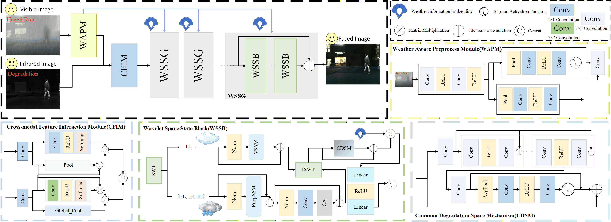
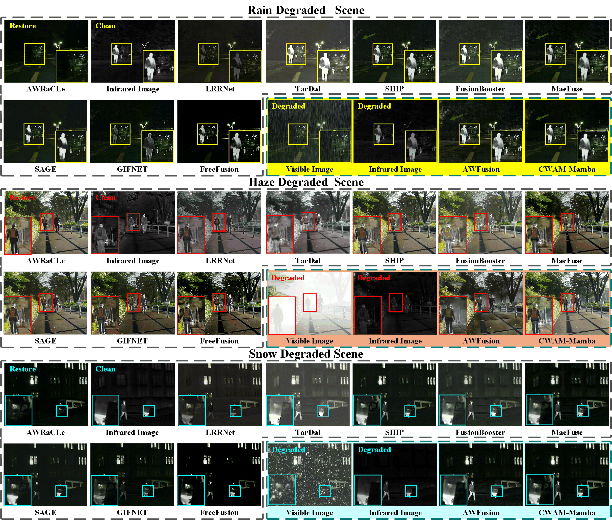
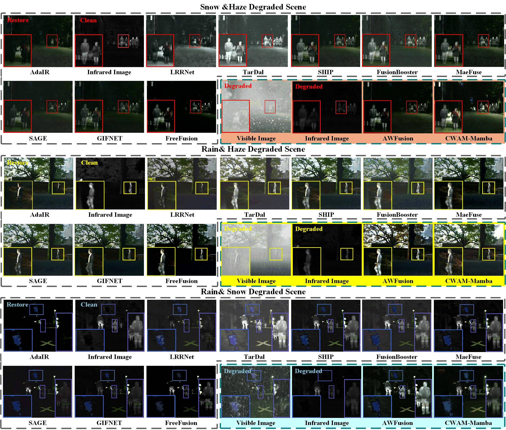
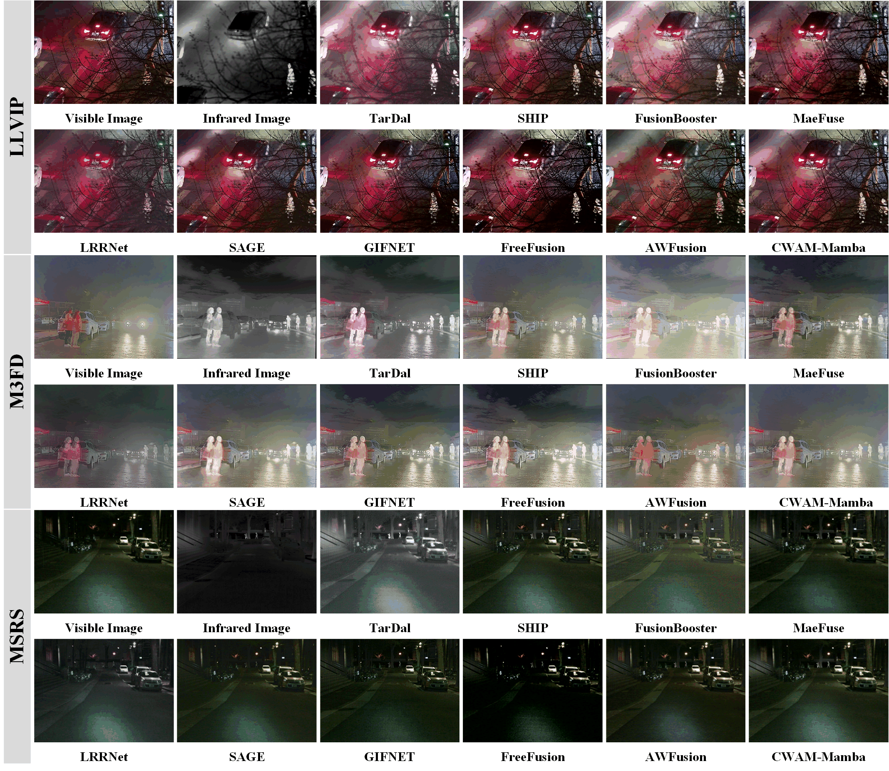
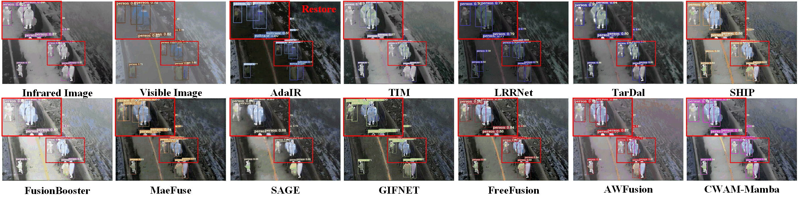
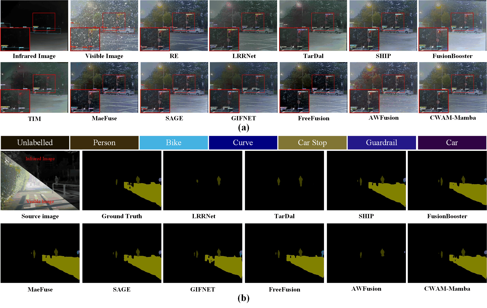

# CAWM-Mamba: Channel Attention Wavelet Mamba for Weather Image Fusion

[](https://arxiv.org/abs/2603.02560)
[](https://www.sciencedirect.com/science/article/abs/pii/S0957417426005786)
[](https://www.python.org/)
[](https://pytorch.org/)

> **Authors: Huichun Liu, Xiaosong Li, Zhuangfan Huang, Tao Ye, Yang Liu, Haishu Tan** 
>

This is the official PyTorch implementation of **CAWM-Mamba**, the first end-to-end framework that jointly performs image fusion and compound weather restoration. CAWM-Mamba integrates three key components: (1) **Weather-Aware Preprocess Module (WAPM)** to enhance degraded features; (2) **Cross-modal Feature Interaction Module (CFIM)** to facilitate modality alignment; and (3) **Wavelet Space State Block (WSSB)** to decouple multi-frequency degradations.

<p align="center">
  
</p>

## 📖 Abstract

Multimodal Image Fusion (MMIF) integrates complementary information from various modalities to produce clearer and more informative fused images. MMIF under adverse weather is particularly crucial in autonomous driving and UAV monitoring applications. However, existing adverse weather fusion methods generally only tackle single types of degradation such as haze, rain, or snow, and fail when multiple degradations coexist (e.g., haze&rain, rain&snow). To address this challenge, we propose **Compound Adverse Weather Mamba (CAWM-Mamba)**, the first end-to-end framework that jointly performs image fusion and compound weather restoration with unified shared weights. Our network contains three key components: (1) a **Weather-Aware Preprocess Module (WAPM)** to enhance degraded visible features and extract global weather embeddings; (2) a **Cross-modal Feature Interaction Module (CFIM)** to facilitate the alignment of heterogeneous modalities and exchange of complementary features across modalities; and (3) a **Wavelet Space State Block (WSSB)** that leverages wavelet-domain decomposition to decouple multi-frequency degradations. WSSB includes Freq-SSM, a module that models anisotropic high-frequency degradation without redundancy, and a unified degradation representation mechanism to further improve generalization across complex compound weather conditions. Extensive experiments on the AWMM-100K benchmark and three standard fusion datasets demonstrate that CAWM-Mamba consistently outperforms state-of-the-art methods in both compound and single-weather scenarios. In addition, our fusion results excel in downstream tasks covering semantic segmentation and object detection, confirming the practical value in real-world adverse weather perception.

## ✨ Highlights

- 🎯 **First End-to-End Framework**: Joint image fusion and compound weather restoration with unified shared weights
- 🌤️ **Weather-Aware Preprocess Module (WAPM)**: Enhances degraded visible features and extracts global weather embeddings
- 🔄 **Cross-modal Feature Interaction Module (CFIM)**: Facilitates alignment of heterogeneous modalities and exchange of complementary features
- 🌊 **Wavelet Space State Block (WSSB)**: Leverages wavelet-domain decomposition to decouple multi-frequency degradations
- 📡 **Freq-SSM**: Models anisotropic high-frequency degradation without redundancy
- 🎯 **Unified Degradation Representation**: Improves generalization across complex compound weather conditions
- 📊 **Comprehensive Evaluation**: Tested on AWMM-100K benchmark and three standard fusion datasets
- ⚡ **Superior Performance**: Outperforms SOTA methods in both compound and single-weather scenarios

## 🔥 Visual Results

### Single Weather Scenarios

<p align="center">
  
</p>

### Compound Weather Scenarios

<p align="center">
  
</p>

### Normal Fusion Performance

<p align="center">
  
</p>

### Real World Performance

<p align="center">
  
</p>

### Downstream Task Performance

<p align="center">
  
</p>

## 🌐 Overview

This project implements **CAWM-Mamba** (Compound Adverse Weather Mamba), the first end-to-end framework that jointly performs image fusion and compound weather restoration. The approach combines:
- **Weather-Aware Preprocess Module (WAPM)**: Enhances degraded visible features and extracts weather embeddings
- **Cross-modal Feature Interaction Module (CFIM)**: Aligns heterogeneous modalities and exchanges complementary features
- **Wavelet Space State Block (WSSB)**: Decouples multi-frequency degradations with Freq-SSM
- **Unified Degradation Representation**: Improves generalization across compound weather conditions

### Key Features
- Support for both **Single-weather** and **Compound-weather** image restoration
- End-to-end joint optimization of fusion and weather restoration
- Efficient inference with PyTorch
- Pre-trained models available for download

## 📊 Datasets

### Pre-Trained Models

| Source | Single Weather | Compound Weather |
|:---:|:---:|:---:|
| **☁️ Baidu Cloud** | [📥 Download](https://pan.baidu.com/s/1z6TTOF3MbocogfvyTPJXmQ?pwd=a528) <br> `pwd: a528` | [📥 Download](https://pan.baidu.com/s/14FIXzRgED-qYiZPmJENC2A?pwd=ui2u) <br> `pwd: ui2u` |

> 💡 **Tip**: Pre-trained models are available for quick inference and fine-tuning on your own datasets.

### Dataset Structure

Expected directory structure for training data:

```
datasets/all_weather/
├── ir/              # Infrared images
├── vi/              # Visible light images
├── gt_ir/           # Ground truth IR
└── gt_vi/           # Ground truth VI
```

## ⚙️ Installation

### Requirements
- Python >= 3.8
- PyTorch >= 1.9.0
- CUDA (for GPU acceleration)

### Dependencies

```bash
pip install torch torchvision
pip install timm einops
pip install pytorch-wavelets pywt
pip install mamba-ssm
```

### Setup

1. Clone the repository:
```bash
git clone https://github.com/yourusername/CAWM-Mamba.git
cd CAWM-Mamba
```

2. Install dependencies:
```bash
pip install -r requirements.txt  # if available
```

## 🚀 Usage

### Training

#### Single Modality Weather Fusion
```bash
python Single_weather_train.py \
    --ir_path /path/to/ir/images \
    --vi_path /path/to/vi/images \
    --gt_path /path/to/gt_vi \
    --gt_ir_path /path/to/gt_ir \
    --batch_size 32 \
    --epochs 100
```

#### Compound Weather Fusion
```bash
python compound_wetaher_train.py \
    --ir_path /path/to/ir/images \
    --vi_path /path/to/vi/images \
    --gt_path /path/to/gt_vi \
    --gt_ir_path /path/to/gt_ir \
    --batch_size 32 \
    --epochs 100
```

### Testing

#### Single Modality Test
```bash
python Single_weather_test.py \
    --model_path /path/to/checkpoint.pth \
    --image_path /path/to/test/images \
    --save_path ./results
```

#### Compound Weather Test
```bash
python Compound_weather_test.py \
    --model_path /path/to/checkpoint.pth \
    --image_path /path/to/test/images \
    --save_path ./results
```

## 📉 Loss Functions

The project uses a comprehensive multi-component fusion loss function (`fusion_loss_vif`) implemented in [losses/losses.py](losses/losses.py):

- **Intensity Loss** (`L_Inten`): Preserves intensity information from both modalities
- **Gradient Loss** (`L_Grad`): Maintains edge and structural details
- **SSIM Loss** (`L_SSIM`): Ensures structural similarity with source images
- **Color Loss** (`L_color2`): Preserves color information in RGB space
- **Perceptual Loss**: Deep feature-based perceptual quality using pretrained networks
- **Wavelet Loss** (`WaveletLoss`): Multi-scale frequency-domain analysis with learnable weights

The final loss is computed as a weighted combination of all components for optimal multi-modal image fusion.

## 📚 Citation

If you find this work useful, please cite:

```bibtex
@article{LIU2026131665,
  title={CAWM-Mamba: A unified model for infrared-visible image fusion and compound adverse weather restoration},
  author={Liu, Huichun and Li, Xiaosong and Huang, Zhuangfan and Ye, Tao and Liu, Yang and Tan, Haishu},
  journal={Expert Systems with Applications},
  volume={314},
  pages={131665},
  year={2026},
  doi={https://doi.org/10.1016/j.eswa.2026.131665},
  url={https://www.sciencedirect.com/science/article/pii/S0957417426005786}
}
```

**arXiv Preprint:** [https://arxiv.org/abs/2603.02560](https://arxiv.org/abs/2603.02560)

## 🤝 Contributing

Contributions are welcome! Please feel free to submit pull requests or open issues for bug reports and feature requests.

## 🙏 Acknowledgments

- Built with [PyTorch](https://pytorch.org/)
- Uses [Mamba SSM](https://github.com/state-spaces/mamba)
- Inspired by recent advances in state space models and image fusion

## 📧 Contact

For questions and inquiries, please contact:
- Email: Feecuin@163.com
- GitHub: [https://github.com/Feecuin/CAWM-Mamba](https://github.com/Feecuin/CAWM-Mamba)
- Issues: [GitHub Issues](https://github.com/Feecuin/CAWM-Mamba/issues)

---

Last Updated: March 2026
