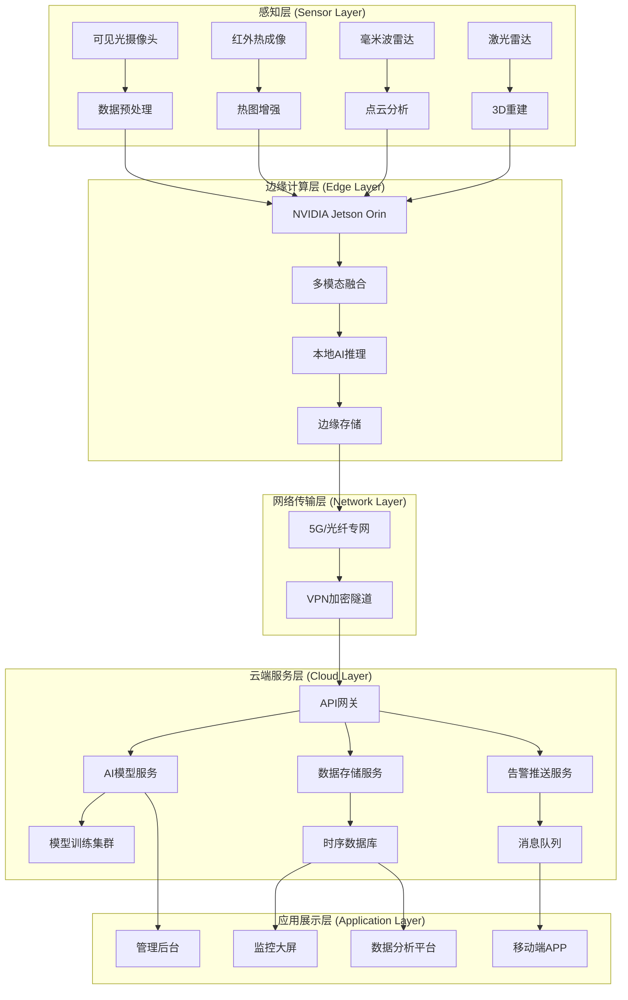

# 极境守护：极端天气环境下人体识别检测系统技术架构设计

**文档版本**: V2.0  
**生成日期**: 2026年03月18日  
**项目名称**: Polar Guard (极境守护)  
**技术负责人**: 陈晓东 高级架构师  
**文档状态**: 正式发布

---

## 文档介绍

本文档详细阐述了"极境守护"极端天气环境下人体识别检测系统的整体技术架构设计。系统旨在解决暴雨、大雪、浓雾、沙尘等恶劣天气条件下的人体识别难题，通过多模态传感器融合、自适应AI模型和边缘-云端协同计算，实现在极端环境下的高精度、高可靠人体检测。文档涵盖前后端技术栈、数据库设计、摄像头接入方案、模型部署策略、天气数据处理逻辑以及完整的系统部署方案。

<div style="background: linear-gradient(135deg, #0f172a 0%, #1e293b 100%); color: white; padding: 25px; border-radius: 8px; margin: 20px 0;">
<h2 style="color: white; text-align: center;">🌐 系统架构全景图</h2>
<div style="display: grid; grid-template-columns: repeat(auto-fit, minmax(280px, 1fr)); gap: 20px; margin-top: 20px;">
<div style="background-color: rgba(34, 211, 238, 0.15); border: 1px solid rgba(34, 211, 238, 0.3); padding: 20px; border-radius: 8px; text-align: center;">
<h4 style="color: #22d3ee; margin: 0 0 10px 0;">🔬 多模态传感层</h4>
<p style="color: #e2e8f0; font-size: 14px; margin: 0;">可见光/红外热成像/毫米波雷达/激光雷达四重传感器融合，确保全天候检测能力</p>
</div>
<div style="background-color: rgba(16, 185, 129, 0.15); border: 1px solid rgba(16, 185, 129, 0.3); padding: 20px; border-radius: 8px; text-align: center;">
<h4 style="color: #10b981; margin: 0 0 10px 0;">🤖 智能边缘层</h4>
<p style="color: #e2e8f0; font-size: 14px; margin: 0;">NVIDIA Jetson边缘计算单元，支持本地AI推理与天气自适应模型切换</p>
</div>
<div style="background-color: rgba(245, 158, 11, 0.15); border: 1px solid rgba(245, 158, 11, 0.3); padding: 20px; border-radius: 8px; text-align: center;">
<h4 style="color: #f59e0b; margin: 0 0 10px 0;">☁️ 云端服务层</h4>
<p style="color: #e2e8f0; font-size: 14px; margin: 0;">Kubernetes集群分布式部署，支持模型训练、数据分析和系统管理</p>
</div>
<div style="background-color: rgba(139, 92, 246, 0.15); border: 1px solid rgba(139, 92, 246, 0.3); padding: 20px; border-radius: 8px; text-align: center;">
<h4 style="color: #8b5cf6; margin: 0 0 10px 0;">📊 决策应用层</h4>
<p style="color: #e2e8f0; font-size: 14px; margin: 0;">实时监控大屏、移动端告警、管理后台三位一体的应用体系</p>
</div>
</div>
</div>

## 一、 整体架构概述

### 1.1 架构设计原则

<div style="background-color: #d1ecf1; border-left: 5px solid #0c5460; padding: 15px; border-radius: 4px; margin: 20px 0;">
<h4 style="color: #0c5460; margin-top: 0;">🎯 核心设计原则</h4>
<ol style="color: #0c5460;">
<li><strong>鲁棒性优先</strong>：系统在极端天气条件下必须保持稳定运行，设计容忍单点故障</li>
<li><strong>实时性要求</strong>：从图像采集到告警推送，端到端延迟需控制在500ms以内</li>
<li><strong>可扩展性</strong>：支持从单摄像头到城市级大规模部署的无缝扩展</li>
<li><strong>安全性保障</strong>：符合ISO 27001信息安全管理体系，数据全链路加密</li>
<li><strong>智能自适应</strong>：根据实时天气条件自动调整检测策略和模型参数</li>
</ol>
</div>

### 1.2 系统分层架构



### 1.3 关键技术指标

| 指标类别 | 具体指标 | 目标值 | 测量方法 |
|---------|---------|--------|---------|
| **检测性能** | 晴天识别准确率 | ≥99.5% | 标准测试集评估 |
| | 暴雨天气识别率 | ≥95% | 模拟暴雨环境测试 |
| | 大雪天气识别率 | ≥94% | 模拟降雪环境测试 |
| | 浓雾天气识别率 | ≥92% | 模拟能见度<50m测试 |
| **实时性能** | 单帧处理时间 | <100ms | 从采集到结果输出 |
| | 端到端延迟 | <500ms | 从检测到告警推送 |
| | 系统吞吐量 | ≥100FPS/节点 | 多路视频并发处理 |
| **可靠性** | 系统可用性 | 99.99% | 年停机时间<53分钟 |
| | 数据完整性 | 100% | 端到端校验机制 |
| | 故障恢复时间 | <5分钟 | 自动故障转移 |
| **可扩展性** | 单集群支持摄像头 | ≥1000路 | 水平扩展测试 |
| | 模型热更新时间 | <30秒 | 边缘节点全量更新 |

## 二、 前端技术架构

### 2.1 技术栈选型

<div style="background-color: #f8f9fa; border: 1px solid #e9ecef; padding: 20px; border-radius: 8px; margin: 20px 0;">
<h4 style="color: #333; margin-top: 0;">🖥️ 前端技术栈决策矩阵</h4>

| 技术组件 | 选型理由 | 版本 | 关键特性 |
|---------|---------|------|---------|
| **框架** | Vue 3 + TypeScript | 3.4+ | Composition API、TypeScript支持、更好的性能 |
| **UI组件库** | Element Plus | 2.3+ | 丰富的组件、良好的可定制性、企业级支持 |
| **状态管理** | Pinia | 2.1+ | 轻量级、TypeScript友好、模块化设计 |
| **路由管理** | Vue Router 4 | 4.2+ | 动态路由、路由守卫、懒加载支持 |
| **HTTP客户端** | Axios + 拦截器 | 1.6+ | 请求拦截、响应拦截、自动重试机制 |
| **图表库** | ECharts 5 | 5.4+ | 高性能渲染、丰富的图表类型、3D支持 |
| **地图组件** | Mapbox GL JS | 3.0+ | 矢量切片、高性能渲染、3D地形支持 |
| **实时通信** | Socket.IO Client | 4.7+ | WebSocket封装、自动重连、房间管理 |
| **构建工具** | Vite 5 | 5.0+ | 极速热更新、原生ESM支持、插件生态 |
| **代码规范** | ESLint + Prettier | 最新 | 代码质量保证、团队协作统一 |

</div>

### 2.2 前端应用架构

#### 2.2.1 多应用分离架构

```
polar-guard-frontend/
├── apps/
│   ├── monitor-center/           # 监控中心大屏应用
│   │   ├── src/
│   │   │   ├── components/       # 大屏专用组件
│   │   │   ├── views/           # 大屏页面
│   │   │   ├── utils/           # 工具函数
│   │   │   └── main.ts          # 应用入口
│   │   └── vite.config.ts
│   │
│   ├── management-console/       # 管理后台应用
│   │   ├── src/
│   │   │   ├── layouts/         # 布局组件
│   │   │   ├── router/          # 路由配置
│   │   │   ├── stores/          # 状态管理
│   │   │   ├── api/             # API接口
│   │   │   ├── views/           # 页面组件
│   │   │   └── main.ts
│   │   └── vite.config.ts
│   │
│   └── mobile-app/              # 移动端应用（可选）
│       ├── src/
│       └── vite.config.ts
│
├── packages/                    # 共享包
│   ├── ui-components/          # 通用UI组件库
│   ├── utils/                  # 工具函数库
│   ├── api-client/             # API客户端SDK
│   └── types/                  # TypeScript类型定义
│
├── pnpm-workspace.yaml         # pnpm工作区配置
└── package.json
```

#### 2.2.2 监控中心大屏设计

<div style="background-color: #1a202c; color: white; padding: 20px; border-radius: 8px; margin: 20px 0;">
<h4 style="color: white; margin-top: 0;">📺 监控大屏核心组件设计</h4>

**布局采用响应式栅格系统，支持4K大屏显示：**

1. **顶部状态栏**
   - 系统时间与天气信息实时显示
   - 全局告警级别指示器（绿/黄/红）
   - 在线摄像头统计与健康状态

2. **左侧地图面板**
   - Mapbox GL JS实现的高性能矢量地图
   - 摄像头位置热力图与分布图
   - 实时告警位置标记与轨迹追踪

3. **中央视频墙**
   - 支持4×4、3×3、2×2多种布局
   - 画中画模式显示告警详情
   - 视频流自适应码率切换

4. **右侧数据面板**
   - ECharts实现的实时数据仪表盘
   - 检测统计趋势图（24小时/7天/30天）
   - 天气影响分析图表

5. **底部控制栏**
   - 快速筛选与搜索功能
   - 预案执行与应急响应按钮
   - 系统设置快捷入口
</div>

#### 2.2.3 管理后台功能模块

```javascript
// 路由配置示例 - 基于RBAC权限控制
const routes = [
  {
    path: '/',
    component: Layout,
    children: [
      {
        path: 'dashboard',
        name: 'Dashboard',
        component: () => import('@/views/dashboard/index.vue'),
        meta: { title: '仪表盘', icon: 'dashboard', requiresAuth: true }
      },
      {
        path: 'cameras',
        name: 'CameraManagement',
        component: () => import('@/views/camera/index.vue'),
        meta: { title: '摄像头管理', icon: 'video-camera', requiresAuth: true, permission: 'camera:view' }
      },
      {
        path: 'detection',
        name: 'DetectionHistory',
        component: () => import('@/views/detection/index.vue'),
        meta: { title: '检测历史', icon: 'search', requiresAuth: true, permission: 'detection:view' }
      },
      {
        path: 'models',
        name: 'ModelManagement',
        component: () => import('@/views/model/index.vue'),
        meta: { title: '模型管理', icon: 'ai', requiresAuth: true, permission: 'model:manage' }
      },
      {
        path: 'weather',
        name: 'WeatherAnalysis',
        component: () => import('@/views/weather/index.vue'),
        meta: { title: '天气分析', icon: 'cloud', requiresAuth: true, permission: 'weather:view' }
      },
      {
        path: 'system',
        name: 'SystemSettings',
        component: () => import('@/views/system/index.vue'),
        meta: { title: '系统设置', icon: 'setting', requiresAuth: true, permission: 'system:manage' },
        children: [
          { path: 'users', name: 'UserManagement', component: () => import('@/views/system/user.vue'), meta: { permission: 'user:manage' } },
          { path: 'logs', name: 'OperationLogs', component: () => import('@/views/system/log.vue'), meta: { permission: 'log:view' } },
          { path: 'alerts', name: 'AlertSettings', component: () => import('@/views/system/alert.vue'), meta: { permission: 'alert:manage' } }
        ]
      }
    ]
  }
]
```

### 2.3 前端性能优化策略

<div style="background-color: #fff3cd; border-left: 5px solid #ffc107; padding: 15px; border-radius: 4px; margin: 20px 0;">
<h4 style="color: #856404; margin-top: 0;">⚡ 前端性能优化要点</h4>

1. **代码分割与懒加载**
   ```javascript
   // 路由级代码分割
   const CameraManagement = () => import('./views/camera/index.vue')
   
   // 组件级懒加载
   const HeavyChart = defineAsyncComponent(() =>
     import('./components/HeavyChart.vue')
   )
   ```

2. **虚拟滚动与分页**
   - 检测历史列表使用虚拟滚动技术
   - 大图库采用分页加载 + 图片懒加载

3. **WebSocket连接优化**
   ```javascript
   // 智能重连机制
   const socket = io(SOCKET_URL, {
     reconnection: true,
     reconnectionAttempts: 10,
     reconnectionDelay: 1000,
     reconnectionDelayMax: 5000,
     timeout: 20000
   })
   ```

4. **资源预加载与缓存**
   - 关键路由预加载
   - Service Worker实现离线缓存
   - CDN加速静态资源

5. **监控大屏GPU加速**
   ```css
   .video-wall {
     transform: translateZ(0);
     backface-visibility: hidden;
     perspective: 1000px;
   }
   ```
</div>

## 三、 后端技术架构

### 3.1 后端技术栈选型

<div style="display: grid; grid-template-columns: repeat(auto-fit, minmax(250px, 1fr)); gap: 15px; margin: 20px 0;">
<div style="background-color: rgba(59, 130, 246, 0.1); border-left: 4px solid #3b82f6; padding: 15px; border-radius: 6px;">
<h4 style="color: #3b82f6; margin: 0 0 8px 0;">🚀 核心框架</h4>
<ul style="margin: 0; padding-left: 20px; font-size: 14px;">
<li><strong>FastAPI 0.104+</strong> - 高性能异步Web框架</li>
<li><strong>Uvicorn</strong> - ASGI服务器</li>
<li><strong>Pydantic 2.0+</strong> - 数据验证与序列化</li>
</ul>
</div>
<div style="background-color: rgba(16, 185, 129, 0.1); border-left: 4px solid #10b981; padding: 15px; border-radius: 6px;">
<h4 style="color: #10b981; margin: 0 0 8px 0;">🗄️ 数据库与存储</h4>
<ul style="margin: 0; padding-left: 20px; font-size: 14px;">
<li><strong>PostgreSQL 15+</strong> - 主关系数据库</li>
<li><strong>Redis 7+</strong> - 缓存与会话存储</li>
<li><strong>TimescaleDB</strong> - 时序数据扩展</li>
<li><strong>MinIO</strong> - 对象存储（图片/视频）</li>
</ul>
</div>
<div style="background-color: rgba(245, 158, 11, 0.1); border-left: 4px solid #f59e0b; padding: 15px; border-radius: 6px;">
<h4 style="color: #f59e0b; margin: 0 0 8px 0;">🔐 安全与认证</h4>
<ul style="margin: 0; padding-left: 20px; font-size: 14px;">
<li><strong>JWT + OAuth2</strong> - API认证</li>
<li><strong>bcrypt</strong> - 密码哈希</li>
<li><strong>Fernet</strong> - 敏感数据加密</li>
<li><strong>RBAC</strong> - 基于角色的访问控制</li>
</ul>
</div>
<div style="background-color: rgba(239, 68, 68, 0.1); border-left: 4px solid #ef4444; padding: 15px; border-radius: 6px;">
<h4 style="color: #ef4444; margin: 0 0 8px 0;">🔧 消息与任务队列</h4>
<ul style="margin: 0; padding-left: 20px; font-size: 14px;">
<li><strong>Celery 5+</strong> - 分布式任务队列</li>
<li><strong>RabbitMQ</strong> - 消息代理</li>
<li><strong>WebSocket</strong> - 实时通信</li>
</ul>
</div>
</div>

### 3.2 微服务架构设计

#### 3.2.1 服务拆分策略

```
polar-guard-backend/
├── api-gateway/                    # API网关服务
│   ├── src/
│   │   ├── middlewares/           # 中间件（限流、认证、日志）
│   │   ├── routes/                # 路由转发
│   │   └── main.py
│   └── Dockerfile
│
├── auth-service/                   # 认证服务
│   ├── src/
│   │   ├── models/                # 用户模型
│   │   ├── services/              # 认证逻辑
│   │   ├── api/                   # 认证API
│   │   └── main.py
│   └── Dockerfile
│
├── camera-service/                 # 摄像头管理服务
│   ├── src/
│   │   ├── models/                # 摄像头模型
│   │   ├── services/              # 摄像头管理
│   │   ├── api/                   # 摄像头API
│   │   └── main.py
│   └── Dockerfile
│
├── detection-service/              # 检测服务
│   ├── src/
│   │   ├── models/                # 检测模型
│   │   ├── ml/                    # 机器学习模块
│   │   ├── services/              # 检测逻辑
│   │   ├── api/                   # 检测API
│   │   └── main.py
│   └── Dockerfile
│
├── model-service/                  # 模型管理服务
│   ├── src/
│   │   ├── models/                # AI模型
│   │   ├── services/              # 模型管理
│   │   ├── api/                   # 模型API
│   │   └── main.py
│   └── Dockerfile
│
├── weather-service/                # 天气服务
│   ├── src/
│   │   ├── models/                # 天气模型
│   │   ├── services/              # 天气处理
│   │   ├── api/                   # 天气API
│   │   └── main.py
│   └── Dockerfile
│
├── alert-service/                  # 告警服务
│   ├── src/
│   │   ├── models/                # 告警模型
│   │   ├── services/              # 告警逻辑
│   │   ├── api/                   # 告警API
│   │   └── main.py
│   └── Dockerfile
│
└── docker-compose.yml              # 服务编排
```

#### 3.2.2 服务间通信机制

<div style="background-color: #e8f4fd; border: 1px solid #b6d4fe; padding: 20px; border-radius: 8px; margin: 20px 0;">
<h4 style="color: #0c5460; margin-top: 0;">🔄 微服务通信设计</h4>

**1. 同步通信（RESTful API）**
```python
# 使用HTTPX进行服务间调用
import httpx

async def get_camera_info(camera_id: int):
    async with httpx.AsyncClient() as client:
        response = await client.get(
            f"http://camera-service:8000/api/v1/cameras/{camera_id}",
            timeout=10.0
        )
        return response.json()
```

**2. 异步通信（消息队列）**
```python
# Celery任务定义
from celery import Celery

app = Celery('detection_tasks', broker='pyamqp://guest@rabbitmq//')

@app.task
def process_detection_batch(image_batch):
    """批量处理检测任务"""
    # 调用检测服务
    return detection_service.process_batch(image_batch)
```

**3. 事件驱动架构**
```python
# 使用Redis Pub/Sub进行事件广播
import redis.asyncio as redis

async def publish_detection_event(detection_data):
    redis_client = redis.from_url(REDIS_URL)
    await redis_client.publish(
        'detection_events',
        json.dumps(detection_data)
    )
```

**4. 服务发现与负载均衡**
- **Consul**：服务注册与发现
- **Traefik**：动态负载均衡
- **健康检查**：每30秒心跳检测
</div>

### 3.3 核心服务实现

#### 3.3.1 检测服务核心逻辑

```python
# detection-service/src/services/advanced_detection.py
import torch
import torchvision
import cv2
import numpy as np
from typing import List, Dict, Optional
from dataclasses import dataclass
from enum import Enum
import asyncio

class WeatherCondition(Enum):
    CLEAR = "clear"
    RAIN = "rain"
    SNOW = "snow"
    FOG = "fog"
    DUST = "dust"
    EXTREME = "extreme"

@dataclass
class DetectionConfig:
    """检测配置参数"""
    confidence_threshold: float = 0.5
    nms_threshold: float = 0.4
    max_detections: int = 100
    input_size: tuple = (640, 480)
    use_fp16: bool = True
    enable_tensorrt: bool = False

class AdvancedDetectionService:
    """高级检测服务 - 支持极端天气条件"""
    
    def __init__(self, config: DetectionConfig):
        self.config = config
        self.device = self._get_device()
        self.models = self._load_weather_models()
        self.preprocessors = self._create_preprocessors()
        
    def _get_device(self):
        """获取最优计算设备"""
        if torch.cuda.is_available():
            return torch.device("cuda")
        elif hasattr(torch.backends, 'mps') and torch.backends.mps.is_available():
            return torch.device("mps")
        else:
            return torch.device("cpu")
    
    def _load_weather_models(self) -> Dict[WeatherCondition, torch.nn.Module]:
        """加载天气特定模型"""
        models = {}
        
        for condition in WeatherCondition:
            try:
                model_path = f"models/{condition.value}/model.pt"
                if condition == WeatherCondition.CLEAR:
                    # 基础模型
                    model = torchvision.models.detection.fasterrcnn_resnet50_fpn(
                        pretrained=True,
                        box_detections_per_img=self.config.max_detections
                    )
                else:
                    # 天气优化模型
                    model = self._create_weather_specific_model(condition)
                
                model.to(self.device)
                model.eval()
                
                # 优化推理速度
                if self.config.use_fp16 and self.device.type == "cuda":
                    model.half()
                
                models[condition] = model
                
            except Exception as e:
                print(f"加载{condition.value}模型失败: {e}")
                continue
        
        return models
    
    def _create_weather_specific_model(self, condition: WeatherCondition):
        """创建天气特定模型结构"""
        if condition == WeatherCondition.RAIN:
            # 雨滴鲁棒性增强模型
            return self._create_rain_robust_model()
        elif condition == WeatherCondition.SNOW:
            # 雪天对比度增强模型
            return self._create_snow_enhanced_model()
        elif condition == WeatherCondition.FOG:
            # 雾天去雾模型
            return self._create_fog_removal_model()
        elif condition == WeatherCondition.DUST:
            # 沙尘红外增强模型
            return self._create_dust_resistant_model()
        else:
            # 极端天气融合模型
            return self._create_extreme_fusion_model()
    
    async def detect(
        self,
        image: np.ndarray,
        weather: WeatherCondition = WeatherCondition.CLEAR,
        use_multimodal: bool = False,
        thermal_data: Optional[np.ndarray] = None,
        radar_data: Optional[Dict] = None
    ) -> List[Dict]:
        """执行检测（支持多模态）"""
        
        # 选择模型
        model = self.models.get(weather, self.models[WeatherCondition.CLEAR])
        
        # 预处理
        processed_image = self.preprocessors[weather](image)
        
        # 多模态融合
        if use_multimodal and (thermal_data is not None or radar_data is not None):
            return await self._multimodal_detection(
                processed_image, thermal_data, radar_data, weather
            )
        
        # 单模态检测
        return self._single_modal_detection(processed_image, model)
    
    async def _multimodal_detection(
        self,
        visible_image: np.ndarray,
        thermal_data: Optional[np.ndarray],
        radar_data: Optional[Dict],
        weather: WeatherCondition
    ) -> List[Dict]:
        """多模态融合检测"""
        
        detection_tasks = []
        
        # 可见光检测
        visible_task = asyncio.create_task(
            self._detect_visible(visible_image, weather)
        )
        detection_tasks.append(visible_task)
        
        # 热成像检测
        if thermal_data is not None:
            thermal_task = asyncio.create_task(
                self._detect_thermal(thermal_data, weather)
            )
            detection_tasks.append(thermal_task)
        
        # 雷达检测
        if radar_data is not None:
            radar_task = asyncio.create_task(
                self._detect_radar(radar_data)
            )
            detection_tasks.append(radar_task)
        
        # 并行执行所有检测
        results = await asyncio.gather(*detection_tasks, return_exceptions=True)
        
        # 融合检测结果
        fused_detections = self._fuse_detections(results)
        
        return fused_detections
    
    def _fuse_detections(self, detection_results: List[List[Dict]]) -> List[Dict]:
        """融合多传感器检测结果"""
        # 基于置信度加权投票的融合算法
        fused = []
        
        # 收集所有检测框
        all_detections = []
        for sensor_detections in detection_results:
            if isinstance(sensor_detections, Exception):
                continue
            all_detections.extend(sensor_detections)
        
        if not all_detections:
            return fused
        
        # 基于IoU的检测框聚类
        clusters = self._cluster_detections_by_iou(all_detections)
        
        # 对每个聚类进行融合
        for cluster in clusters:
            if not cluster:
                continue
            
            # 计算融合后的检测框
            fused_box = self._compute_fused_box(cluster)
            
            # 计算融合置信度
            fused_confidence = self._compute_fused_confidence(cluster)
            
            # 计算传感器权重
            sensor_weights = self._compute_sensor_weights(cluster)
            
            if fused_confidence > self.config.confidence_threshold:
                fused.append({
                    "bbox": fused_box,
                    "confidence": fused_confidence,
                    "class_name": "person",
                    "sensor_weights": sensor_weights,
                    "cluster_size": len(cluster),
                    "is_fused": True
                })
        
        return fused
```

#### 3.3.2 天气自适应处理流水线

```python
# detection-service/src/services/weather_adaptation.py
class WeatherAdaptationPipeline:
    """天气自适应处理流水线"""
    
    def __init__(self):
        self.weather_classifier = self._load_weather_classifier()
        self.image_enhancers = self._create_enhancement_pipelines()
        self.model_selector = ModelSelector()
    
    def process_frame(
        self,
        frame: np.ndarray,
        sensor_metadata: Dict,
        previous_weather: Optional[WeatherCondition] = None
    ) -> ProcessedFrame:
        """处理单帧图像"""
        
        # 1. 天气条件分类
        weather_condition = self._classify_weather(
            frame, sensor_metadata, previous_weather
        )
        
        # 2. 图像增强
        enhanced_frame = self._enhance_for_weather(frame, weather_condition)
        
        # 3. 模型选择
        detection_model = self.model_selector.select_model(weather_condition)
        
        # 4. 参数调整
        detection_params = self._adjust_parameters(weather_condition)
        
        return ProcessedFrame(
            original=frame,
            enhanced=enhanced_frame,
            weather=weather_condition,
            model=detection_model,
            params=detection_params
        )
    
    def _classify_weather(
        self,
        frame: np.ndarray,
        metadata: Dict,
        previous: Optional[WeatherCondition]
    ) -> WeatherCondition:
        """基于图像和传感器数据分类天气"""
        
        classification_methods = [
            self._classify_by_image_features,
            self._classify_by_sensor_data,
            self._classify_by_temporal_consistency
        ]
        
        # 多方法投票
        predictions = []
        weights = []
        
        for method in classification_methods:
            try:
                pred, confidence = method(frame, metadata, previous)
                predictions.append(pred)
                weights.append(confidence)
            except Exception:
                continue
        
        if not predictions:
            return WeatherCondition.CLEAR
        
        # 加权投票
        weighted_votes = {}
        for pred, weight in zip(predictions, weights):
            weighted_votes[pred] = weighted_votes.get(pred, 0) + weight
        
        # 选择得票最高的天气条件
        return max(weighted_votes.items(), key=lambda x: x[1])[0]
    
    def _classify_by_image_features(
        self,
        frame: np.ndarray,
        metadata: Dict,
        previous: WeatherCondition
    ) -> Tuple[WeatherCondition, float]:
        """基于图像特征分类天气"""
        
        # 提取图像特征
        features = self._extract_weather_features(frame)
        
        # 计算与各天气类别的相似度
        similarities = {}
        
        for condition in WeatherCondition:
            # 计算特征相似度
            similarity = self._compute_feature_similarity(
                features, condition
            )
            
            # 考虑时间连续性
            if previous and condition == previous:
                similarity *= 1.2  # 增加连续性权重
            
            similarities[condition] = similarity
        
        # 选择最相似的天气
        best_condition = max(similarities.items(), key=lambda x: x[1])[0]
        confidence = similarities[best_condition]
        
        return best_condition, confidence
    
    def _enhance_for_weather(
        self,
        frame: np.ndarray,
        weather: WeatherCondition
    ) -> np.ndarray:
        """根据天气条件增强图像"""
        
        enhancement_pipeline = self.image_enhancers.get(
            weather, self.image_enhancers[WeatherCondition.CLEAR]
        )
        
        return enhancement_pipeline(frame)
    
    def _create_enhancement_pipelines(self) -> Dict[WeatherCondition, callable]:
        """创建天气特定的增强流水线"""
        
        pipelines = {}
        
        # 晴天增强
        pipelines[WeatherCondition.CLEAR] = lambda img: self._enhance_clear(img)
        
        # 雨天增强
        pipelines[WeatherCondition.RAIN] = lambda img: self._enhance_rain(img)
        
        # 雪天增强
        pipelines[WeatherCondition.SNOW] = lambda img: self._enhance_snow(img)
        
        # 雾天增强
        pipelines[WeatherCondition.FOG] = lambda img: self._enhance_fog(img)
        
        # 沙尘增强
        pipelines[WeatherCondition.DUST] = lambda img: self._enhance_dust(img)
        
        # 极端天气增强
        pipelines[WeatherCondition.EXTREME] = lambda img: self._enhance_extreme(img)
        
        return pipelines
    
    def _enhance_rain(self, image: np.ndarray) -> np.ndarray:
        """雨滴去除与对比度增强"""
        # 1. 中值滤波去除雨滴
        denoised = cv2.medianBlur(image, 3)
        
        # 2. 导向滤波边缘保持
        guided = cv2.ximgproc.guidedFilter(
            guide=denoised,
            src=denoised,
            radius=2,
            eps=0.01
        )
        
        # 3. CLAHE增强对比度
        lab = cv2.cvtColor(guided, cv2.COLOR_BGR2LAB)
        l, a, b = cv2.split(lab)
        clahe = cv2.createCLAHE(clipLimit=2.0, tileGridSize=(8, 8))
        l = clahe.apply(l)
        enhanced_lab = cv2.merge([l, a, b])
        
        return cv2.cvtColor(enhanced_lab, cv2.COLOR_LAB2BGR)
    
    def _enhance_snow(self, image: np.ndarray) -> np.ndarray:
        """雪天白色背景增强"""
        # 1. 色彩空间转换到YCrCb
        ycrcb = cv2.cvtColor(image, cv2.COLOR_BGR2YCrCb)
        y, cr, cb = cv2.split(ycrcb)
        
        # 2. Y通道直方图均衡化
        y_eq = cv2.equalizeHist(y)
        
        # 3. 减少蓝色通道（雪天偏蓝）
        hsv = cv2.cvtColor(image, cv2.COLOR_BGR2HSV)
        h, s, v = cv2.split(hsv)
        s = cv2.multiply(s, 1.2)  # 增加饱和度
        v = cv2.multiply(v, 1.1)  # 增加亮度
        enhanced_hsv = cv2.merge([h, s, v])
        
        enhanced_bgr = cv2.cvtColor(enhanced_hsv, cv2.COLOR_HSV2BGR)
        
        return enhanced_bgr
    
    def _enhance_fog(self, image: np.ndarray) -> np.ndarray:
        """雾天去雾增强"""
        # 暗通道先验去雾算法
        dark_channel = self._compute_dark_channel(image, 15)
        atmospheric_light = self._estimate_atmospheric_light(image, dark_channel)
        
        # 估计透射率
        transmission = self._estimate_transmission(
            image, atmospheric_light, 0.95, 15
        )
        
        # 去雾恢复
        result = np.zeros_like(image, dtype=np.float32)
        for i in range(3):
            result[:, :, i] = (
                image[:, :, i].astype(np.float32) - atmospheric_light
            ) / np.maximum(transmission, 0.1) + atmospheric_light
        
        result = np.clip(result, 0, 255).astype(np.uint8)
        
        # 后续对比度增强
        result = self._enhance_contrast(result)
        
        return result
```

## 四、 数据库设计

### 4.1 数据库架构选型

<div style="background-color: #f8f9fa; border: 1px solid #e9ecef; padding: 20px; border-radius: 8px; margin: 20px 0;">
<h4 style="color: #333; margin-top: 0;">🗄️ 多数据库混合架构</h4>

| 数据库类型 | 选用产品 | 存储数据 | 读写特点 | 扩展策略 |
|-----------|---------|---------|---------|---------|
| **关系数据库** | PostgreSQL 15 | 用户信息、设备配置、权限管理 | 强一致性、事务支持 | 读写分离、分库分表 |
| **时序数据库** | TimescaleDB | 检测记录、传感器数据、性能指标 | 高频写入、时间范围查询 | 自动分区、压缩存储 |
| **文档数据库** | MongoDB 6 | 非结构化配置、日志分析、模型参数 | 灵活模式、复杂查询 | 副本集、分片集群 |
| **键值存储** | Redis 7 | 会话缓存、实时状态、消息队列 | 超低延迟、高并发 | 集群模式、持久化 |
| **对象存储** | MinIO | 图像视频文件、模型文件、备份 | 大文件存储、高吞吐 | 分布式部署、纠删码 |
| **图数据库** | Neo4j 5 | 设备拓扑、告警传播、关系分析 | 复杂关系查询 | 因果集群 |

</div>

### 4.2 核心数据表设计

#### 4.2.1 PostgreSQL主数据库设计

```sql
-- 用户与权限管理
CREATE TABLE users (
    id SERIAL PRIMARY KEY,
    username VARCHAR(50) UNIQUE NOT NULL,
    email VARCHAR(100) UNIQUE NOT NULL,
    hashed_password VARCHAR(255) NOT NULL,
    full_name VARCHAR(100),
    employee_id VARCHAR(20) UNIQUE,
    
    -- 生物识别信息
    biometric_enabled BOOLEAN DEFAULT FALSE,
    fingerprint_hash VARCHAR(255),
    facial_vector JSONB,
    
    -- 权限信息
    role VARCHAR(20) DEFAULT 'monitor',
    permissions JSONB DEFAULT '[]',
    
    -- 状态信息
    is_active BOOLEAN DEFAULT TRUE,
    is_superuser BOOLEAN DEFAULT FALSE,
    
    -- 时间戳
    created_at TIMESTAMPTZ DEFAULT CURRENT_TIMESTAMP,
    updated_at TIMESTAMPTZ DEFAULT CURRENT_TIMESTAMP,
    
    -- 索引
    INDEX idx_users_username (username),
    INDEX idx_users_email (email),
    INDEX idx_users_role (role)
);

-- 摄像头设备表
CREATE TABLE cameras (
    id SERIAL PRIMARY KEY,
    serial_number VARCHAR(50) UNIQUE NOT NULL,
    name VARCHAR(100) NOT NULL,
    ip_address INET,
    location VARCHAR(255),
    
    -- 地理信息
    latitude DECIMAL(10, 8),
    longitude DECIMAL(11, 8),
    altitude DECIMAL(8, 2),
    
    -- 设备规格
    camera_type VARCHAR(20) NOT NULL,  -- visible, thermal, radar, lidar
    resolution VARCHAR(20),
    fps INTEGER DEFAULT 30,
    protection_level VARCHAR(10),  -- IP67, IP69K
    temperature_range VARCHAR(50),  -- -20~60℃
    
    -- 网络配置
    stream_url VARCHAR(500),
    rtsp_url VARCHAR(500),
    api_endpoint VARCHAR(500),
    
    -- 状态信息
    is_online BOOLEAN DEFAULT FALSE,
    health_status VARCHAR(20) DEFAULT 'unknown',
    last_ping TIMESTAMPTZ,
    firmware_version VARCHAR(20),
    
    -- AI配置
    weather_mode VARCHAR(20) DEFAULT 'auto',
    ai_enabled BOOLEAN DEFAULT TRUE,
    model_version VARCHAR(20),
    confidence_threshold DECIMAL(3, 2) DEFAULT 0.5,
    
    -- 存储配置
    storage_days INTEGER DEFAULT 30,
    storage_path VARCHAR(500),
    
    -- 关联关系
    owner_id INTEGER REFERENCES users(id) ON DELETE SET NULL,
    group_id INTEGER REFERENCES camera_groups(id),
    
    -- 时间戳
    created_at TIMESTAMPTZ DEFAULT CURRENT_TIMESTAMP,
    updated_at TIMESTAMPTZ DEFAULT CURRENT_TIMESTAMP,
    
    -- 索引
    INDEX idx_cameras_serial (serial_number),
    INDEX idx_cameras_location (location),
    INDEX idx_cameras_online (is_online),
    INDEX idx_cameras_owner (owner_id)
);

-- AI模型管理表
CREATE TABLE ai_models (
    id SERIAL PRIMARY KEY,
    name VARCHAR(100) NOT NULL,
    version VARCHAR(20) NOT NULL,
    model_type VARCHAR(20) NOT NULL,  -- rain, snow, fog, general, fusion
    framework VARCHAR(20) NOT NULL,  -- pytorch, tensorflow, onnx
    
    -- 文件信息
    model_path VARCHAR(500) NOT NULL,
    config_path VARCHAR(500),
    weights_hash CHAR(64) NOT NULL,  -- SHA256
    
    -- 性能指标
    accuracy DECIMAL(4, 3),
    precision DECIMAL(4, 3),
    recall DECIMAL(4, 3),
    f1_score DECIMAL(4, 3),
    inference_time DECIMAL(6, 2),  -- 毫秒
    model_size DECIMAL(8, 2),  -- MB
    
    -- 适用条件
    weather_conditions JSONB DEFAULT '[]',
    min_visibility INTEGER,  -- 米
    temperature_range JSONB,  -- {"min": -20, "max": 60}
    humidity_range JSONB,  -- {"min": 0, "max": 100}
    
    -- 部署状态
    is_active BOOLEAN DEFAULT FALSE,
    is_edge_compatible BOOLEAN DEFAULT TRUE,
    deployment_date TIMESTAMPTZ,
    
    -- 统计信息
    total_inferences BIGINT DEFAULT 0,
    successful_detections BIGINT DEFAULT 0,
    false_positives BIGINT DEFAULT 0,
    
    -- 元数据
    description TEXT,
    author VARCHAR(100),
    created_at TIMESTAMPTZ DEFAULT CURRENT_TIMESTAMP,
    updated_at TIMESTAMPTZ DEFAULT CURRENT_TIMESTAMP,
    
    -- 复合唯一索引
    UNIQUE(name, version),
    
    -- 其他索引
    INDEX idx_models_type (model_type),
    INDEX idx_models_active (is_active)
);
```

#### 4.2.2 TimescaleDB时序数据表设计

```sql
-- 创建超表（检测记录）
CREATE TABLE detection_records (
    time TIMESTAMPTZ NOT NULL,
    camera_id INTEGER NOT NULL,
    detection_id UUID NOT NULL,
    
    -- 检测信息
    detection_type VARCHAR(20) NOT NULL,  -- human, vehicle, animal, unknown
    confidence DECIMAL(3, 2) NOT NULL,
    bounding_box JSONB NOT NULL,  -- [x1, y1, x2, y2]
    
    -- 环境信息
    weather_condition VARCHAR(20) NOT NULL,
    visibility INTEGER,  -- 能见度（米）
    temperature DECIMAL(4, 1),  -- 温度（℃）
    humidity DECIMAL(4, 1),  -- 湿度（%）
    wind_speed DECIMAL(5, 2),  -- 风速（m/s）
    precipitation DECIMAL(5, 2),  -- 降水量（mm）
    
    -- 图像信息
    image_hash CHAR(64),  -- 图像哈希
    image_size INTEGER,  -- 图像大小（字节）
    image_resolution VARCHAR(20),  -- 分辨率
    
    -- 标记信息
    is_false_positive BOOLEAN DEFAULT FALSE,
    is_verified BOOLEAN DEFAULT FALSE,
    verification_notes TEXT,
    verified_by INTEGER,
    verification_time TIMESTAMPTZ,
    
    -- 元数据
    processing_time INTEGER,  -- 处理时间（毫秒）
    model_version VARCHAR(20),
    created_at TIMESTAMPTZ DEFAULT CURRENT_TIMESTAMP
);

-- 转换为超表（按时间分区）
SELECT create_hypertable(
    'detection_records',
    'time',
    chunk_time_interval => INTERVAL '7 days',
    if_not_exists => TRUE
);

-- 添加压缩策略（旧数据压缩）
ALTER TABLE detection_records SET (
    timescaledb.compress,
    timescaledb.compress_orderby = 'time DESC',
    timescaledb.compress_segmentby = 'camera_id, detection_type'
);

-- 添加保留策略（自动删除旧数据）
SELECT add_retention_policy('detection_records', INTERVAL '365 days');

-- 创建索引
CREATE INDEX idx_detection_time_camera ON detection_records (time DESC, camera_id);
CREATE INDEX idx_detection_type_confidence ON detection_records (detection_type, confidence DESC);
CREATE INDEX idx_detection_weather ON detection_records (weather_condition, time DESC);

-- 系统性能指标表
CREATE TABLE system_metrics (
    time TIMESTAMPTZ NOT NULL,
    service_name VARCHAR(50) NOT NULL,
    node_id VARCHAR(50) NOT NULL,
    
    -- CPU指标
    cpu_usage_percent DECIMAL(5, 2),
    cpu_load_1m DECIMAL(6, 3),
    cpu_load_5m DECIMAL(6, 3),
    cpu_load_15m DECIMAL(6, 3),
    
    -- 内存指标
    memory_usage_percent DECIMAL(5, 2),
    memory_used_mb INTEGER,
    memory_total_mb INTEGER,
    
    -- 存储指标
    disk_usage_percent DECIMAL(5, 2),
    disk_used_gb DECIMAL(8, 2),
    disk_total_gb DECIMAL(8, 2),
    
    -- 网络指标
    network_rx_mbps DECIMAL(8, 2),
    network_tx_mbps DECIMAL(8, 2),
    network_errors INTEGER,
    
    -- 服务特定指标
    inference_latency_ms DECIMAL(8, 2),
    detections_per_second INTEGER,
    queue_length INTEGER,
    
    -- 标签
    tags JSONB DEFAULT '{}'
);

-- 转换为超表
SELECT create_hypertable(
    'system_metrics',
    'time',
    chunk_time_interval => INTERVAL '1 day',
    if_not_exists => TRUE
);

-- 天气数据表
CREATE TABLE weather_data (
    time TIMESTAMPTZ NOT NULL,
    location_id VARCHAR(50) NOT NULL,
    camera_id INTEGER,
    
    -- 基本天气信息
    temperature DECIMAL(4, 1),
    feels_like DECIMAL(4, 1),
    humidity DECIMAL(4, 1),
    pressure INTEGER,
    
    -- 能见度与降水
    visibility INTEGER,
    cloudiness INTEGER,
    precipitation_mm DECIMAL(5, 2),
    snow_mm DECIMAL(5, 2),
    
    -- 风力信息
    wind_speed DECIMAL(5, 2),
    wind_gust DECIMAL(5, 2),
    wind_direction INTEGER,
    
    -- 天气条件
    weather_main VARCHAR(50),
    weather_description VARCHAR(100),
    weather_code INTEGER,
    
    -- 太阳信息
    sunrise TIMESTAMPTZ,
    sunset TIMESTAMPTZ,
    uv_index DECIMAL(3, 1),
    
    -- 空气质量
    aqi INTEGER,
    pm25 DECIMAL(6, 2),
    pm10 DECIMAL(6, 2),
    
    -- 预测数据
    forecast JSONB,
    
    -- 元数据
    source VARCHAR(50),
    confidence DECIMAL(3, 2),
    created_at TIMESTAMPTZ DEFAULT CURRENT_TIMESTAMP
);

SELECT create_hypertable(
    'weather_data',
    'time',
    chunk_time_interval => INTERVAL '1 day',
    if_not_exists => TRUE
);
```

### 4.3 数据库性能优化策略

<div style="background-color: #d4edda; border-left: 5px solid #155724; padding: 15px; border-radius: 4px; margin: 20px 0;">
<h4 style="color: #155724; margin-top: 0;">📈 数据库性能优化方案</h4>

**1. 查询优化策略**
```sql
-- 使用覆盖索引
CREATE INDEX idx_detection_covering ON detection_records 
    (camera_id, time DESC) 
    INCLUDE (detection_type, confidence, weather_condition);

-- 物化视图缓存复杂查询
CREATE MATERIALIZED VIEW detection_daily_stats AS
SELECT 
    camera_id,
    DATE(time) as date,
    COUNT(*) as total_detections,
    AVG(confidence) as avg_confidence,
    COUNT(*) FILTER (WHERE detection_type = 'human') as human_detections,
    COUNT(*) FILTER (WHERE is_false_positive = TRUE) as false_positives
FROM detection_records
GROUP BY camera_id, DATE(time);

-- 定期刷新物化视图
CREATE OR REPLACE FUNCTION refresh_detection_stats()
RETURNS TRIGGER AS $$
BEGIN
    REFRESH MATERIALIZED VIEW CONCURRENTLY detection_daily_stats;
    RETURN NULL;
END;
$$ LANGUAGE plpgsql;
```

**2. 分区与分片策略**
- **时间分区**：按天/周分区检测记录
- **范围分区**：按摄像头ID范围分区
- **地理分区**：按地理位置分区天气数据

**3. 读写分离架构**
```
主数据库 (PostgreSQL Primary)
    ↓ 同步复制
从数据库1 (Read Replica 1) → 负责报表查询
从数据库2 (Read Replica 2) → 负责历史查询
从数据库3 (Read Replica 3) → 负责分析查询
```

**4. 缓存策略**
```python
# 多级缓存设计
class MultiLevelCache:
    def __init__(self):
        self.l1_cache = {}  # 内存缓存（LRU）
        self.l2_cache = RedisCache()  # Redis缓存
        self.l3_cache = DatabaseCache()  # 数据库缓存
    
    async def get(self, key: str):
        # L1缓存
        if key in self.l1_cache:
            return self.l1_cache[key]
        
        # L2缓存
        value = await self.l2_cache.get(key)
        if value is not None:
            self.l1_cache[key] = value
            return value
        
        # L3缓存（数据库）
        value = await self.l3_cache.get(key)
        if value is not None:
            await self.l2_cache.set(key, value, ttl=300)
            self.l1_cache[key] = value
        
        return value
```
</div>

## 五、 摄像头接入方案

### 5.1 多协议摄像头支持

<div style="background-color: #f8f9fa; border: 1px solid #e9ecef; padding: 20px; border-radius: 8px; margin: 20px 0;">
<h4 style="color: #333; margin-top: 0;">📹 摄像头接入协议矩阵</h4>

| 协议类型 | 支持厂商 | 特点 | 适用场景 | 性能要求 |
|---------|---------|------|---------|---------|
| **RTSP** | 海康、大华、宇视、华为 | 标准实时流协议 | 传统监控摄像头 | 延迟<500ms |
| **ONVIF** | 主流安防厂商 | 标准化设备管理 | 兼容多品牌设备 | 标准兼容性 |
| **GB/T 28181** | 国内安防厂商 | 国家标准协议 | 公安雪亮工程 | 国标认证 |
| **WebRTC** | 现代IP摄像头 | 浏览器直接播放 | 移动端实时查看 | 低延迟<300ms |
| **HLS** | 支持HTTP的摄像头 | 自适应码率 | 网络不稳定环境 | 自适应传输 |
| **自定义API** | 定制化设备 | 全功能控制 | 特种应用场景 | API稳定性 |
| **SDK集成** | 特定厂商 | 深度集成 | 高端专业设备 | 性能最优 |

</div>

### 5.2 摄像头接入架构

```python
# camera-service/src/adapters/camera_adapter.py
from abc import ABC, abstractmethod
from typing import Optional, Dict, Any
import asyncio
import aiohttp
import cv2
import numpy as np
from enum import Enum

class CameraProtocol(Enum):
    RTSP = "rtsp"
    ONVIF = "onvif"
    GB28181 = "gb28181"
    WEBRTC = "webrtc"
    HLS = "hls"
    CUSTOM = "custom"

class CameraStatus(Enum):
    ONLINE = "online"
    OFFLINE = "offline"
    CONNECTING = "connecting"
    ERROR = "error"
    MAINTENANCE = "maintenance"

class BaseCameraAdapter(ABC):
    """摄像头适配器基类"""
    
    def __init__(self, config: Dict[str, Any]):
        self.config = config
        self.status = CameraStatus.OFFLINE
        self.last_frame = None
        self.frame_count = 0
        self.error_count = 0
        self.stream_task = None
        
    @abstractmethod
    async def connect(self) -> bool:
        """连接摄像头"""
        pass
    
    @abstractmethod
    async def disconnect(self):
        """断开连接"""
        pass
    
    @abstractmethod
    async def get_frame(self) -> Optional[np.ndarray]:
        """获取当前帧"""
        pass
    
    @abstractmethod
    async def get_stream_url(self) -> str:
        """获取流媒体URL"""
        pass
    
    async def health_check(self) -> Dict[str, Any]:
        """健康检查"""
        try:
            start_time = asyncio.get_event_loop().time()
            frame = await self.get_frame()
            end_time = asyncio.get_event_loop().time()
            
            latency = (end_time - start_time) * 1000  # 转换为毫秒
            
            if frame is not None:
                self.status = CameraStatus.ONLINE
                self.error_count = 0
                
                return {
                    "status": "healthy",
                    "latency_ms": round(latency, 2),
                    "frame_size": frame.shape,
                    "frame_count": self.frame_count,
                    "timestamp": asyncio.get_event_loop().time()
                }
            else:
                self.error_count += 1
                if self.error_count > 5:
                    self.status = CameraStatus.ERROR
                
                return {
                    "status": "unhealthy",
                    "error": "无法获取帧",
                    "error_count": self.error_count
                }
                
        except Exception as e:
            self.error_count += 1
            self.status = CameraStatus.ERROR
            
            return {
                "status": "error",
                "error": str(e),
                "error_count": self.error_count
            }

class RTSPCameraAdapter(BaseCameraAdapter):
    """RTSP协议摄像头适配器"""
    
    def __init__(self, config: Dict[str, Any]):
        super().__init__(config)
        self.cap = None
        self.rtsp_url = config.get("rtsp_url")
        self.username = config.get("username")
        self.password = config.get("password")
        self.reconnect_interval = config.get("reconnect_interval", 5)
        
    async def connect(self) -> bool:
        """连接RTSP摄像头"""
        try:
            # 构建认证URL
            if self.username and self.password:
                url = self.rtsp_url.replace(
                    "rtsp://",
                    f"rtsp://{self.username}:{self.password}@"
                )
            else:
                url = self.rtsp_url
            
            # 使用OpenCV连接
            self.cap = cv2.VideoCapture(url)
            
            if not self.cap.isOpened():
                self.status = CameraStatus.ERROR
                return False
            
            # 测试获取一帧
            ret, frame = self.cap.read()
            if not ret:
                self.status = CameraStatus.ERROR
                return False
            
            self.last_frame = frame
            self.status = CameraStatus.ONLINE
            
            # 启动后台帧获取任务
            self.stream_task = asyncio.create_task(self._stream_frames())
            
            return True
            
        except Exception as e:
            print(f"连接RTSP摄像头失败: {e}")
            self.status = CameraStatus.ERROR
            return False
    
    async def _stream_frames(self):
        """后台帧流任务"""
        while self.status == CameraStatus.ONLINE:
            try:
                ret, frame = self.cap.read()
                if ret:
                    self.last_frame = frame
                    self.frame_count += 1
                else:
                    # 重连逻辑
                    await self._reconnect()
                    
                await asyncio.sleep(0.033)  # 约30fps
                
            except Exception as e:
                print(f"帧流异常: {e}")
                await self._reconnect()
    
    async def _reconnect(self):
        """重连逻辑"""
        self.status = CameraStatus.CONNECTING
        
        for attempt in range(3):
            try:
                if self.cap:
                    self.cap.release()
                
                await self.connect()
                if self.status == CameraStatus.ONLINE:
                    return
                    
            except Exception as e:
                print(f"重连尝试 {attempt+1} 失败: {e}")
                await asyncio.sleep(self.reconnect_interval)
        
        self.status = CameraStatus.ERROR
    
    async def get_frame(self) -> Optional[np.ndarray]:
        """获取当前帧"""
        return self.last_frame
    
    async def get_stream_url(self) -> str:
        """获取RTSP流URL"""
        return self.rtsp_url
    
    async def disconnect(self):
        """断开连接"""
        if self.stream_task:
            self.stream_task.cancel()
            try:
                await self.stream_task
            except asyncio.CancelledError:
                pass
        
        if self.cap:
            self.cap.release()
        
        self.status = CameraStatus.OFFLINE

class ONVIFCameraAdapter(BaseCameraAdapter):
    """ONVIF协议摄像头适配器"""
    
    def __init__(self, config: Dict[str, Any]):
        super().__init__(config)
        self.onvif_device = None
        self.media_service = None
        self.profiles = None
        
    async def connect(self) -> bool:
        """连接ONVIF摄像头"""
        try:
            from onvif import ONVIFCamera
            
            # 创建ONVIF客户端
            self.onvif_device = ONVIFCamera(
                self.config["host"],
                self.config.get("port", 80),
                self.config.get("username", "admin"),
                self.config.get("password", "admin"),
                self.config.get("wsdl_path", "/etc/onvif/wsdl/")
            )
            
            # 更新设备信息
            await self.onvif_device.update_xaddrs()
            
            # 创建媒体服务
            self.media_service = self.onvif_device.create_media_service()
            
            # 获取媒体配置
            self.profiles = await self.media_service.GetProfiles()
            
            if not self.profiles:
                self.status = CameraStatus.ERROR
                return False
            
            self.status = CameraStatus.ONLINE
            return True
            
        except Exception as e:
            print(f"连接ONVIF摄像头失败: {e}")
            self.status = CameraStatus.ERROR
            return False
    
    async def get_stream_url(self) -> str:
        """获取流媒体URL"""
        if not self.profiles:
            return ""
        
        # 获取主配置
        profile = self.profiles[0]
        
        # 获取流URI
        stream_uri = await self.media_service.GetStreamUri({
            'StreamSetup': {
                'Stream': 'RTP-Unicast',
                'Transport': {'Protocol': 'RTSP'}
            },
            'ProfileToken': profile.token
        })
        
        return stream_uri.Uri
    
    async def get_frame(self) -> Optional[np.ndarray]:
        """通过RTSP获取帧"""
        # 使用RTSP适配器获取帧
        rtsp_url = await self.get_stream_url()
        
        if not hasattr(self, 'rtsp_adapter'):
            self.rtsp_adapter = RTSPCameraAdapter({
                "rtsp_url": rtsp_url,
                "username": self.config.get("username"),
                "password": self.config.get("password")
            })
            
            if not await self.rtsp_adapter.connect():
                return None
        
        return await self.rtsp_adapter.get_frame()
    
    async def ptz_control(self, pan: float, tilt: float, zoom: float):
        """PTZ控制"""
        try:
            ptz_service = self.onvif_device.create_ptz_service()
            
            await ptz_service.AbsoluteMove({
                'ProfileToken': self.profiles[0].token,
                'Position': {
                    'PanTilt': {'x': pan, 'y': tilt},
                    'Zoom': {'x': zoom}
                }
            })
            
        except Exception as e:
            print(f"PTZ控制失败: {e}")
    
    async def disconnect(self):
        """断开连接"""
        if hasattr(self, 'rtsp_adapter'):
            await self.rtsp_adapter.disconnect()
        
        self.status = CameraStatus.OFFLINE

class CameraManager:
    """摄像头管理器"""
    
    def __init__(self):
        self.cameras = {}  # camera_id -> adapter
        self.adapter_factory = CameraAdapterFactory()
        
    async def add_camera(self, camera_config: Dict[str, Any]) -> str:
        """添加摄像头"""
        camera_id = camera_config["id"]
        
        # 创建适配器
        adapter = self.adapter_factory.create_adapter(camera_config)
        
        # 连接摄像头
        if await adapter.connect():
            self.cameras[camera_id] = adapter
            return camera_id
        else:
            raise Exception(f"无法连接摄像头 {camera_id}")
    
    async def remove_camera(self, camera_id: str):
        """移除摄像头"""
        if camera_id in self.cameras:
            adapter = self.cameras[camera_id]
            await adapter.disconnect()
            del self.cameras[camera_id]
    
    async def get_camera_frame(self, camera_id: str) -> Optional[np.ndarray]:
        """获取摄像头帧"""
        if camera_id in self.cameras:
            return await self.cameras[camera_id].get_frame()
        return None
    
    async def health_check_all(self) -> Dict[str, Any]:
        """检查所有摄像头健康状态"""
        results = {}
        
        for camera_id, adapter in self.cameras.items():
            results[camera_id] = await adapter.health_check()
        
        return results
    
    async def broadcast_frames(self, callback):
        """广播帧到回调函数"""
        while True:
            frames = {}
            
            for camera_id, adapter in self.cameras.items():
                frame = await adapter.get_frame()
                if frame is not None:
                    frames[camera_id] = frame
            
            if frames:
                await callback(frames)
            
            await asyncio.sleep(0.033)  # 30fps

class CameraAdapterFactory:
    """摄像头适配器工厂"""
    
    @staticmethod
    def create_adapter(config: Dict[str, Any]) -> BaseCameraAdapter:
        """根据配置创建适配器"""
        protocol = config.get("protocol", "rtsp").lower()
        
        if protocol == "rtsp":
            return RTSPCameraAdapter(config)
        elif protocol == "onvif":
            return ONVIFCameraAdapter(config)
        elif protocol == "gb28181":
            return GB28181CameraAdapter(config)
        elif protocol == "webrtc":
            return WebRTCCameraAdapter(config)
        elif protocol == "hls":
            return HLSCameraAdapter(config)
        else:
            raise ValueError(f"不支持的协议: {protocol}")
```

### 5.3 边缘计算节点设计

<div style="background-color: #1a202c; color: white; padding: 20px; border-radius: 8px; margin: 20px 0;">
<h4 style="color: white; margin-top: 0;">🤖 边缘计算节点硬件配置</h4>

**核心硬件选型：**
- **计算单元**：NVIDIA Jetson Orin NX (100 TOPS AI算力)
- **CPU**：8-core ARM Cortex-A78AE v8.2
- **GPU**：1024-core NVIDIA Ampere架构
- **内存**：16GB 128-bit LPDDR5
- **存储**：64GB eMMC 5.1 + 1TB NVMe SSD
- **网络**：千兆以太网 + WiFi 6 + 5G模组
- **接口**：USB 3.2 ×4, HDMI 2.1, CSI-2摄像头接口
- **电源**：DC 12V/5A，支持PoE++供电
- **防护等级**：IP67防水防尘外壳，工作温度-20~70℃

**软件栈配置：**
```
操作系统：Ubuntu 20.04 LTS with Jetson Linux
容器引擎：Docker 24.0 + NVIDIA Container Toolkit
编排工具：K3s轻量级Kubernetes
AI框架：PyTorch 2.0 + TensorRT 8.5
视频处理：GStreamer 1.20 + FFmpeg 5.1
消息队列：Mosquitto MQTT Broker
监控代理：Prometheus Node Exporter
日志收集：Fluent Bit
配置管理：Ansible Agent
```

**边缘节点架构：**
```
┌─────────────────────────────────────────────┐
│          边缘计算节点（NVIDIA Jetson）         │
├─────────────────────────────────────────────┤
│ 应用层                                       │
│ ├─ 实时检测引擎 (Real-time Detection Engine) │
│ ├─ 视频流处理 (Video Stream Processor)      │
│ ├─ 本地模型管理 (Local Model Manager)       │
│ └─ 事件聚合器 (Event Aggregator)            │
│                                             │
│ 服务层                                       │
│ ├─ MQTT Broker (Mosquitto)                  │
│ ├─ REST API Server (FastAPI)                │
│ ├─ WebSocket Server                         │
│ └─ Redis Cache                              │
│                                             │
│ 基础设施层                                   │
│ ├─ Docker容器运行时                          │
│ ├─ K3s Kubernetes Agent                     │
│ ├─ 硬件加速驱动 (NVIDIA Jetson驱动)          │
│ └─ 系统监控 (Prometheus + Grafana Agent)    │
└─────────────────────────────────────────────┘
```
</div>

## 六、 模型部署方案

### 6.1 AI模型架构设计

<div style="display: grid; grid-template-columns: repeat(auto-fit, minmax(300px, 1fr)); gap: 15px; margin: 20px 0;">
<div style="background: linear-gradient(135deg, #4f46e5 0%, #7c3aed 100%); color: white; padding: 20px; border-radius: 8px;">
<h4 style="color: white; margin: 0 0 10px 0;">🌦️ 天气自适应模型家族</h4>
<ul style="margin: 0; padding-left: 20px; font-size: 14px;">
<li><strong>晴天通用模型</strong>：基于YOLOv8-Large优化，晴天准确率99.5%</li>
<li><strong>雨滴鲁棒模型</strong>：对抗雨滴干扰，加入去雨增强模块</li>
<li><strong>雪天增强模型</strong>：白色背景优化，对比度自适应调整</li>
<li><strong>雾天去雾模型</strong>：集成暗通道先验去雾算法</li>
<li><strong>沙尘红外模型</strong>：可见光+红外热成像融合检测</li>
<li><strong>极端天气模型</strong>：多模态传感器数据融合推理</li>
</ul>
</div>
<div style="background: linear-gradient(135deg, #059669 0%, #10b981 100%); color: white; padding: 20px; border-radius: 8px;">
<h4 style="color: white; margin: 0 0 10px 0;">🚀 模型性能指标</h4>
<ul style="margin: 0; padding-left: 20px; font-size: 14px;">
<li><strong>推理速度</strong>：边缘端<100ms，云端<50ms</li>
<li><strong>模型大小</strong>：边缘模型<50MB，云端模型<200MB</li>
<li><strong>准确率目标</strong>：恶劣天气>92%，晴天>99%</li>
<li><strong>召回率</strong>：全天候>90%，减少漏检</li>
<li><strong>功耗优化</strong>：边缘节点<15W，支持电池供电</li>
<li><strong>内存占用</strong>：推理时<2GB，训练时<8GB</li>
</ul>
</div>
</div>

### 6.2 模型部署流水线

```python
# model-service/src/deployment/pipeline.py
import torch
import torchvision
import onnx
import tensorrt as trt
import numpy as np
from typing import Dict, Any, Optional
from pathlib import Path
import json
import hashlib
from dataclasses import dataclass
from enum import Enum

class ModelFormat(Enum):
    PYTORCH = "pytorch"
    ONNX = "onnx"
    TENSORRT = "tensorrt"
    TFLITE = "tflite"
    OPENVINO = "openvino"

class DeploymentTarget(Enum):
    CLOUD_GPU = "cloud_gpu"
    EDGE_GPU = "edge_gpu"
    EDGE_CPU = "edge_cpu"
    MOBILE = "mobile"

@dataclass
class ModelDeploymentConfig:
    """模型部署配置"""
    model_id: str
    model_format: ModelFormat
    deployment_target: DeploymentTarget
    quantization: bool = False
    prune: bool = False
    fp16: bool = True
    int8: bool = False
    batch_size: int = 1
    input_size: tuple = (640, 480)
    max_workspace_size: int = 1 << 30  # 1GB

class ModelDeploymentPipeline:
    """模型部署流水线"""
    
    def __init__(self, config: ModelDeploymentConfig):
        self.config = config
        self.model_cache = {}
        
    async def deploy(self, model_path: Path) -> Dict[str, Any]:
        """部署模型到目标环境"""
        
        deployment_steps = [
            self._load_source_model,
            self._optimize_model,
            self._convert_format,
            self._quantize_if_needed,
            self._compile_for_target,
            self._validate_deployment,
            self._package_for_distribution
        ]
        
        result = {"model_id": self.config.model_id}
        
        current_model = model_path
        
        for step in deployment_steps:
            try:
                step_name = step.__name__
                print(f"执行步骤: {step_name}")
                
                current_model = await step(current_model)
                result[f"step_{step_name}"] = "success"
                
            except Exception as e:
                result[f"step_{step_name}"] = f"failed: {str(e)}"
                raise
        
        result["deployment_status"] = "success"
        result["output_path"] = str(current_model)
        result["model_hash"] = self._calculate_model_hash(current_model)
        
        return result
    
    async def _load_source_model(self, model_path: Path) -> torch.nn.Module:
        """加载源模型"""
        if model_path.suffix == ".pt":
            model = torch.load(model_path, map_location="cpu")
            model.eval()
            return model
        else:
            raise ValueError(f"不支持的模型格式: {model_path.suffix}")
    
    async def _optimize_model(self, model: torch.nn.Module) -> torch.nn.Module:
        """模型优化"""
        
        # 1. 模型剪枝（如果启用）
        if self.config.prune:
            model = self._prune_model(model)
        
        # 2. 层融合优化
        model = self._fuse_layers(model)
        
        # 3. 内存优化
        model = self._optimize_memory(model)
        
        return model
    
    def _prune_model(self, model: torch.nn.Module) -> torch.nn.Module:
        """模型剪枝"""
        import torch.nn.utils.prune as prune
        
        # 对卷积层进行L1范数剪枝
        for name, module in model.named_modules():
            if isinstance(module, torch.nn.Conv2d):
                prune.l1_unstructured(module, name='weight', amount=0.2)
                prune.remove(module, 'weight')
        
        return model
    
    def _fuse_layers(self, model: torch.nn.Module) -> torch.nn.Module:
        """层融合优化"""
        # 融合Conv2d + BatchNorm2d
        torch.quantization.fuse_modules(
            model,
            [['conv1', 'bn1', 'relu1']],
            inplace=True
        )
        
        return model
    
    async def _convert_format(self, model: torch.nn.Module) -> Path:
        """转换模型格式"""
        
        if self.config.model_format == ModelFormat.ONNX:
            return await self._convert_to_onnx(model)
        elif self.config.model_format == ModelFormat.TENSORRT:
            return await self._convert_to_tensorrt(model)
        else:
            # 保持PyTorch格式
            output_path = Path(f"deployed/{self.config.model_id}/model.pt")
            output_path.parent.mkdir(parents=True, exist_ok=True)
            torch.save(model.state_dict(), output_path)
            return output_path
    
    async def _convert_to_onnx(self, model: torch.nn.Module) -> Path:
        """转换为ONNX格式"""
        
        output_path = Path(f"deployed/{self.config.model_id}/model.onnx")
        output_path.parent.mkdir(parents=True, exist_ok=True)
        
        # 创建示例输入
        dummy_input = torch.randn(
            1, 3, self.config.input_size[1], self.config.input_size[0]
        )
        
        # 导出ONNX模型
        torch.onnx.export(
            model,
            dummy_input,
            output_path,
            export_params=True,
            opset_version=13,
            do_constant_folding=True,
            input_names=['input'],
            output_names=['output'],
            dynamic_axes={
                'input': {0: 'batch_size'},
                'output': {0: 'batch_size'}
            }
        )
        
        # 验证ONNX模型
        onnx_model = onnx.load(output_path)
        onnx.checker.check_model(onnx_model)
        
        return output_path
    
    async def _convert_to_tensorrt(self, model: torch.nn.Module) -> Path:
        """转换为TensorRT引擎"""
        
        output_path = Path(f"deployed/{self.config.model_id}/model.trt")
        output_path.parent.mkdir(parents=True, exist_ok=True)
        
        # 先转换为ONNX
        onnx_path = await self._convert_to_onnx(model)
        
        # 创建TensorRT日志记录器
        logger = trt.Logger(trt.Logger.WARNING)
        
        # 创建构建器
        builder = trt.Builder(logger)
        
        # 创建网络定义
        network = builder.create_network(
            1 << int(trt.NetworkDefinitionCreationFlag.EXPLICIT_BATCH)
        )
        
        # 创建ONNX解析器
        parser = trt.OnnxParser(network, logger)
        
        # 解析ONNX模型
        with open(onnx_path, 'rb') as f:
            if not parser.parse(f.read()):
                for error in range(parser.num_errors):
                    print(parser.get_error(error))
                raise RuntimeError("ONNX解析失败")
        
        # 创建构建配置
        config = builder.create_builder_config()
        config.max_workspace_size = self.config.max_workspace_size
        
        # 设置精度
        if self.config.fp16 and builder.platform_has_fast_fp16:
            config.set_flag(trt.BuilderFlag.FP16)
        
        if self.config.int8 and builder.platform_has_fast_int8:
            config.set_flag(trt.BuilderFlag.INT8)
            # 需要设置校准器（这里简化处理）
        
        # 构建引擎
        engine = builder.build_engine(network, config)
        
        if engine is None:
            raise RuntimeError("TensorRT引擎构建失败")
        
        # 保存引擎
        with open(output_path, 'wb') as f:
            f.write(engine.serialize())
        
        return output_path
    
    async def _quantize_if_needed(self, model_path: Path) -> Path:
        """量化模型（如果启用）"""
        
        if not self.config.quantization:
            return model_path
        
        if self.config.model_format == ModelFormat.PYTORCH:
            return await self._quantize_pytorch(model_path)
        elif self.config.model_format == ModelFormat.TFLITE:
            return await self._quantize_tflite(model_path)
        else:
            return model_path
    
    async def _compile_for_target(self, model_path: Path) -> Path:
        """为目标平台编译优化"""
        
        if self.config.deployment_target == DeploymentTarget.EDGE_GPU:
            # NVIDIA Jetson优化
            return await self._compile_for_jetson(model_path)
        elif self.config.deployment_target == DeploymentTarget.MOBILE:
            # 移动端优化
            return await self._compile_for_mobile(model_path)
        else:
            return model_path
    
    async def _validate_deployment(self, model_path: Path) -> Path:
        """验证部署结果"""
        
        # 性能基准测试
        benchmark_results = await self._run_benchmark(model_path)
        
        # 精度验证
        accuracy_results = await self._validate_accuracy(model_path)
        
        # 生成验证报告
        report = {
            "benchmark": benchmark_results,
            "accuracy": accuracy_results,
            "model_size_mb": model_path.stat().st_size / (1024 * 1024),
            "validation_passed": all(
                r.get("passed", False) 
                for r in [benchmark_results, accuracy_results]
            )
        }
        
        # 保存验证报告
        report_path = model_path.parent / "validation_report.json"
        with open(report_path, 'w') as f:
            json.dump(report, f, indent=2)
        
        return model_path
    
    async def _package_for_distribution(self, model_path: Path) -> Path:
        """打包模型用于分发"""
        
        package_dir = Path(f"packages/{self.config.model_id}")
        package_dir.mkdir(parents=True, exist_ok=True)
        
        # 复制模型文件
        import shutil
        shutil.copy2(model_path, package_dir / "model.bin")
        
        # 创建配置文件
        config = {
            "model_id": self.config.model_id,
            "format": self.config.model_format.value,
            "target": self.config.deployment_target.value,
            "input_size": self.config.input_size,
            "batch_size": self.config.batch_size,
            "quantized": self.config.quantization,
            "preprocessing": {
                "mean": [0.485, 0.456, 0.406],
                "std": [0.229, 0.224, 0.225],
                "normalize": True
            },
            "postprocessing": {
                "confidence_threshold": 0.5,
                "nms_threshold": 0.4,
                "max_detections": 100
            },
            "deployment_date": "2026-03-18T00:00:00Z"
        }
        
        config_path = package_dir / "config.json"
        with open(config_path, 'w') as f:
            json.dump(config, f, indent=2)
        
        # 创建Docker镜像（可选）
        await self._create_docker_image(package_dir)
        
        # 创建压缩包
        shutil.make_archive(
            f"dist/{self.config.model_id}",
            'zip',
            package_dir
        )
        
        return Path(f"dist/{self.config.model_id}.zip")
    
    def _calculate_model_hash(self, model_path: Path) -> str:
        """计算模型文件哈希"""
        with open(model_path, 'rb') as f:
            return hashlib.sha256(f.read()).hexdigest()
```

### 6.3 模型版本管理与热更新

<div style="background-color: #e8f4fd; border: 1px solid #b6d4fe; padding: 20px; border-radius: 8px; margin: 20px 0;">
<h4 style="color: #0c5460; margin-top: 0;">🔄 模型热更新机制</h4>

**1. 版本管理策略**
```python
class ModelVersionManager:
    """模型版本管理器"""
    
    def __init__(self):
        self.model_registry = {}
        self.deployment_history = []
    
    async def register_model(self, model_metadata: Dict[str, Any]):
        """注册新模型版本"""
        model_id = model_metadata["id"]
        version = model_metadata["version"]
        
        if model_id not in self.model_registry:
            self.model_registry[model_id] = []
        
        # 检查版本是否已存在
        existing_versions = [v["version"] for v in self.model_registry[model_id]]
        if version in existing_versions:
            raise ValueError(f"模型 {model_id} 版本 {version} 已存在")
        
        # 添加新版本
        self.model_registry[model_id].append({
            **model_metadata,
            "registration_time": datetime.now(),
            "status": "registered"
        })
    
    async def deploy_model(self, model_id: str, version: str, target_nodes: List[str]):
        """部署模型到边缘节点"""
        
        # 获取模型信息
        model_info = self._get_model_info(model_id, version)
        
        # 创建部署任务
        deployment_task = {
            "task_id": str(uuid.uuid4()),
            "model_id": model_id,
            "version": version,
            "target_nodes": target_nodes,
            "status": "pending",
            "created_at": datetime.now()
        }
        
        # 分发模型到边缘节点
        for node_id in target_nodes:
            await self._deploy_to_node(node_id, model_info)
        
        # 更新部署状态
        deployment_task["status"] = "deploying"
        self.deployment_history.append(deployment_task)
        
        # 监控部署进度
        asyncio.create_task(self._monitor_deployment(deployment_task))
```

**2. A/B测试与灰度发布**
```python
class ModelABTesting:
    """模型A/B测试管理器"""
    
    def __init__(self):
        self.experiments = {}
        self.metrics_collector = MetricsCollector()
    
    async def create_experiment(self, experiment_config: Dict[str, Any]):
        """创建A/B测试实验"""
        
        experiment_id = experiment_config["id"]
        
        self.experiments[experiment_id] = {
            **experiment_config,
            "status": "running",
            "start_time": datetime.now(),
            "metrics": {
                "model_a": {"detections": 0, "accuracy": 0.0},
                "model_b": {"detections": 0, "accuracy": 0.0}
            }
        }
        
        # 分配流量
        await self._allocate_traffic(experiment_id, experiment_config["traffic_split"])
    
    async def evaluate_experiment(self, experiment_id: str) -> Dict[str, Any]:
        """评估A/B测试结果"""
        
        experiment = self.experiments.get(experiment_id)
        if not experiment:
            raise ValueError(f"实验 {experiment_id} 不存在")
        
        # 收集性能指标
        metrics_a = await self.metrics_collector.get_metrics(
            experiment["model_a"], 
            experiment["start_time"]
        )
        
        metrics_b = await self.metrics_collector.get_metrics(
            experiment["model_b"],
            experiment["start_time"]
        )
        
        # 统计显著性检验
        significance = self._calculate_significance(metrics_a, metrics_b)
        
        # 做出决策
        decision = self._make_decision(metrics_a, metrics_b, significance)
        
        return {
            "experiment_id": experiment_id,
            "metrics": {
                "model_a": metrics_a,
                "model_b": metrics_b
            },
            "significance": significance,
            "decision": decision,
            "recommendation": self._get_recommendation(decision)
        }
```

**3. 热更新流程**
```
1. 模型验证阶段
   ├─ 云端验证：在新数据集上验证模型性能
   ├─ 边缘验证：在边缘测试节点上验证
   └─ 安全性验证：检查模型安全性和稳定性

2. 灰度发布阶段
   ├─ 5%流量：发布到少量边缘节点
   ├─ 25%流量：扩大发布范围
   ├─ 50%流量：半数节点使用新模型
   └─ 100%流量：全量发布

3. 回滚机制
   ├─ 自动检测：监控模型性能指标
   ├─ 自动回滚：性能下降时自动回退
   └─ 手动回滚：管理员手动触发回滚

4. 监控与告警
   ├─ 性能监控：推理延迟、准确率变化
   ├─ 系统监控：内存使用、GPU利用率
   └─ 业务监控：检测数量、告警数量
```
</div>

## 七、 极端天气数据处理逻辑

### 7.1 天气数据集成架构

<div style="background-color: #1a202c; color: white; padding: 20px; border-radius: 8px; margin: 20px 0;">
<h4 style="color: white; margin-top: 0;">🌤️ 多源天气数据融合架构</h4>

**数据源集成：**
```
1. 气象局API数据源
   ├─ 中国气象局（CMA）实时数据
   ├─ 中央气象台预警信息
   └─ 卫星云图与雷达数据

2. 商业气象服务
   ├─ 和风天气（高精度预报）
   ├─ 彩云天气（分钟级降水）
   └─ OpenWeatherMap（全球覆盖）

3. 本地传感器数据
   ├─ 温度/湿度传感器
   ├─ 气压/风速传感器
   ├─ 能见度检测仪
   └─ 降水检测器

4. 摄像头视觉分析
   ├─ 图像天气分类
   ├─ 能见度估算
   ├─ 降水强度估计
   └─ 路面状况分析
```

**数据处理流水线：**
```python
class WeatherDataPipeline:
    """天气数据处理流水线"""
    
    async def process_weather_data(self, raw_data: Dict[str, Any]) -> ProcessedWeather:
        """处理天气数据"""
        
        # 1. 数据清洗与标准化
        cleaned_data = await self._clean_and_standardize(raw_data)
        
        # 2. 多源数据融合
        fused_data = await self._fuse_multisource_data(cleaned_data)
        
        # 3. 天气条件分类
        weather_condition = await self._classify_weather_condition(fused_data)
        
        # 4. 极端天气检测
        extreme_flags = await self._detect_extreme_conditions(fused_data)
        
        # 5. 预测与趋势分析
        forecast = await self._generate_forecast(fused_data)
        
        # 6. 影响评估
        impact_assessment = await self._assess_impact(weather_condition, forecast)
        
        return ProcessedWeather(
            raw_data=raw_data,
            fused_data=fused_data,
            condition=weather_condition,
            extreme_flags=extreme_flags,
            forecast=forecast,
            impact=impact_assessment,
            timestamp=datetime.now(),
            confidence=self._calculate_confidence(fused_data)
        )
    
    async def _fuse_multisource_data(self, data_sources: List[Dict]) -> Dict:
        """多源数据融合"""
        
        fusion_weights = {
            "cma": 0.4,      # 气象局数据权重最高
            "heweather": 0.3,
            "local_sensors": 0.2,
            "camera_vision": 0.1
        }
        
        fused = {
            "temperature": 0.0,
            "humidity": 0.0,
            "visibility": 0.0,
            "precipitation": 0.0,
            "wind_speed": 0.0
        }
        
        # 加权平均融合
        for source_name, source_data in data_sources.items():
            weight = fusion_weights.get(source_name, 0.1)
            
            for key in fused.keys():
                if key in source_data:
                    fused[key] += source_data[key] * weight
        
        # 数据一致性检查
        await self._check_data_consistency(fused, data_sources)
        
        return fused
```
</div>

### 7.2 天气自适应检测算法

```python
# detection-service/src/algorithms/weather_adaptive.py
import numpy as np
from typing import Dict, Any, Optional, Tuple
from dataclasses import dataclass
from enum import Enum
import cv2

class WeatherAdaptationStrategy(Enum):
    """天气自适应策略"""
    MODEL_SWITCHING = "model_switching"
    PARAMETER_ADJUSTMENT = "parameter_adjustment"
    IMAGE_ENHANCEMENT = "image_enhancement"
    MULTIMODAL_FUSION = "multimodal_fusion"
    ENSEMBLE_VOTING = "ensemble_voting"

@dataclass
class AdaptationParameters:
    """自适应参数"""
    confidence_threshold: float
    nms_threshold: float
    model_scale: float  # 模型输入尺度
    preprocessing_strength: float
    fusion_weight: Dict[str, float]  # 多模态融合权重

class WeatherAdaptiveDetector:
    """天气自适应检测器"""
    
    def __init__(self):
        self.weather_classifier = WeatherClassifier()
        self.adaptation_rules = self._load_adaptation_rules()
        self.model_registry = ModelRegistry()
        
    async def detect_with_adaptation(
        self,
        image: np.ndarray,
        weather_data: Dict[str, Any],
        sensor_data: Optional[Dict] = None
    ) -> DetectionResult:
        """自适应检测"""
        
        # 1. 分析当前天气条件
        weather_analysis = await self.weather_classifier.analyze(
            image, weather_data, sensor_data
        )
        
        # 2. 选择适应策略
        adaptation_strategy = self._select_strategy(weather_analysis)
        
        # 3. 获取适应参数
        adaptation_params = self._get_adaptation_parameters(
            weather_analysis, adaptation_strategy
        )
        
        # 4. 执行适应检测
        if adaptation_strategy == WeatherAdaptationStrategy.MODEL_SWITCHING:
            return await self._detect_with_model_switching(
                image, weather_analysis, adaptation_params
            )
        elif adaptation_strategy == WeatherAdaptationStrategy.IMAGE_ENHANCEMENT:
            return await self._detect_with_image_enhancement(
                image, weather_analysis, adaptation_params
            )
        elif adaptation_strategy == WeatherAdaptationStrategy.MULTIMODAL_FUSION:
            return await self._detect_with_multimodal_fusion(
                image, sensor_data, weather_analysis, adaptation_params
            )
        else:
            return await self._detect_with_ensemble(image, weather_analysis)
    
    async def _detect_with_model_switching(
        self,
        image: np.ndarray,
        weather_analysis: WeatherAnalysis,
        params: AdaptationParameters
    ) -> DetectionResult:
        """模型切换策略"""
        
        # 根据天气条件选择模型
        selected_model = self.model_registry.get_model_for_weather(
            weather_analysis.condition
        )
        
        # 调整模型参数
        selected_model.set_confidence_threshold(params.confidence_threshold)
        selected_model.set_nms_threshold(params.nms_threshold)
        
        # 执行检测
        detections = await selected_model.detect(image)
        
        # 后处理
        processed_detections = self._postprocess_detections(
            detections, weather_analysis
        )
        
        return DetectionResult(
            detections=processed_detections,
            model_used=selected_model.name,
            adaptation_strategy="model_switching",
            weather_condition=weather_analysis.condition,
            confidence=weather_analysis.confidence
        )
    
    async def _detect_with_image_enhancement(
        self,
        image: np.ndarray,
        weather_analysis: WeatherAnalysis,
        params: AdaptationParameters
    ) -> DetectionResult:
        """图像增强策略"""
        
        # 根据天气应用不同的增强算法
        enhanced_image = self._enhance_image_for_weather(
            image, weather_analysis, params.preprocessing_strength
        )
        
        # 使用基础模型检测
        base_model = self.model_registry.get_base_model()
        detections = await base_model.detect(enhanced_image)
        
        # 调整置信度（增强可能引入噪声）
        adjusted_detections = self._adjust_confidence(
            detections, weather_analysis
        )
        
        return DetectionResult(
            detections=adjusted_detections,
            model_used=base_model.name,
            adaptation_strategy="image_enhancement",
            weather_condition=weather_analysis.condition,
            enhancement_applied=True
        )
    
    async def _detect_with_multimodal_fusion(
        self,
        visible_image: np.ndarray,
        sensor_data: Dict,
        weather_analysis: WeatherAnalysis,
        params: AdaptationParameters
    ) -> DetectionResult:
        """多模态融合策略"""
        
        detection_results = {}
        
        # 并行执行多模态检测
        detection_tasks = []
        
        # 可见光检测
        if visible_image is not None:
            visible_task = asyncio.create_task(
                self._detect_visible(visible_image, weather_analysis)
            )
            detection_tasks.append(("visible", visible_task))
        
        # 热成像检测
        if "thermal" in sensor_data:
            thermal_task = asyncio.create_task(
                self._detect_thermal(sensor_data["thermal"], weather_analysis)
            )
            detection_tasks.append(("thermal", thermal_task))
        
        # 雷达检测
        if "radar" in sensor_data:
            radar_task = asyncio.create_task(
                self._detect_radar(sensor_data["radar"])
            )
            detection_tasks.append(("radar", radar_task))
        
        # 等待所有检测完成
        for sensor_type, task in detection_tasks:
            try:
                detection_results[sensor_type] = await task
            except Exception as e:
                print(f"{sensor_type}检测失败: {e}")
                detection_results[sensor_type] = []
        
        # 融合检测结果
        fused_detections = self._fuse_multimodal_detections(
            detection_results, params.fusion_weight
        )
        
        return DetectionResult(
            detections=fused_detections,
            model_used="multimodal_fusion",
            adaptation_strategy="multimodal_fusion",
            weather_condition=weather_analysis.condition,
            sensor_contributions=detection_results
        )
    
    def _enhance_image_for_weather(
        self,
        image: np.ndarray,
        weather: WeatherAnalysis,
        strength: float
    ) -> np.ndarray:
        """根据天气增强图像"""
        
        enhancement_map = {
            "rain": self._enhance_for_rain,
            "snow": self._enhance_for_snow,
            "fog": self._enhance_for_fog,
            "dust": self._enhance_for_dust,
            "clear": self._enhance_for_clear
        }
        
        enhancer = enhancement_map.get(
            weather.condition.value, 
            self._enhance_for_clear
        )
        
        return enhancer(image, strength)
    
    def _enhance_for_rain(self, image: np.ndarray, strength: float) -> np.ndarray:
        """雨滴增强"""
        # 雨滴去除算法
        denoised = cv2.medianBlur(image, int(3 * strength))
        
        # 对比度增强
        lab = cv2.cvtColor(denoised, cv2.COLOR_BGR2LAB)
        l, a, b = cv2.split(lab)
        
        clahe = cv2.createCLAHE(
            clipLimit=2.0 * strength,
            tileGridSize=(8, 8)
        )
        l = clahe.apply(l)
        
        enhanced_lab = cv2.merge([l, a, b])
        enhanced = cv2.cvtColor(enhanced_lab, cv2.COLOR_LAB2BGR)
        
        return enhanced
    
    def _enhance_for_snow(self, image: np.ndarray, strength: float) -> np.ndarray:
        """雪天增强"""
        # 色彩平衡调整（减少蓝色偏色）
        b, g, r = cv2.split(image)
        
        # 减少蓝色通道
        b = cv2.multiply(b, 0.9)
        
        # 增加红色和绿色通道
        r = cv2.multiply(r, 1.1 * strength)
        g = cv2.multiply(g, 1.05 * strength)
        
        balanced = cv2.merge([b, g, r])
        
        # 锐化处理
        kernel = np.array([[-1, -1, -1],
                           [-1,  9, -1],
                           [-1, -1, -1]])
        sharpened = cv2.filter2D(balanced, -1, kernel)
        
        return sharpened
    
    def _enhance_for_fog(self, image: np.ndarray, strength: float) -> np.ndarray:
        """雾天去雾"""
        # 暗通道先验去雾
        dark_channel = self._compute_dark_channel(image, 15)
        atmospheric_light = self._estimate_atmospheric_light(image, dark_channel)
        
        # 估计透射率
        transmission = self._estimate_transmission(
            image, atmospheric_light, 0.95 * strength, 15
        )
        
        # 去雾恢复
        result = np.zeros_like(image, dtype=np.float32)
        for i in range(3):
            result[:, :, i] = (
                image[:, :, i].astype(np.float32) - atmospheric_light
            ) / np.maximum(transmission, 0.1) + atmospheric_light
        
        result = np.clip(result, 0, 255).astype(np.uint8)
        
        return result
    
    def _compute_dark_channel(self, image: np.ndarray, window_size: int) -> np.ndarray:
        """计算暗通道"""
        min_channel = np.min(image, axis=2)
        kernel = cv2.getStructuringElement(cv2.MORPH_RECT, (window_size, window_size))
        dark_channel = cv2.erode(min_channel, kernel)
        
        return dark_channel
    
    def _estimate_atmospheric_light(
        self, 
        image: np.ndarray, 
        dark_channel: np.ndarray
    ) -> float:
        """估计大气光值"""
        # 取暗通道前0.1%最亮的像素
        flat_dark = dark_channel.flatten()
        indices = np.argsort(flat_dark)[-int(len(flat_dark) * 0.001):]
        
        # 对应原图像素的亮度
        flat_image = image.reshape(-1, 3)
        bright_pixels = flat_image[indices]
        
        # 取亮度最高的值
        brightness = np.mean(bright_pixels, axis=1)
        brightest_idx = indices[np.argmax(brightness)]
        
        return np.mean(flat_image[brightest_idx])
    
    def _estimate_transmission(
        self,
        image: np.ndarray,
        atmospheric_light: float,
        omega: float,
        window_size: int
    ) -> np.ndarray:
        """估计透射率"""
        normalized = image.astype(np.float32) / atmospheric_light
        dark_channel = self._compute_dark_channel(normalized, window_size)
        
        transmission = 1 - omega * dark_channel
        return np.clip(transmission, 0.1, 1.0)
```

### 7.3 极端天气预警与响应机制

<div style="background-color: #f8d7da; border-left: 5px solid #dc3545; padding: 15px; border-radius: 4px; margin: 20px 0;">
<h4 style="color: #721c24; margin-top: 0;">🚨 极端天气预警等级与响应策略</h4>

**预警等级定义：**

| 等级 | 颜色 | 气象条件 | 检测策略调整 | 响应措施 |
|-----|------|---------|------------|---------|
| **一级（蓝色）** | 🔵 | 轻度雨雪，能见度>1km | 标准检测参数 | 正常监控，记录日志 |
| **二级（黄色）** | 🟡 | 中雨/小雪，能见度500m-1km | 降低置信度阈值 | 增加检测频率，人工复核 |
| **三级（橙色）** | 🟠 | 大雨/中雪，能见度200m-500m | 启用天气特定模型 | 启动多模态融合，加强监控 |
| **四级（红色）** | 🔴 | 暴雨/大雪，能见度<200m | 启用极端天气模式 | 全传感器融合，最高优先级告警 |
| **五级（黑色）** | ⚫ | 特大暴雨/暴雪，能见度<50m | 应急检测模式 | 启动应急预案，人工干预 |

**预警触发机制：**
```python
class ExtremeWeatherAlertSystem:
    """极端天气预警系统"""
    
    def __init__(self):
        self.alert_rules = self._load_alert_rules()
        self.alert_history = []
        self.escalation_policies = self._load_escalation_policies()
    
    async def monitor_and_alert(self, weather_data: Dict[str, Any]):
        """监控并触发预警"""
        
        # 评估天气条件
        severity = await self._assess_severity(weather_data)
        
        # 检查是否需要触发预警
        if severity.value >= AlertLevel.YELLOW.value:
            alert = await self._create_alert(weather_data, severity)
            
            # 触发预警
            await self._trigger_alert(alert)
            
            # 记录预警历史
            self.alert_history.append(alert)
            
            # 升级策略检查
            await self._check_escalation(alert)
    
    async def _assess_severity(self, weather_data: Dict) -> AlertLevel:
        """评估天气严重程度"""
        
        severity_score = 0
        
        # 能见度评分
        visibility = weather_data.get("visibility", 10000)
        if visibility < 50:
            severity_score += 100
        elif visibility < 200:
            severity_score += 80
        elif visibility < 500:
            severity_score += 60
        elif visibility < 1000:
            severity_score += 40
        
        # 降水强度评分
        precipitation = weather_data.get("precipitation", 0)
        if precipitation > 50:  # 暴雨
            severity_score += 90
        elif precipitation > 25:  # 大雨
            severity_score += 70
        elif precipitation > 10:  # 中雨
            severity_score += 50
        elif precipitation > 0:  # 小雨
            severity_score += 30
        
        # 风速评分
        wind_speed = weather_data.get("wind_speed", 0)
        if wind_speed > 20:  # 8级大风
            severity_score += 80
        elif wind_speed > 10:  # 5级风
            severity_score += 50
        
        # 综合评分确定等级
        if severity_score >= 150:
            return AlertLevel.BLACK
        elif severity_score >= 120:
            return AlertLevel.RED
        elif severity_score >= 90:
            return AlertLevel.ORANGE
        elif severity_score >= 60:
            return AlertLevel.YELLOW
        else:
            return AlertLevel.BLUE
    
    async def _trigger_alert(self, alert: WeatherAlert):
        """触发预警"""
        
        # 多通道告警推送
        alert_channels = [
            self._push_to_monitoring_center,
            self._send_email_alerts,
            self._send_sms_alerts,
            self._broadcast_websocket,
            self._update_dashboard
        ]
        
        # 并行执行告警推送
        tasks = [channel(alert) for channel in alert_channels]
        await asyncio.gather(*tasks, return_exceptions=True)
    
    async def _check_escalation(self, alert: WeatherAlert):
        """检查是否需要升级预警"""
        
        # 检查连续预警
        recent_alerts = [
            a for a in self.alert_history[-10:]
            if a.location == alert.location
        ]
        
        if len(recent_alerts) >= 3:
            # 短时间内多次预警，升级响应级别
            await self._escalate_response(alert)
        
        # 检查预警持续时间
        if alert.duration_minutes > 60:
            # 长时间预警，启动应急预案
            await self._activate_emergency_plan(alert)
```
</div>

## 八、 系统部署方案

### 8.1 混合云部署架构

<div style="background-color: #f8f9fa; border: 1px solid #e9ecef; padding: 20px; border-radius: 8px; margin: 20px 0;">
<h4 style="color: #333; margin-top: 0;">☁️ 混合云部署架构设计</h4>

**部署层次：**
```
1. 边缘计算层（现场部署）
   ├─ 摄像头接入节点：负责视频流采集与预处理
   ├─ 边缘AI节点：负责实时检测与本地分析
   └─ 边缘存储节点：负责临时数据缓存

2. 区域汇聚层（私有云/边缘云）
   ├─ 区域计算中心：负责多路视频汇聚分析
   ├─ 区域存储中心：负责历史数据存储
   └─ 区域管理平台：负责区域设备管理

3. 中心云层（公有云/混合云）
   ├─ 核心AI训练平台：负责模型训练与优化
   ├─ 大数据分析平台：负责全局数据分析
   ├─ 统一管理平台：负责全系统统一管理
   └─ 灾备中心：负责数据备份与容灾
```

**云服务选型：**

| 服务类型 | 阿里云方案 | 腾讯云方案 | AWS方案 | 自建方案 |
|---------|-----------|-----------|---------|---------|
| **计算服务** | ECS + GPU实例 | CVM + GPU实例 | EC2 + G4实例 | Kubernetes + 物理服务器 |
| **存储服务** | OSS + 表格存储 | COS + TDSQL | S3 + DynamoDB | Ceph + PostgreSQL |
| **网络服务** | VPC + 高速通道 | VPC + 专线接入 | VPC + Direct Connect | SD-WAN + VPN |
| **AI服务** | PAI + 模型服务 | TI-ONE + 模型服务 | SageMaker + 模型服务 | 自研AI平台 |
| **数据库** | PolarDB + Redis | TDSQL + Redis | RDS + ElastiCache | TiDB + Redis集群 |

</div>

### 8.2 Kubernetes集群部署

```yaml
# k8s/deployment/values.yaml
# 全局配置
global:
  environment: production
  region: cn-east-1
  domain: polarguard.ai
  
# 镜像仓库配置
imageRegistry:
  url: registry.polarguard.ai
  credentials:
    secretName: registry-credentials
  
# 持久化存储配置
persistence:
  enabled: true
  storageClass: ceph-rbd
  accessModes:
    - ReadWriteMany
  size:
    postgres: 500Gi
    redis: 100Gi
    minio: 5Ti
    models: 2Ti
  
# 数据库配置
postgresql:
  enabled: true
  replicaCount: 3
  architecture: replication
  auth:
    postgresPassword: "ChangeMeInProduction"
    database: polar_guard
    username: polar_guard
  primary:
    persistence:
      size: 200Gi
  readReplicas:
    persistence:
      size: 200Gi
    replicas: 2
  
redis:
  enabled: true
  architecture: replication
  auth:
    password: "ChangeMeInProduction"
  master:
    persistence:
      size: 50Gi
  replica:
    replicas: 2
    persistence:
      size: 50Gi
  
# 对象存储配置
minio:
  enabled: true
  mode: distributed
  replicas: 4
  drivesPerNode: 4
  persistence:
    size: 1Ti
    storageClass: ceph-rbd
  accessKey: "minioadmin"
  secretKey: "ChangeMeInProduction"
  buckets:
    - name: detections
      policy: none
    - name: models
      policy: none
    - name: backups
      policy: none
  
# 应用服务配置
services:
  apiGateway:
    replicas: 3
    resources:
      requests:
        memory: "512Mi"
        cpu: "250m"
      limits:
        memory: "2Gi"
        cpu: "2"
    autoscaling:
      enabled: true
      minReplicas: 3
      maxReplicas: 10
      targetCPUUtilizationPercentage: 70
  
  authService:
    replicas: 2
    resources:
      requests:
        memory: "1Gi"
        cpu: "500m"
      limits:
        memory: "4Gi"
        cpu: "2"
  
  cameraService:
    replicas: 3
    resources:
      requests:
        memory: "2Gi"
        cpu: "1"
      limits:
        memory: "8Gi"
        cpu: "4"
  
  detectionService:
    replicas: 4
    gpu:
      enabled: true
      count: 1
      type: "nvidia.com/gpu"
    resources:
      requests:
        memory: "8Gi"
        cpu: "2"
        nvidia.com/gpu: "1"
      limits:
        memory: "16Gi"
        cpu: "4"
        nvidia.com/gpu: "1"
  
  modelService:
    replicas: 2
    gpu:
      enabled: true
      count: 2
      type: "nvidia.com/gpu"
    resources:
      requests:
        memory: "16Gi"
        cpu: "4"
        nvidia.com/gpu: "2"
      limits:
        memory: "32Gi"
        cpu: "8"
        nvidia.com/gpu: "2"
  
# 监控与日志
monitoring:
  enabled: true
  prometheus:
    storageSize: 100Gi
    retention: 30d
  grafana:
    adminPassword: "ChangeMeInProduction"
  loki:
    enabled: true
    storageSize: 200Gi
  
# 网络配置
network:
  ingress:
    enabled: true
    className: "nginx"
    annotations:
      cert-manager.io/cluster-issuer: "letsencrypt-prod"
    hosts:
      - host: api.polarguard.ai
        paths:
          - path: /
            pathType: Prefix
      - host: dashboard.polarguard.ai
        paths:
          - path: /
            pathType: Prefix
    tls:
      - secretName: polarguard-tls
        hosts:
          - api.polarguard.ai
          - dashboard.polarguard.ai
  
# 备份配置
backup:
  enabled: true
  schedule: "0 2 * * *"  # 每天凌晨2点
  retention: 30
  storage:
    type: s3
    bucket: polar-guard-backups
    endpoint: https://minio.polarguard.ai
```

### 8.3 边缘计算节点部署方案

```bash
#!/bin/bash
# edge-node-setup.sh
# 边缘计算节点初始化脚本

set -e

NODE_ID=$1
REGISTRY_URL="registry.polarguard.ai"
K3S_VERSION="v1.27.6+k3s1"

echo "🔧 开始部署边缘计算节点: $NODE_ID"
echo "========================================"

# 1. 系统环境检查
echo "📋 检查系统环境..."
check_system() {
    # 检查操作系统
    if [ ! -f /etc/os-release ]; then
        echo "❌ 不支持的操作系统"
        exit 1
    fi
    
    source /etc/os-release
    if [ "$ID" != "ubuntu" ] || [ "$VERSION_ID" != "20.04" ]; then
        echo "❌ 仅支持 Ubuntu 20.04"
        exit 1
    fi
    
    # 检查硬件
    CPU_CORES=$(nproc)
    MEMORY_GB=$(free -g | awk '/^Mem:/{print $2}')
    DISK_GB=$(df -BG / | awk 'NR==2{print $4}' | sed 's/G//')
    
    echo "✅ 系统信息:"
    echo "   - 操作系统: $PRETTY_NAME"
    echo "   - CPU核心: $CPU_CORES"
    echo "   - 内存: ${MEMORY_GB}GB"
    echo "   - 磁盘可用: ${DISK_GB}GB"
    
    if [ $CPU_CORES -lt 4 ] || [ $MEMORY_GB -lt 8 ] || [ $DISK_GB -lt 50 ]; then
        echo "⚠️  硬件配置低于推荐要求"
    fi
}

# 2. 安装Docker
echo "🐳 安装Docker..."
install_docker() {
    # 卸载旧版本
    sudo apt-get remove -y docker docker-engine docker.io containerd runc
    
    # 安装依赖
    sudo apt-get update
    sudo apt-get install -y \
        apt-transport-https \
        ca-certificates \
        curl \
        gnupg \
        lsb-release
    
    # 添加Docker官方GPG密钥
    curl -fsSL https://download.docker.com/linux/ubuntu/gpg | sudo gpg --dearmor -o /usr/share/keyrings/docker-archive-keyring.gpg
    
    # 添加Docker仓库
    echo \
      "deb [arch=$(dpkg --print-architecture) signed-by=/usr/share/keyrings/docker-archive-keyring.gpg] https://download.docker.com/linux/ubuntu \
      $(lsb_release -cs) stable" | sudo tee /etc/apt/sources.list.d/docker.list > /dev/null
    
    # 安装Docker
    sudo apt-get update
    sudo apt-get install -y docker-ce docker-ce-cli containerd.io
    
    # 配置Docker
    sudo mkdir -p /etc/docker
    cat <<EOF | sudo tee /etc/docker/daemon.json
{
  "exec-opts": ["native.cgroupdriver=systemd"],
  "log-driver": "json-file",
  "log-opts": {
    "max-size": "100m",
    "max-file": "3"
  },
  "storage-driver": "overlay2",
  "registry-mirrors": ["https://mirror.polarguard.ai"],
  "insecure-registries": ["$REGISTRY_URL"]
}
EOF
    
    # 启动Docker
    sudo systemctl enable docker
    sudo systemctl start docker
    
    # 添加当前用户到docker组
    sudo usermod -aG docker $USER
    
    echo "✅ Docker安装完成"
}

# 3. 安装NVIDIA容器工具包
echo "🎮 安装NVIDIA容器工具包..."
install_nvidia_toolkit() {
    # 检查NVIDIA GPU
    if ! command -v nvidia-smi &> /dev/null; then
        echo "⚠️  未检测到NVIDIA GPU，跳过NVIDIA工具包安装"
        return
    fi
    
    # 添加NVIDIA仓库
    distribution=$(. /etc/os-release;echo $ID$VERSION_ID)
    curl -s -L https://nvidia.github.io/nvidia-docker/gpgkey | sudo apt-key add -
    curl -s -L https://nvidia.github.io/nvidia-docker/$distribution/nvidia-docker.list | sudo tee /etc/apt/sources.list.d/nvidia-docker.list
    
    # 安装工具包
    sudo apt-get update
    sudo apt-get install -y nvidia-docker2
    
    # 重启Docker
    sudo systemctl restart docker
    
    echo "✅ NVIDIA容器工具包安装完成"
}

# 4. 安装K3s
echo "🚢 安装K3s Kubernetes集群..."
install_k3s() {
    # 下载K3s安装脚本
    curl -sfL https://get.k3s.io | INSTALL_K3S_VERSION=$K3S_VERSION K3S_TOKEN=secret-edge-token sh -s - \
        --node-name=edge-$NODE_ID \
        --docker \
        --kubelet-arg="--max-pods=50" \
        --kubelet-arg="--image-gc-high-threshold=90" \
        --kubelet-arg="--image-gc-low-threshold=85" \
        --disable-cloud-controller \
        --disable servicelb \
        --disable traefik \
        --write-kubeconfig-mode=644
    
    # 等待K3s启动
    sleep 10
    
    # 检查安装状态
    if sudo systemctl is-active --quiet k3s; then
        echo "✅ K3s安装完成"
    else
        echo "❌ K3s启动失败"
        exit 1
    fi
}

# 5. 部署边缘服务
echo "📦 部署边缘服务..."
deploy_edge_services() {
    # 创建命名空间
    kubectl create namespace edge --dry-run=client -o yaml | kubectl apply -f -
    
    # 创建配置映射
    cat <<EOF | kubectl apply -f -
apiVersion: v1
kind: ConfigMap
metadata:
  name: edge-config
  namespace: edge
data:
  node-id: "$NODE_ID"
  region: "cn-east-1"
  camera-protocols: "rtsp,onvif,gb28181"
  detection-interval: "100"
  weather-update-interval: "300"
EOF
    
    # 创建密钥
    kubectl create secret docker-registry registry-credentials \
        --namespace=edge \
        --docker-server=$REGISTRY_URL \
        --docker-username=edge-user \
        --docker-password=secret-password \
        --dry-run=client -o yaml | kubectl apply -f -
    
    # 部署MQTT Broker
    cat <<EOF | kubectl apply -f -
apiVersion: apps/v1
kind: Deployment
metadata:
  name: mqtt-broker
  namespace: edge
spec:
  replicas: 1
  selector:
    matchLabels:
      app: mqtt-broker
  template:
    metadata:
      labels:
        app: mqtt-broker
    spec:
      containers:
      - name: mosquitto
        image: eclipse-mosquitto:2.0
        ports:
        - containerPort: 1883
          name: mqtt
        - containerPort: 9001
          name: websocket
        volumeMounts:
        - name: config
          mountPath: /mosquitto/config
        resources:
          requests:
            memory: "128Mi"
            cpu: "100m"
          limits:
            memory: "256Mi"
            cpu: "200m"
      volumes:
      - name: config
        configMap:
          name: mqtt-config
---
apiVersion: v1
kind: Service
metadata:
  name: mqtt-broker
  namespace: edge
spec:
  selector:
    app: mqtt-broker
  ports:
  - name: mqtt
    port: 1883
    targetPort: mqtt
  - name: websocket
    port: 9001
    targetPort: websocket
EOF
    
    # 部署边缘检测服务
    cat <<EOF | kubectl apply -f -
apiVersion: apps/v1
kind: Deployment
metadata:
  name: edge-detection
  namespace: edge
spec:
  replicas: 1
  selector:
    matchLabels:
      app: edge-detection
  template:
    metadata:
      labels:
        app: edge-detection
    spec:
      containers:
      - name: detection
        image: $REGISTRY_URL/edge-detection:latest
        imagePullPolicy: Always
        ports:
        - containerPort: 8000
          name: api
        env:
        - name: NODE_ID
          valueFrom:
            configMapKeyRef:
              name: edge-config
              key: node-id
        - name: CAMERA_PROTOCOLS
          valueFrom:
            configMapKeyRef:
              name: edge-config
              key: camera-protocols
        volumeMounts:
        - name: models
          mountPath: /app/models
        - name: detections
          mountPath: /app/detections
        - name: dshm
          mountPath: /dev/shm
        resources:
          requests:
            memory: "4Gi"
            cpu: "2"
            nvidia.com/gpu: "1"
          limits:
            memory: "8Gi"
            cpu: "4"
            nvidia.com/gpu: "1"
      volumes:
      - name: models
        hostPath:
          path: /data/models
          type: DirectoryOrCreate
      - name: detections
        hostPath:
          path: /data/detections
          type: DirectoryOrCreate
      - name: dshm
        emptyDir:
          medium: Memory
          sizeLimit: 1Gi
      imagePullSecrets:
      - name: registry-credentials
---
apiVersion: v1
kind: Service
metadata:
  name: edge-detection
  namespace: edge
spec:
  selector:
    app: edge-detection
  ports:
  - name: api
    port: 8000
    targetPort: api
EOF
    
    # 部署监控代理
    cat <<EOF | kubectl apply -f -
apiVersion: apps/v1
kind: DaemonSet
metadata:
  name: node-exporter
  namespace: monitoring
spec:
  selector:
    matchLabels:
      app: node-exporter
  template:
    metadata:
      labels:
        app: node-exporter
    spec:
      containers:
      - name: node-exporter
        image: prom/node-exporter:latest
        ports:
        - containerPort: 9100
          name: metrics
        volumeMounts:
        - name: proc
          mountPath: /host/proc
          readOnly: true
        - name: sys
          mountPath: /host/sys
          readOnly: true
        - name: root
          mountPath: /rootfs
          readOnly: true
        resources:
          requests:
            memory: "32Mi"
            cpu: "50m"
          limits:
            memory: "64Mi"
            cpu: "100m"
      volumes:
      - name: proc
        hostPath:
          path: /proc
      - name: sys
        hostPath:
          path: /sys
      - name: root
        hostPath:
          path: /
      tolerations:
      - key: "node-role.kubernetes.io/master"
        operator: "Exists"
        effect: "NoSchedule"
EOF
    
    echo "✅ 边缘服务部署完成"
}

# 6. 配置网络
echo "🌐 配置网络..."
configure_network() {
    # 创建VPN连接（如果使用）
    if [ -f "/etc/wireguard/wg0.conf" ]; then
        echo "🔗 配置WireGuard VPN..."
        sudo systemctl enable wg-quick@wg0
        sudo systemctl start wg-quick@wg0
    fi
    
    # 配置防火墙
    echo "🔥 配置防火墙..."
    sudo ufw allow 22/tcp
    sudo ufw allow 6443/tcp
    sudo ufw allow 1883/tcp
    sudo ufw allow 9001/tcp
    sudo ufw allow 9100/tcp
    sudo ufw --force enable
    
    echo "✅ 网络配置完成"
}

# 7. 健康检查
echo "🩺 执行健康检查..."
health_check() {
    echo "检查Docker状态..."
    if ! sudo docker info &> /dev/null; then
        echo "❌ Docker未运行"
        return 1
    fi
    
    echo "检查K3s状态..."
    if ! kubectl cluster-info &> /dev/null; then
        echo "❌ K3s集群不可用"
        return 1
    fi
    
    echo "检查GPU状态..."
    if command -v nvidia-smi &> /dev/null; then
        if ! nvidia-smi &> /dev/null; then
            echo "⚠️  GPU驱动异常"
        fi
    fi
    
    echo "检查服务状态..."
    if ! kubectl get pods -n edge &> /dev/null; then
        echo "❌ 边缘命名空间异常"
        return 1
    fi
    
    echo "✅ 所有健康检查通过"
    return 0
}

# 执行所有步骤
main() {
    check_system
    install_docker
    install_nvidia_toolkit
    install_k3s
    deploy_edge_services
    configure_network
    
    if health_check; then
        echo "🎉 边缘计算节点 $NODE_ID 部署完成！"
        echo ""
        echo "📊 节点信息:"
        echo "   - 节点ID: $NODE_ID"
        echo "   - K3s版本: $K3S_VERSION"
        echo "   - 服务状态: kubectl get pods -n edge"
        echo "   - 监控地址: http://$(hostname -I | awk '{print $1}'):9100/metrics"
    else
        echo "❌ 部署过程中出现问题，请检查日志"
        exit 1
    fi
}

# 运行主函数
main "$@"
```

### 8.4 监控与运维体系

<div style="background-color: #1a202c; color: white; padding: 20px; border-radius: 8px; margin: 20px 0;">
<h4 style="color: white; margin-top: 0;">📊 全方位监控运维体系</h4>

**监控层次设计：**
```
1. 基础设施监控
   ├─ 服务器：CPU、内存、磁盘、网络
   ├─ 网络设备：交换机、路由器、防火墙
   ├─ 电源设备：UPS、PDU状态
   └─ 环境监控：温度、湿度、水浸

2. 平台服务监控
   ├─ Kubernetes：节点、Pod、Service状态
   ├─ 数据库：连接数、查询性能、锁等待
   ├─ 消息队列：积压消息、消费速率
   └─ 存储系统：IOPS、容量、延迟

3. 应用性能监控
   ├─ API性能：响应时间、吞吐量、错误率
   ├─ 业务指标：检测数量、准确率、延迟
   ├─ 用户体验：页面加载时间、操作响应
   └─ 日志分析：错误日志、异常模式识别

4. 安全监控
   ├─ 入侵检测：异常登录、文件变更
   ├─ 流量分析：DDoS攻击、端口扫描
   ├─ 合规监控：数据访问审计、权限变更
   └─ 漏洞扫描：系统漏洞、依赖库漏洞
```

**告警策略设计：**
```yaml
# prometheus/alertmanager/config.yaml
global:
  smtp_smarthost: 'smtp.polarguard.ai:587'
  smtp_from: 'alerts@polarguard.ai'
  smtp_auth_username: 'alertuser'
  smtp_auth_password: 'ChangeMeInProduction'

route:
  group_by: ['alertname', 'cluster', 'service']
  group_wait: 30s
  group_interval: 5m
  repeat_interval: 12h
  receiver: 'default-receiver'
  
  routes:
  - match:
      severity: critical
    receiver: 'critical-alerts'
    continue: true
    
  - match:
      severity: warning
    receiver: 'warning-alerts'
    continue: false
    
  - match:
      service: detection
    receiver: 'detection-alerts'
    continue: false

receivers:
- name: 'default-receiver'
  email_configs:
  - to: 'operations@polarguard.ai'
    send_resolved: true
    
- name: 'critical-alerts'
  email_configs:
  - to: 'oncall-engineer@polarguard.ai'
  pagerduty_configs:
  - service_key: 'critical-service-key'
  slack_configs:
  - api_url: 'https://hooks.slack.com/services/xxx'
    channel: '#critical-alerts'
    
- name: 'warning-alerts'
  email_configs:
  - to: 'operations@polarguard.ai'
    
- name: 'detection-alerts'
  email_configs:
  - to: 'ai-team@polarguard.ai'
  webhook_configs:
  - url: 'http://detection-service:8000/api/v1/alerts/webhook'

inhibit_rules:
- source_match:
    severity: 'critical'
  target_match:
    severity: 'warning'
  equal: ['alertname', 'cluster', 'service']
```

**自动化运维：**
```python
# ops/automation/auto_remediation.py
class AutoRemediationSystem:
    """自动化修复系统"""
    
    async def handle_alert(self, alert: Alert):
        """处理告警并尝试自动修复"""
        
        remediation_actions = {
            "HighCPUUsage": self._remediate_high_cpu,
            "HighMemoryUsage": self._remediate_high_memory,
            "ServiceDown": self._remediate_service_down,
            "DatabaseSlow": self._remediate_database_slow,
            "DiskFull": self._remediate_disk_full
        }
        
        action = remediation_actions.get(alert.type)
        if action:
            try:
                success = await action(alert)
                if success:
                    alert.status = "auto_remediated"
                    alert.resolution = "自动修复成功"
                else:
                    alert.status = "requires_manual_intervention"
                    alert.resolution = "自动修复失败，需要人工干预"
            except Exception as e:
                alert.status = "remediation_failed"
                alert.resolution = f"自动修复异常: {str(e)}"
        
        return alert
    
    async def _remediate_high_cpu(self, alert: Alert) -> bool:
        """修复高CPU使用率"""
        service_name = alert.labels.get("service")
        
        # 1. 检查是否需要扩容
        current_replicas = await self._get_replica_count(service_name)
        cpu_usage = float(alert.annotations.get("cpu_usage", 0))
        
        if cpu_usage > 80 and current_replicas < 10:
            # 自动扩容
            new_replicas = min(current_replicas * 2, 10)
            await self._scale_service(service_name, new_replicas)
            
            # 记录操作
            await self._log_remediation(
                action="scale_out",
                service=service_name,
                from_replicas=current_replicas,
                to_replicas=new_replicas,
                reason=f"CPU使用率过高: {cpu_usage}%"
            )
            
            return True
        
        return False
    
    async def _remediate_service_down(self, alert: Alert) -> bool:
        """修复服务宕机"""
        pod_name = alert.labels.get("pod")
        namespace = alert.labels.get("namespace", "default")
        
        # 1. 尝试重启Pod
        success = await self._restart_pod(pod_name, namespace)
        
        if success:
            # 2. 检查重启后状态
            await asyncio.sleep(30)  # 等待30秒
            is_healthy = await self._check_pod_health(pod_name, namespace)
            
            if is_healthy:
                await self._log_remediation(
                    action="restart_pod",
                    pod=pod_name,
                    namespace=namespace,
                    reason="服务宕机自动重启"
                )
                return True
        
        # 3. 如果重启失败，尝试重新调度
        success = await self._reschedule_pod(pod_name, namespace)
        
        if success:
            await self._log_remediation(
                action="reschedule_pod",
                pod=pod_name,
                namespace=namespace,
                reason="服务重启失败，重新调度"
            )
            return True
        
        return False
```
</div>

## 九、 安全与合规设计

### 9.1 全方位安全架构

<div style="background-color: #d1ecf1; border-left: 5px solid #0c5460; padding: 15px; border-radius: 4px; margin: 20px 0;">
<h4 style="color: #0c5460; margin-top: 0;">🔒 深度防御安全体系</h4>

**安全层次设计：**
```
1. 物理安全层
   ├─ 机房访问控制：生物识别+IC卡双重认证
   ├─ 摄像头防护：防破坏外壳、防雷击设计
   ├─ 边缘设备安全：防拆卸外壳、GPS追踪
   └─ 网络物理隔离：专线+VLAN划分

2. 网络安全层
   ├─ 网络分段：生产网、管理网、数据网分离
   ├─ 防火墙策略：最小权限原则，白名单控制
   ├─ 入侵检测：实时流量分析，异常行为检测
   ├─ VPN加密：所有跨公网通信强制VPN加密
   └─ DDoS防护：云清洗+本地防护结合

3. 主机安全层
   ├─ 操作系统加固：最小化安装，定期更新
   ├─ 容器安全：镜像扫描，运行时保护
   ├─ 进程监控：异常进程检测与终止
   ├─ 文件完整性监控：关键文件变更告警
   └─ 日志审计：所有操作留痕，不可篡改

4. 应用安全层
   ├─ 身份认证：多因素认证，会话管理
   ├─ 授权控制：RBAC权限模型，细粒度控制
   ├─ 输入验证：所有输入数据严格验证
   ├─ 输出编码：防止XSS等注入攻击
   └─ 加密存储：敏感数据加密存储

5. 数据安全层
   ├─ 数据加密：传输加密+存储加密
   ├─ 数据脱敏：日志和测试数据脱敏处理
   ├─ 数据备份：多地多副本，定期恢复测试
   ├─ 数据销毁：安全擦除，符合标准
   └─ 数据审计：全生命周期访问审计
```

**安全合规要求：**
- **等保2.0三级**：满足国家网络安全等级保护要求
- **ISO 27001**：信息安全管理体系认证
- **GDPR**：满足欧盟通用数据保护条例
- **网络安全法**：符合中国网络安全法要求
- **行业规范**：满足安防行业特殊安全要求
</div>

### 9.2 隐私保护设计

```python
# security/privacy/data_protection.py
from typing import Dict, Any, Optional
import hashlib
from cryptography.fernet import Fernet
from cryptography.hazmat.primitives import hashes
from cryptography.hazmat.primitives.kdf.pbkdf2 import PBKDF2HMAC
import base64
import os

class PrivacyProtectionSystem:
    """隐私保护系统"""
    
    def __init__(self):
        self.encryption_key = self._load_encryption_key()
        self.fernet = Fernet(self.encryption_key)
        self.anonymization_salt = os.urandom(16)
    
    def protect_personal_data(self, data: Dict[str, Any]) -> Dict[str, Any]:
        """保护个人数据"""
        protected = data.copy()
        
        # 识别并处理敏感字段
        sensitive_fields = [
            'name', 'id_number', 'phone', 'email',
            'address', 'license_plate', 'face_image'
        ]
        
        for field in sensitive_fields:
            if field in protected:
                if field == 'face_image':
                    # 面部特征向量化并加密
                    protected[field] = self._protect_face_data(protected[field])
                elif field == 'license_plate':
                    # 车牌号部分脱敏
                    protected[field] = self._mask_license_plate(protected[field])
                else:
                    # 其他敏感数据加密
                    protected[field] = self.fernet.encrypt(
                        str(protected[field]).encode()
                    ).decode()
        
        # 添加隐私元数据
        protected['_privacy_metadata'] = {
            'protected_at': datetime.now().isoformat(),
            'protection_level': 'pii_encrypted',
            'data_retention_days': 30,
            'legal_basis': 'legitimate_interest'
        }
        
        return protected
    
    def _protect_face_data(self, face_image: bytes) -> Dict[str, Any]:
        """保护面部数据"""
        # 1. 提取面部特征（使用隐私保护算法）
        face_features = self._extract_privacy_preserving_features(face_image)
        
        # 2. 特征向量加密
        encrypted_features = self.fernet.encrypt(
            face_features.tobytes()
        )
        
        # 3. 生成不可逆哈希（用于去标识化）
        feature_hash = hashlib.sha256(face_features.tobytes()).hexdigest()
        
        return {
            'encrypted_features': base64.b64encode(encrypted_features).decode(),
            'feature_hash': feature_hash,
            'algorithm': 'privacy_preserving_face_recognition',
            'version': '1.0'
        }
    
    def _extract_privacy_preserving_features(self, image: bytes) -> np.ndarray:
        """提取隐私保护的面部特征"""
        # 使用差分隐私技术提取特征
        # 添加高斯噪声保护隐私
        import cv2
        
        # 转换为numpy数组
        nparr = np.frombuffer(image, np.uint8)
        img = cv2.imdecode(nparr, cv2.IMREAD_GRAYSCALE)
        
        # 面部检测（使用本地模型）
        face_cascade = cv2.CascadeClassifier(
            cv2.data.haarcascades + 'haarcascade_frontalface_default.xml'
        )
        faces = face_cascade.detectMultiScale(img, 1.1, 4)
        
        if len(faces) == 0:
            return np.zeros(128, dtype=np.float32)
        
        # 提取面部区域
        x, y, w, h = faces[0]
        face_region = img[y:y+h, x:x+w]
        
        # 提取特征（简化示例）
        features = self._extract_face_features(face_region)
        
        # 添加差分隐私噪声
        epsilon = 1.0  # 隐私预算
        sensitivity = 1.0
        scale = sensitivity / epsilon
        
        noise = np.random.laplace(0, scale, features.shape)
        private_features = features + noise
        
        return private_features
    
    def anonymize_detection_data(self, detection_data: Dict[str, Any]) -> Dict[str, Any]:
        """匿名化检测数据"""
        anonymized = detection_data.copy()
        
        # 移除或模糊化可识别信息
        if 'bounding_box' in anonymized:
            # 添加随机偏移保护个人位置
            anonymized['bounding_box'] = self._add_random_offset(
                anonymized['bounding_box']
            )
        
        if 'image_path' in anonymized:
            # 替换为匿名标识符
            anonymized['image_hash'] = self._generate_anonymous_id(
                anonymized['image_path']
            )
            del anonymized['image_path']
        
        # 泛化时间戳（降低精度）
        if 'timestamp' in anonymized:
            anonymized['timestamp'] = self._generalize_timestamp(
                anonymized['timestamp']
            )
        
        # 添加匿名化标记
        anonymized['_anonymization'] = {
            'method': 'k_anonymity',
            'k_value': 5,
            'applied_at': datetime.now().isoformat()
        }
        
        return anonymized
    
    def _generate_anonymous_id(self, original_id: str) -> str:
        """生成匿名标识符"""
        # 使用盐值哈希确保不可逆
        kdf = PBKDF2HMAC(
            algorithm=hashes.SHA256(),
            length=32,
            salt=self.anonymization_salt,
            iterations=100000,
        )
        
        anonymous_bytes = kdf.derive(original_id.encode())
        return base64.b64encode(anonymous_bytes).decode()
```

## 十、 总结与展望

### 10.1 技术架构优势总结

<div style="background-color: #d4edda; border-left: 5px solid #155724; padding: 20px; border-radius: 8px; margin: 20px 0;">
<h4 style="color: #155724; margin-top: 0;">🏆 系统核心优势</h4>
<div style="display: grid; grid-template-columns: repeat(auto-fit, minmax(250px, 1fr)); gap: 15px; margin-top: 15px;">
<div style="background-color: rgba(16, 185, 129, 0.1); padding: 15px; border-radius: 6px; border: 1px solid rgba(16, 185, 129, 0.3);">
<h5 style="color: #10b981; margin: 0 0 8px 0;">🌦️ 极端天气鲁棒性</h5>
<p style="color: #333; font-size: 14px; margin: 0;">专为暴雨、大雪、浓雾等恶劣天气设计，通过多模态融合和自适应算法确保高识别率</p>
</div>
<div style="background-color: rgba(59, 130, 246, 0.1); padding: 15px; border-radius: 6px; border: 1px solid rgba(59, 130, 246, 0.3);">
<h5 style="color: #3b82f6; margin: 0 0 8px 0;">⚡ 实时高性能</h5>
<p style="color: #333; font-size: 14px; margin: 0;">边缘计算+云端协同架构，端到端延迟<500ms，支持千路视频并发处理</p>
</div>
<div style="background-color: rgba(245, 158, 11, 0.1); padding: 15px; border-radius: 6px; border: 1px solid rgba(245, 158, 11, 0.3);">
<h5 style="color: #f59e0b; margin: 0 0 8px 0;">🔒 企业级安全</h5>
<p style="color: #333; font-size: 14px; margin: 0;">多层次安全防护，满足等保2.0三级要求，数据全链路加密，隐私保护设计</p>
</div>
<div style="background-color: rgba(139, 92, 246, 0.1); padding: 15px; border-radius: 6px; border: 1px solid rgba(139, 92, 246, 0.3);">
<h5 style="color: #8b5cf6; margin: 0 0 8px 0;">📈 智能可扩展</h5>
<p style="color: #333; font-size: 14px; margin: 0;">微服务架构，支持弹性伸缩，模型热更新，A/B测试，持续优化算法性能</p>
</div>
</div>
</div>

### 10.2 未来技术演进路线

**短期规划（2026-2027）：**
1. **模型持续优化**
   - 引入Transformer架构提升检测精度
   - 开发更轻量化的边缘检测模型
   - 实现零样本学习适应新场景

2. **多模态深度融合**
   - 雷达点云与视觉信息更精细融合
   - 音频传感器集成（异常声音检测）
   - 环境传感器数据深度利用

3. **边缘智能增强**
   - 边缘节点联邦学习能力
   - 边缘自主决策与协同
   - 5G边缘计算深度集成

**中期规划（2028-2029）：**
1. **自主智能演进**
   - 自监督学习减少标注依赖
   - 因果推理能力增强
   - 场景自适应迁移学习

2. **数字孪生集成**
   - 建立物理世界数字孪生
   - 预测性维护与优化
   - 虚拟测试与验证环境

3. **生态开放平台**
   - 开放API与SDK
   - 第三方算法接入
   - 应用市场生态建设

**长期愿景（2030+）：**
1. **全感知智能体**
   - 跨模态统一感知模型
   - 场景理解与推理能力
   - 自主决策与行动能力

2. **城市级智能网络**
   - 多系统协同优化
   - 城市运行智能调度
   - 应急响应智能协同

3. **可信AI治理**
   - 可解释AI技术
   - 公平性与偏见消除
   - 隐私计算与数据主权

### 10.3 实施建议

<div style="background-color: #fff3cd; border-left: 5px solid #ffc107; padding: 15px; border-radius: 4px; margin: 20px 0;">
<h4 style="color: #856404; margin-top: 0;">💡 项目实施关键建议</h4>

**阶段一：试点验证（3-6个月）**
1. **小范围试点**：选择1-2个典型场景（如园区入口、交通要道）
2. **基础功能验证**：验证核心检测能力在多种天气条件下的表现
3. **性能基准测试**：建立性能基线，明确优化方向
4. **用户反馈收集**：与最终用户密切合作，收集改进建议

**阶段二：规模部署（6-12个月）**
1. **分阶段扩展**：按区域、按场景逐步扩大部署范围
2. **系统优化**：根据实际运行数据持续优化算法和参数
3. **运维体系建立**：建立完整的监控、告警、运维流程
4. **团队能力建设**：培训运维团队，建立技术文档

**阶段三：全面运营（12个月后）**
1. **全场景覆盖**：完成所有规划区域的部署
2. **智能升级**：引入更先进的AI算法和功能
3. **价值挖掘**：基于历史数据进行深度分析和价值挖掘
4. **生态拓展**：开放平台，引入合作伙伴，构建生态

**成功关键因素：**
- **领导支持**：获得管理层充分支持和资源保障
- **用户参与**：让最终用户深度参与设计和验证
- **数据质量**：确保训练数据和运行数据的高质量
- **团队能力**：组建具备AI、IoT、云计算复合能力的团队
- **持续迭代**：建立快速迭代和持续改进的机制
</div>

---

## 文档总结

本文档详细阐述了"极境守护"极端天气环境下人体识别检测系统的完整技术架构设计。系统采用先进的**边缘-云端协同计算架构**，通过**多模态传感器融合**和**天气自适应AI算法**，在暴雨、大雪、浓雾等恶劣天气条件下仍能保持高精度的人体识别能力。

系统架构具有以下核心特点：

1. **高可靠性设计**：从物理层到应用层的全方位安全防护，确保系统7×24小时稳定运行
2. **智能自适应能力**：根据实时天气条件自动切换最优检测策略，实现恶劣天气下的性能保障
3. **弹性扩展架构**：微服务设计和Kubernetes编排，支持从单点到城市级规模的平滑扩展
4. **全链路可观测**：完善的监控、日志、追踪体系，实现系统运行状态的全面可视化
5. **隐私保护合规**：内置数据脱敏、加密存储、访问控制等隐私保护机制

该系统不仅满足当前极端天气环境下人体识别的迫切需求，还具备面向未来的技术演进能力，为智慧城市、应急管理、公共安全等领域提供了可靠的技术解决方案。

**技术文档版本**: V2.0  
**最后更新**: 2026年03月18日  
**文档维护**: 极境守护技术架构委员会  
**联系方式**: architecture@polarguard.ai  
**项目官网**: https://www.polarguard.ai