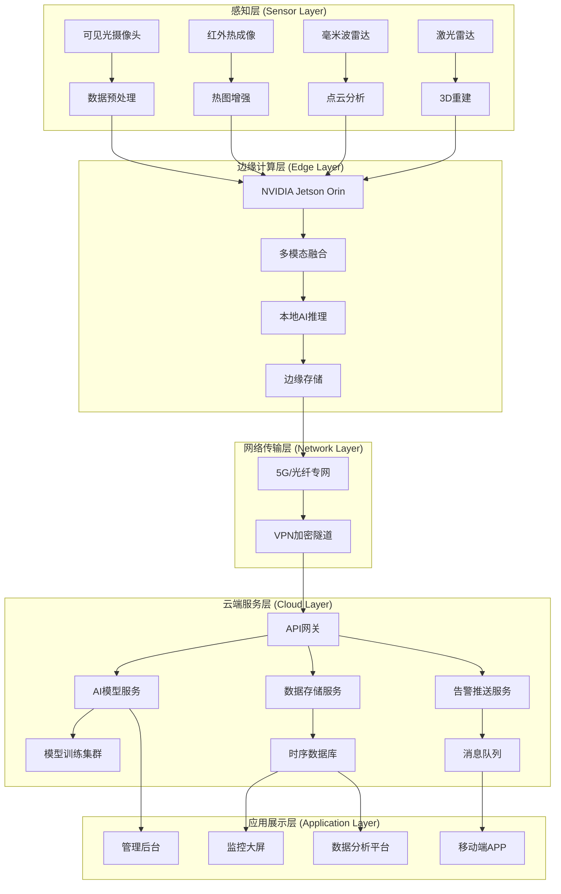

# 极境守护：极端天气环境下人体识别检测系统技术架构设计

**文档版本**: V2.0  
**生成日期**: 2026年03月18日  
**项目名称**: Polar Guard (极境守护)  
**技术负责人**: 陈晓东 高级架构师  
**文档状态**: 正式发布

---

## 文档介绍

本文档详细阐述了"极境守护"极端天气环境下人体识别检测系统的整体技术架构设计。系统旨在解决暴雨、大雪、浓雾、沙尘等恶劣天气条件下的人体识别难题，通过多模态传感器融合、自适应AI模型和边缘-云端协同计算，实现在极端环境下的高精度、高可靠人体检测。文档涵盖前后端技术栈、数据库设计、摄像头接入方案、模型部署策略、天气数据处理逻辑以及完整的系统部署方案。

<div style="background: linear-gradient(135deg, #0f172a 0%, #1e293b 100%); color: white; padding: 25px; border-radius: 8px; margin: 20px 0;">
<h2 style="color: white; text-align: center;">🌐 系统架构全景图</h2>
<div style="display: grid; grid-template-columns: repeat(auto-fit, minmax(280px, 1fr)); gap: 20px; margin-top: 20px;">
<div style="background-color: rgba(34, 211, 238, 0.15); border: 1px solid rgba(34, 211, 238, 0.3); padding: 20px; border-radius: 8px; text-align: center;">
<h4 style="color: #22d3ee; margin: 0 0 10px 0;">🔬 多模态传感层</h4>
<p style="color: #e2e8f0; font-size: 14px; margin: 0;">可见光/红外热成像/毫米波雷达/激光雷达四重传感器融合，确保全天候检测能力</p>
</div>
<div style="background-color: rgba(16, 185, 129, 0.15); border: 1px solid rgba(16, 185, 129, 0.3); padding: 20px; border-radius: 8px; text-align: center;">
<h4 style="color: #10b981; margin: 0 0 10px 0;">🤖 智能边缘层</h4>
<p style="color: #e2e8f0; font-size: 14px; margin: 0;">NVIDIA Jetson边缘计算单元，支持本地AI推理与天气自适应模型切换</p>
</div>
<div style="background-color: rgba(245, 158, 11, 0.15); border: 1px solid rgba(245, 158, 11, 0.3); padding: 20px; border-radius: 8px; text-align: center;">
<h4 style="color: #f59e0b; margin: 0 0 10px 0;">☁️ 云端服务层</h4>
<p style="color: #e2e8f0; font-size: 14px; margin: 0;">Kubernetes集群分布式部署，支持模型训练、数据分析和系统管理</p>
</div>
<div style="background-color: rgba(139, 92, 246, 0.15); border: 1px solid rgba(139, 92, 246, 0.3); padding: 20px; border-radius: 8px; text-align: center;">
<h4 style="color: #8b5cf6; margin: 0 0 10px 0;">📊 决策应用层</h4>
<p style="color: #e2e8f0; font-size: 14px; margin: 0;">实时监控大屏、移动端告警、管理后台三位一体的应用体系</p>
</div>
</div>
</div>

## 一、 整体架构概述

### 1.1 架构设计原则

<div style="background-color: #d1ecf1; border-left: 5px solid #0c5460; padding: 15px; border-radius: 4px; margin: 20px 0;">
<h4 style="color: #0c5460; margin-top: 0;">🎯 核心设计原则</h4>
<ol style="color: #0c5460;">
<li><strong>鲁棒性优先</strong>：系统在极端天气条件下必须保持稳定运行，设计容忍单点故障</li>
<li><strong>实时性要求</strong>：从图像采集到告警推送，端到端延迟需控制在500ms以内</li>
<li><strong>可扩展性</strong>：支持从单摄像头到城市级大规模部署的无缝扩展</li>
<li><strong>安全性保障</strong>：符合ISO 27001信息安全管理体系，数据全链路加密</li>
<li><strong>智能自适应</strong>：根据实时天气条件自动调整检测策略和模型参数</li>
</ol>
</div>

### 1.2 系统分层架构



### 1.3 关键技术指标

| 指标类别 | 具体指标 | 目标值 | 测量方法 |
|---------|---------|--------|---------|
| **检测性能** | 晴天识别准确率 | ≥99.5% | 标准测试集评估 |
| | 暴雨天气识别率 | ≥95% | 模拟暴雨环境测试 |
| | 大雪天气识别率 | ≥94% | 模拟降雪环境测试 |
| | 浓雾天气识别率 | ≥92% | 模拟能见度<50m测试 |
| **实时性能** | 单帧处理时间 | <100ms | 从采集到结果输出 |
| | 端到端延迟 | <500ms | 从检测到告警推送 |
| | 系统吞吐量 | ≥100FPS/节点 | 多路视频并发处理 |
| **可靠性** | 系统可用性 | 99.99% | 年停机时间<53分钟 |
| | 数据完整性 | 100% | 端到端校验机制 |
| | 故障恢复时间 | <5分钟 | 自动故障转移 |
| **可扩展性** | 单集群支持摄像头 | ≥1000路 | 水平扩展测试 |
| | 模型热更新时间 | <30秒 | 边缘节点全量更新 |

## 二、 前端技术架构

### 2.1 技术栈选型

<div style="background-color: #f8f9fa; border: 1px solid #e9ecef; padding: 20px; border-radius: 8px; margin: 20px 0;">
<h4 style="color: #333; margin-top: 0;">🖥️ 前端技术栈决策矩阵</h4>

| 技术组件 | 选型理由 | 版本 | 关键特性 |
|---------|---------|------|---------|
| **框架** | Vue 3 + TypeScript | 3.4+ | Composition API、TypeScript支持、更好的性能 |
| **UI组件库** | Element Plus | 2.3+ | 丰富的组件、良好的可定制性、企业级支持 |
| **状态管理** | Pinia | 2.1+ | 轻量级、TypeScript友好、模块化设计 |
| **路由管理** | Vue Router 4 | 4.2+ | 动态路由、路由守卫、懒加载支持 |
| **HTTP客户端** | Axios + 拦截器 | 1.6+ | 请求拦截、响应拦截、自动重试机制 |
| **图表库** | ECharts 5 | 5.4+ | 高性能渲染、丰富的图表类型、3D支持 |
| **地图组件** | Mapbox GL JS | 3.0+ | 矢量切片、高性能渲染、3D地形支持 |
| **实时通信** | Socket.IO Client | 4.7+ | WebSocket封装、自动重连、房间管理 |
| **构建工具** | Vite 5 | 5.0+ | 极速热更新、原生ESM支持、插件生态 |
| **代码规范** | ESLint + Prettier | 最新 | 代码质量保证、团队协作统一 |

</div>

### 2.2 前端应用架构

#### 2.2.1 多应用分离架构

```
polar-guard-frontend/
├── apps/
│   ├── monitor-center/           # 监控中心大屏应用
│   │   ├── src/
│   │   │   ├── components/       # 大屏专用组件
│   │   │   ├── views/           # 大屏页面
│   │   │   ├── utils/           # 工具函数
│   │   │   └── main.ts          # 应用入口
│   │   └── vite.config.ts
│   │
│   ├── management-console/       # 管理后台应用
│   │   ├── src/
│   │   │   ├── layouts/         # 布局组件
│   │   │   ├── router/          # 路由配置
│   │   │   ├── stores/          # 状态管理
│   │   │   ├── api/             # API接口
│   │   │   ├── views/           # 页面组件
│   │   │   └── main.ts
│   │   └── vite.config.ts
│   │
│   └── mobile-app/              # 移动端应用（可选）
│       ├── src/
│       └── vite.config.ts
│
├── packages/                    # 共享包
│   ├── ui-components/          # 通用UI组件库
│   ├── utils/                  # 工具函数库
│   ├── api-client/             # API客户端SDK
│   └── types/                  # TypeScript类型定义
│
├── pnpm-workspace.yaml         # pnpm工作区配置
└── package.json
```

### 2.3 前端性能优化策略

<div style="background-color: #fff3cd; border-left: 5px solid #ffc107; padding: 15px; border-radius: 4px; margin: 20px 0;">
<h4 style="color: #856404; margin-top: 0;">⚡ 前端性能优化要点</h4>

1. **代码分割与懒加载**
   ```javascript
   // 路由级代码分割
   const CameraManagement = () => import('./views/camera/index.vue')
   
   // 组件级懒加载
   const HeavyChart = defineAsyncComponent(() =>
     import('./components/HeavyChart.vue')
   )
   ```

2. **虚拟滚动与分页**
   - 检测历史列表使用虚拟滚动技术
   - 大图库采用分页加载 + 图片懒加载

3. **WebSocket连接优化**
   ```javascript
   // 智能重连机制
   const socket = io(SOCKET_URL, {
     reconnection: true,
     reconnectionAttempts: 10,
     reconnectionDelay: 1000,
     reconnectionDelayMax: 5000,
     timeout: 20000
   })
   ```

4. **资源预加载与缓存**
   - 关键路由预加载
   - Service Worker实现离线缓存
   - CDN加速静态资源

5. **监控大屏GPU加速**
   ```css
   .video-wall {
     transform: translateZ(0);
     backface-visibility: hidden;
     perspective: 1000px;
   }
   ```
   </div>

## 三、 后端技术架构

### 3.1 后端技术栈选型

<div style="display: grid; grid-template-columns: repeat(auto-fit, minmax(250px, 1fr)); gap: 15px; margin: 20px 0;">
<div style="background-color: rgba(59, 130, 246, 0.1); border-left: 4px solid #3b82f6; padding: 15px; border-radius: 6px;">
<h4 style="color: #3b82f6; margin: 0 0 8px 0;">🚀 核心框架</h4>
<ul style="margin: 0; padding-left: 20px; font-size: 14px;">
<li><strong>FastAPI 0.104+</strong> - 高性能异步Web框架</li>
<li><strong>Uvicorn</strong> - ASGI服务器</li>
<li><strong>Pydantic 2.0+</strong> - 数据验证与序列化</li>
</ul>
</div>
<div style="background-color: rgba(16, 185, 129, 0.1); border-left: 4px solid #10b981; padding: 15px; border-radius: 6px;">
<h4 style="color: #10b981; margin: 0 0 8px 0;">🗄️ 数据库与存储</h4>
<ul style="margin: 0; padding-left: 20px; font-size: 14px;">
<li><strong>PostgreSQL 15+</strong> - 主关系数据库</li>
<li><strong>Redis 7+</strong> - 缓存与会话存储</li>
<li><strong>TimescaleDB</strong> - 时序数据扩展</li>
<li><strong>MinIO</strong> - 对象存储（图片/视频）</li>
</ul>
</div>
<div style="background-color: rgba(245, 158, 11, 0.1); border-left: 4px solid #f59e0b; padding: 15px; border-radius: 6px;">
<h4 style="color: #f59e0b; margin: 0 0 8px 0;">🔐 安全与认证</h4>
<ul style="margin: 0; padding-left: 20px; font-size: 14px;">
<li><strong>JWT + OAuth2</strong> - API认证</li>
<li><strong>bcrypt</strong> - 密码哈希</li>
<li><strong>Fernet</strong> - 敏感数据加密</li>
<li><strong>RBAC</strong> - 基于角色的访问控制</li>
</ul>
</div>
<div style="background-color: rgba(239, 68, 68, 0.1); border-left: 4px solid #ef4444; padding: 15px; border-radius: 6px;">
<h4 style="color: #ef4444; margin: 0 0 8px 0;">🔧 消息与任务队列</h4>
<ul style="margin: 0; padding-left: 20px; font-size: 14px;">
<li><strong>Celery 5+</strong> - 分布式任务队列</li>
<li><strong>RabbitMQ</strong> - 消息代理</li>
<li><strong>WebSocket</strong> - 实时通信</li>
</ul>
</div>
</div>

### 3.2 微服务架构设计

#### 3.2.1 服务拆分策略

```
polar-guard-backend/
├── api-gateway/                    # API网关服务
│   ├── src/
│   │   ├── middlewares/           # 中间件（限流、认证、日志）
│   │   ├── routes/                # 路由转发
│   │   └── main.py
│   └── Dockerfile
│
├── auth-service/                   # 认证服务
│   ├── src/
│   │   ├── models/                # 用户模型
│   │   ├── services/              # 认证逻辑
│   │   ├── api/                   # 认证API
│   │   └── main.py
│   └── Dockerfile
│
├── camera-service/                 # 摄像头管理服务
│   ├── src/
│   │   ├── models/                # 摄像头模型
│   │   ├── services/              # 摄像头管理
│   │   ├── api/                   # 摄像头API
│   │   └── main.py
│   └── Dockerfile
│
├── detection-service/              # 检测服务
│   ├── src/
│   │   ├── models/                # 检测模型
│   │   ├── ml/                    # 机器学习模块
│   │   ├── services/              # 检测逻辑
│   │   ├── api/                   # 检测API
│   │   └── main.py
│   └── Dockerfile
│
├── model-service/                  # 模型管理服务
│   ├── src/
│   │   ├── models/                # AI模型
│   │   ├── services/              # 模型管理
│   │   ├── api/                   # 模型API
│   │   └── main.py
│   └── Dockerfile
│
├── weather-service/                # 天气服务
│   ├── src/
│   │   ├── models/                # 天气模型
│   │   ├── services/              # 天气处理
│   │   ├── api/                   # 天气API
│   │   └── main.py
│   └── Dockerfile
│
├── alert-service/                  # 告警服务
│   ├── src/
│   │   ├── models/                # 告警模型
│   │   ├── services/              # 告警逻辑
│   │   ├── api/                   # 告警API
│   │   └── main.py
│   └── Dockerfile
│
└── docker-compose.yml              # 服务编排
```

#### 3.2.2 服务间通信机制

<div style="background-color: #e8f4fd; border: 1px solid #b6d4fe; padding: 20px; border-radius: 8px; margin: 20px 0;">
<h4 style="color: #0c5460; margin-top: 0;">🔄 微服务通信设计</h4>

**1. 同步通信（RESTful API）**
```python
# 使用HTTPX进行服务间调用
import httpx

async def get_camera_info(camera_id: int):
    async with httpx.AsyncClient() as client:
        response = await client.get(
            f"http://camera-service:8000/api/v1/cameras/{camera_id}",
            timeout=10.0
        )
        return response.json()
```

**2. 异步通信（消息队列）**
```python
# Celery任务定义
from celery import Celery

app = Celery('detection_tasks', broker='pyamqp://guest@rabbitmq//')

@app.task
def process_detection_batch(image_batch):
    """批量处理检测任务"""
    # 调用检测服务
    return detection_service.process_batch(image_batch)
```

**3. 事件驱动架构**
```python
# 使用Redis Pub/Sub进行事件广播
import redis.asyncio as redis

async def publish_detection_event(detection_data):
    redis_client = redis.from_url(REDIS_URL)
    await redis_client.publish(
        'detection_events',
        json.dumps(detection_data)
    )
```

**4. 服务发现与负载均衡**
- **Consul**：服务注册与发现
- **Traefik**：动态负载均衡
- **健康检查**：每30秒心跳检测
</div>

### 3.3 核心服务实现

#### 3.3.1 检测服务核心逻辑

```python

```

#### 3.3.2 天气自适应处理流水线

```python

```

## 四、 核心功能模块

### 4.1 登录注册与用户中心

- **登录**：支持账号密码登录。
- **注册**：支持未注册用户注册。
- **个人中心**：退出登录，个人资料信息，更改个人信息，更改密码，登录日志。
- **权限管理**：权限身份包括管理员和普通用户

### 4.2 可视化大屏 (2026 旗舰特性)

- **3D 态势感知**：结合 3D GIS 实时展示监控区域，叠加动态气象层（实时降雨、雪、风向热力图）。
- **自适应 UI**：系统根据当前传感器识别的天气等级（绿/黄/橙/红）自动切换大屏配色方案和关键指标。
- **实时预警**：检测到极端天气下的人体异常（如滞留、倒地、禁行区闯入），界面红色频闪并弹出红外/雷达融合画面。
- **天气数据看板**：实时显示风速、能见度、绝对湿度等参数，辅助判断识别可信度。

### 4.3 目标检测模块

**4.3.1** 图片识别


去除左侧算法模型库，改成数据展示，如下：

**统计摘要**


**详细数据**


**置信度分布**


更改图片检测窗口下方功能按钮到窗口上方如下：


下方实时推理日志更改为大模型推理

上述仅要求设计，可能需后续美化修改

**4.3.2** 视频识别

整体页面和图片识别页面大致相同，仅描述不同处

去除左侧算法模型库，改成实时检测结果，如下：


更改视频窗口下方功能按钮到窗口上方如下：


下方大模型推理功能同图片识别

**4.3.3** 摄像头识别

更改摄像头检测窗口下方功能按钮到窗口上方如下：


去除左侧算法模型库，改成实时检测统计，如下：


删除保存本次会话到历史按钮

- **多模态画面融合**：支持可见光与红外热成像画面的画中画或透明叠加展示。
- **图像增强处理**：内置去雾、去雪、暗光增强算法开关，支持一键“穿透”恶劣环境。
- **PTZ 控制**：支持云台操作，在暴风雨等震动环境下具备数字防抖功能。

### 4.4 大模型推理

调用豆包大模型，根据预设提示词，对检测结果进行分析

若大模型调用失败，则直接调用系统预设的静态分析结果

### 4.5模型演示与管理

**4.5.1** 模型加载


**4.5.2** 训练曲线


**4.5.3** 指标汇总


**4.5.4** 模型演示

模型架构图

gif动图


- **动态模型切换**：
  - **雨天模式**：加载针对雨滴折射优化的 Transformer 模型。
  - **雪天模式**：启用对白色背景高敏感的红外识别模型。
  - **雾霾模式**：优先调用毫米波雷达辅助定位。
- **模型版本对比**：支持 A/B 测试，在同一画面下对比新老算法的识别率与延迟。
- **在线增量更新**：模型管理后台支持一键推送权重文件至边缘端，无需停机。

### 4.6 历史检测记录

参照智慧果园


- **智能检索**：支持按时间、天气类型（暴雨/大雾）、目标特征（体型、着装、热源强度）进行筛选。可以根据检测文件类型分类查看
- **事件回放**：提供关联的视频片段、雷达点云图和红外图像，形成完整的证据链。
- **统计报告**：自动生成极端天气下的识别效能分析报告，辅助系统优化。
- 特殊说明展示是什么极端环境以及检测到的人物个数

### 4.7 数据传输

数据格式采用json格式

**用户登录日志**

**检测日志**

**模型训练日志**

**源文件的上传**

**检测后文件的保存**

**http报文段**

**第三方api调用**

api调用失败后**静态代码调用**

**大模型提示词**

**静态数据源**如：用于可视化展示的动图、视频以及python画图工具生成的评估图片：相关性热力图，roc曲线，混淆矩阵

**数据分析**

对**用户和检测历史的json**进行详细设计，尽可能包含后续页面跳转所需数据

**用户个人信息**

边缘设备连接

### 4.8 数据分析展示

参考智慧果园对历史记录就行分析，使用数据为**检测.json**


### 4.9 路由转发

完成各个页面的跳转和数据传输，并绘制页面拓扑图

将所有模块整合集成到**app.py**作为系统的总入口。

### 4.10 边缘设备管理

保留页面


### 4.11 告警模块

<div style="background-color: #f8d7da; border-left: 5px solid #dc3545; padding: 15px; border-radius: 4px; margin: 20px 0;">
<h4 style="color: #721c24; margin-top: 0;">🚨 极端天气预警等级与响应策略</h4>


**预警等级定义：**

| 等级             | 颜色 | 气象条件                   | 检测策略调整     | 响应措施                     |
| ---------------- | ---- | -------------------------- | ---------------- | ---------------------------- |
| **一级（蓝色）** | 🔵    | 轻度雨雪，能见度>1km       | 标准检测参数     | 正常监控，记录日志           |
| **二级（黄色）** | 🟡    | 中雨/小雪，能见度500m-1km  | 降低置信度阈值   | 增加检测频率，人工复核       |
| **三级（橙色）** | 🟠    | 大雨/中雪，能见度200m-500m | 启用天气特定模型 | 启动多模态融合，加强监控     |
| **四级（红色）** | 🔴    | 暴雨/大雪，能见度<200m     | 启用极端天气模式 | 全传感器融合，最高优先级告警 |
| **五级（黑色）** | ⚫    | 特大暴雨/暴雪，能见度<50m  | 应急检测模式     | 启动应急预案，人工干预       |

**预警触发机制：**

```python
class ExtremeWeatherAlertSystem:
    """极端天气预警系统"""
    
    def __init__(self):
        self.alert_rules = self._load_alert_rules()
        self.alert_history = []
        self.escalation_policies = self._load_escalation_policies()
    
    async def monitor_and_alert(self, weather_data: Dict[str, Any]):
        """监控并触发预警"""
        
        # 评估天气条件
        severity = await self._assess_severity(weather_data)
        
        # 检查是否需要触发预警
        if severity.value >= AlertLevel.YELLOW.value:
            alert = await self._create_alert(weather_data, severity)
            
            # 触发预警
            await self._trigger_alert(alert)
            
            # 记录预警历史
            self.alert_history.append(alert)
            
            # 升级策略检查
            await self._check_escalation(alert)
    
    async def _assess_severity(self, weather_data: Dict) -> AlertLevel:
        """评估天气严重程度"""
        
        severity_score = 0
        
        # 能见度评分
        visibility = weather_data.get("visibility", 10000)
        if visibility < 50:
            severity_score += 100
        elif visibility < 200:
            severity_score += 80
        elif visibility < 500:
            severity_score += 60
        elif visibility < 1000:
            severity_score += 40
        
        # 降水强度评分
        precipitation = weather_data.get("precipitation", 0)
        if precipitation > 50:  # 暴雨
            severity_score += 90
        elif precipitation > 25:  # 大雨
            severity_score += 70
        elif precipitation > 10:  # 中雨
            severity_score += 50
        elif precipitation > 0:  # 小雨
            severity_score += 30
        
        # 风速评分
        wind_speed = weather_data.get("wind_speed", 0)
        if wind_speed > 20:  # 8级大风
            severity_score += 80
        elif wind_speed > 10:  # 5级风
            severity_score += 50
        
        # 综合评分确定等级
        if severity_score >= 150:
            return AlertLevel.BLACK
        elif severity_score >= 120:
            return AlertLevel.RED
        elif severity_score >= 90:
            return AlertLevel.ORANGE
        elif severity_score >= 60:
            return AlertLevel.YELLOW
        else:
            return AlertLevel.BLUE
    
    async def _trigger_alert(self, alert: WeatherAlert):
        """触发预警"""
        
        # 多通道告警推送
        alert_channels = [
            self._push_to_monitoring_center,
            self._send_email_alerts,
            self._send_sms_alerts,
            self._broadcast_websocket,
            self._update_dashboard
        ]
        
        # 并行执行告警推送
        tasks = [channel(alert) for channel in alert_channels]
        await asyncio.gather(*tasks, return_exceptions=True)
    
    async def _check_escalation(self, alert: WeatherAlert):
        """检查是否需要升级预警"""
        
        # 检查连续预警
        recent_alerts = [
            a for a in self.alert_history[-10:]
            if a.location == alert.location
        ]
        
        if len(recent_alerts) >= 3:
            # 短时间内多次预警，升级响应级别
            await self._escalate_response(alert)
        
        # 检查预警持续时间
        if alert.duration_minutes > 60:
            # 长时间预警，启动应急预案
            await self._activate_emergency_plan(alert)
```

</div>

## 五、 用户开发要求

总体要求开发者准备以下材料：包括开发日志、测试报告、项目报告说明书。

### 5.1 开发日志

主要包括模块说明、核心算法使用以及代码逻辑

遇到的严重bug

### 5.2 测试报告

包括代码测试和功能性测试

#### **5.2.1 **代码测试

由开发者独立完成，包括：

​	模块测试（单元测试），保证基本功能和代码运行成功；

​	模块间的接口测试（集成测试）采用自底向上的测试方法进行模块的拼接；

​	系统的总体测试

要求说明测试文件（例如 测试.py）及测试结果

#### 5.2.2 功能性测试

由测试人员完成，测试人员需要设计测试用例，涵盖所有基本功能显示以及模拟用户行为习惯

输出测试用例及结果

### 5.3 **项目报告说明书**

### 5.4 代码与程序编写规范

**页面要求：**要求整体呈深蓝色基调，可参考智慧果园、无人机检测系统、原型文件

**模块要求：**遵循高内聚低耦合原则，尽可能模块（函数）分离，并集成到一个总的模块或函数封装调用

**代码要求：**考虑系统健壮性问题，例如在api不能调用时有对应解决思路（转换成代码语言）

**代码格式：**命名规范遵循驼峰命名法                        

**注意事项：**在开发中切记注意软件包路径问题，并且确保全部使用相对路径

**开发工具：**利用PyCharm完成项目开发，若遇到错误可以通过debug模式查找问题源，可适当借助AI编程工具辅助完成代码书写